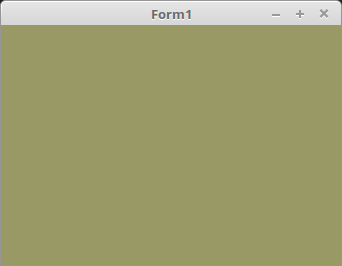

<html>
    <b><h1>01 - Einrichten und Einstieg</h1></b>
    <b><h2>05 - Context erzeugen</h2></b>
  
OpenGL Context 3.3 erzeugen und OpenGL initialisieren. 
<b>Parent</b> kann z.B. auch ein TPanel sein. (Parent := Panel1;) 
 
Man kann die <b>TOpenGLControl</b>-Komponente auch über die Komponenten-Leiste auf dem Form erzeugen. 
Aber meine Erfahrung hat gezeigt, wenn man eine neuere Lazarus-Version installiert, dass es dann zu Problemen kommen kann. 

 
Den Zeichen-Context mit <b>TOpenGLControl</b> deklarieren. 
<pre><code=pascal><b>type</b>
  TForm1 = <b>class</b>(TForm)
    <b>procedure</b> FormCreate(Sender: TObject);
  <b>private</b>
    ogc: TOpenGLControl;   <i>// Deklaration von ogc</i>
    <b>procedure</b> InitScene;
    <b>procedure</b> DrawScene(Sender: TObject);
  <b>end</b>;</code></pre>
Den Zeichen-Context erzeugen. 
<pre><code=pascal><b>procedure</b> TForm1.FormCreate(Sender: TObject);
<b>begin</b>
  ogc := TOpenGLControl.Create(<b>Self</b>); <i>// Den Zeichen-Context erzeugen.</i>
  <b>with</b> ogc <b>do</b> <b>begin</b>
    Parent := <b>Self</b>;
    Align := alClient;
    OpenGLMajorVersion := 3;          <i>// Dies ist wichtig, dass der Context 3.3 verwendet wird.</i>
    OpenGLMinorVersion := 3;
    OnPaint := @DrawScene;
    InitOpenGL;
    MakeCurrent;
    ReadExtensions;
    ReadImplementationProperties;
  <b>end</b>;
  InitScene;                          <i>// Rendert die Szene</i>
<b>end</b>;</code></pre>
Für die Contexterzeugung, habe ich eine Klasse geschrieben, diese beinhaltet den Teil im <b>with</b>-Block, ausgenommen <b>OnPaint</b>. 
In späteren Tutorial wird nur noch diese verwendet. 

 
Rendern der Szene, momentan wird nur die Hintergrundfarbe festgelegt. 
Die Werte werden bei <b>glClearColor(...</b> als R, G, B, A eingegeben, wobei A keinen Einfluss hat. 
0.0 ist dunkel und 1.0 ist volle Intensität, somit wäre 0.0, 0.0, 0.0 Schwarz und 1.0, 1.0, 1.0 Weiss. 
Hier im Beispiel ist es ein Olivgrün. 
<pre><code=pascal><b>procedure</b> TForm1.InitScene;
<b>begin</b>
  glClearColor(0.6, 0.6, 0.4, 1.0);  <i>// Hintergrundfarbe</i>
<b>end</b>;</code></pre>
Darstellen der Szene, momentan wird mit <b>glClear(...</b> nur der Frame-Puffer geleert und und mit der mit <b>glClearColor(...</b> festgelegten Farbe gefüllt. 
Der noch leere Frame-Puffer wird mit <b>ogc.SwapBuffers;</b> auf dem Bildschirm dargestellt. 
Somit ist nur der Hintergrund sichtbar und man sieht keine Änderung. 
<pre><code=pascal><b>procedure</b> TForm1.DrawScene(Sender: TObject);
<b>begin</b>
  glClear(GL_COLOR_BUFFER_BIT);  <i>// Frame-Buffer löschen und einfärben.</i>
 
  ogc.SwapBuffers;               <i>// Frame-Buffer auf den Bildschirm kopieren.</i>
<b>end</b>;</code></pre>
 
</html>
