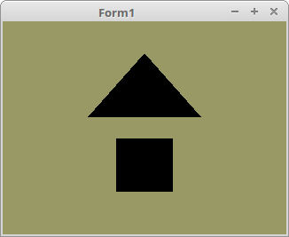

<html>
    <b><h1>01 - Einrichten und Einstieg</h1></b>
    <b><h2>10 - VAO - Daten laden</h2></b>
  
Hier werden zum ersten Mal Vertex-Daten ins VRAM geladen. 
<b>Hinweis:</b> Je nach Grafiktreiber kann es sein, dass man keine Ausgabe sieht, weil noch kein Shader geladen ist. Mehr dazu im nächsten Tutorial. 
Mit dem original NVidia- und Intel-Treiber sollten die Mesh unter Linux und Windows sichtbar sein. 
Mit dem Mesa-Treiber unter Linux mit einer NVidia-Karte ist nichts sichtbar. 

 
Typen-Deklaration für die Face-Daten. 
<pre><code><b>type</b>
  TVertex3f = <b>array</b>[0..2] <b>of</b> GLfloat;
  TFace = <b>array</b>[0..2] <b>of</b> TVertex3f;</code></pre>
Koordinaten für das Mesh, hier ein Dreieck und ein Quadrat, welches wir später in das VRAM (Video-Ram) rendern. 
<pre><code><b>const</b>
  Triangle: <b>array</b>[0..0] <b>of</b> TFace =
    (((-0.4, 0.1, 0.0), (0.4, 0.1, 0.0), (0.0, 0.7, 0.0)));
  Quad: <b>array</b>[0..1] <b>of</b> TFace =
    (((-0.2, -0.6, 0.0), (-0.2, -0.1, 0.0), (0.2, -0.1, 0.0)),
    ((-0.2, -0.6, 0.0), (0.2, -0.1, 0.0), (0.2, -0.6, 0.0)));</code></pre>
Für den Contexterzeugung und sonstige OpenGL-Inizialisationen, übernimmt der grösste Teil, die Klasse <b>TContext</b>, der Unit <b>oglContext</b>. 
Anstelle von <b>Self</b>, kann auch ein anderes <b>TWinControl</b> angegeben werden, zB. ein <b>TPanel</b>. 
 
Am Ende müssen noch diese beiden Prozeduren aufgerufen werden, welche die Puffer für die Mesh erzeugen und die Vertexkoordinaten in den Puffer laden. 
<pre><code><b>procedure</b> TForm1.FormCreate(Sender: TObject);
<b>begin</b>
  ogc := TContext.Create(<b>Self</b>);  <i>// Den Context erzeugen und OpenGL inizialisieren.</i>
  ogc.OnPaint := @ogcDrawScene;  <i>// OnPaint-Ereigniss von dem Contextfenster.</i>

  CreateScene;                   <i>// Puffer anlegen.</i>
  InitScene;                     <i>// Vertex-Daten in den Buffer schreiben.</i>
<b>end</b>;</code></pre>
Buffer für Vertex-Daten anlegen. 
 
Mit <b>glGenVertexArrays(...</b> wird ein <b>Vertex Array Object</b> für jedes Mesh erzeugt. 
Mit <b>glGenBuffers(...</b> wird ein <b>Vertex Buffer Object</b> für die Vertex-Daten des Meshes erzeugt. 
<pre><code><b>procedure</b> TForm1.CreateScene;
<b>begin</b>
  glGenVertexArrays(1, @VBTriangle.VAO);
  glGenVertexArrays(1, @VBQuad.VAO);

  glGenBuffers(1, @VBTriangle.VBO);
  glGenBuffers(1, @VBQuad.VBO);
<b>end</b>;</code></pre>
Die folgenden Anweisungen laden die Vertex-Daten in das VRAM. 
 
Mit <b>glBindVertexArray(...</b> wird das gewünschte Mesh gebunden, so das man mit <b>glBufferData(...</b> die Vertex-Daten in das VRAM schreiben kann. 
Mit <b>glEnableVertexAttribArray(...</b> gibt man an, welches Layout man im Shader will. 
Mit <b>glVertexAttribPointer(...</b> gibt man an, in welchem Format man die Vertex-Daten übergeben hat. 
Der erste Parameter (<b>Index</b>) muss mit den Wert bei <b>location</b> im Shader übereinstimmen, dies ist momentan aber nicht relevant, da (noch) gar kein Shader geladen ist. 
 
<b>InitScene</b> kann zur Laufzeit mit anderen Daten geladen werden. 
<pre><code><b>procedure</b> TForm1.InitScene;
<b>begin</b>
  glClearColor(0.6, 0.6, 0.4, 1.0); <i>// Hintergrundfarbe</i>

  <i>// Daten für das Dreieck</i>
  glBindVertexArray(VBTriangle.VAO);
  glBindBuffer(GL_ARRAY_BUFFER, VBTriangle.VBO);
  glBufferData(GL_ARRAY_BUFFER, sizeof(Triangle), @Triangle, GL_STATIC_DRAW);
  glEnableVertexAttribArray(0);
  glVertexAttribPointer(0, 3, GL_FLOAT, <b>False</b>, 0, <b>nil</b>);

  <i>// Daten für das Quadrat</i>
  glBindVertexArray(VBQuad.VAO);
  glBindBuffer(GL_ARRAY_BUFFER, VBQuad.VBO);
  glBufferData(GL_ARRAY_BUFFER, sizeof(Quad), @Quad, GL_STATIC_DRAW);
  glEnableVertexAttribArray(0);
  glVertexAttribPointer(0, 3, GL_FLOAT, <b>False</b>, 0, <b>nil</b>);
<b>end</b>;</code></pre>
Jetzt wird das gerenderte Objekt im VRAM auf dem Bildschirm ausgegeben. 
 
Da kommt ein grosser Vorteil von OpenGL 3.3 zu Geltung. 
 
Man muss nur noch mit <b>glBindVertexArray(...</b> das Mesh wählen, das man ausgeben will. 
Gezeichnet wird dann mit <b>glDrawArrays(...</b>, meistens werden mit <b>GL_TRIANGLES</b> Dreiecke ausgegeben. 
Quadrate und Polygone gehen NICHT mehr, so wie man es noch mit <b>glBegin(...</b> konnte ! 
 
Shapes, welche funktionieren: 
* GL_POINTS 
* GL_LINES 
* GL_LINE_STRIP 
* GL_LINE_LOOP 
* GL_TRIANGLES 
* GL_TRIANGLE_STRIP 
* GL_TRIANGLE_FAN 
 
Da gibt es noch spezial-Versionen, diese sind aber nur mit einem Geometrie-Shader sinnvoll. 
Den Geometrie-Shader werde ich später erwähnen. 
 
* GL_LINES_ADJACENCY 
* GL_LINE_STRIP_ADJACENCY 
* GL_TRIANGLES_ADJACENCY 
* GL_TRIANGLE_STRIP_ADJACENCY 
 
Zum Schluss muss noch der Frame-Puffer auf den Bildschirm kopiert werden. 
<pre><code><b>procedure</b> TForm1.ogcDrawScene(Sender: TObject);
<b>begin</b>
  glClear(GL_COLOR_BUFFER_BIT);

  <i>// Zeichne Dreieck</i>
  glBindVertexArray(VBTriangle.VAO);
  glDrawArrays(GL_TRIANGLES, 0, Length(Triangle) * 3);

  <i>// Zeichne Quadrat</i>
  glBindVertexArray(VBQuad.VAO);
  glDrawArrays(GL_TRIANGLES, 0, Length(Quad) * 3);

  ogc.SwapBuffers;
<b>end</b>;</code></pre>
Am Ende muss man die angelegten <b>Vertex Array Objects</b> und <b>Vertex Buffer Objects</b> wieder freigeben. 
<pre><code><b>procedure</b> TForm1.FormDestroy(Sender: TObject);
<b>begin</b>
  glDeleteVertexArrays(1, @VBTriangle.VAO);
  glDeleteVertexArrays(1, @VBQuad.VAO);

  glDeleteBuffers(1, @VBTriangle.VBO);
  glDeleteBuffers(1, @VBQuad.VBO);
<b>end</b>;
</code></pre>

</html>
