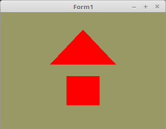

<html>
  
Hier wird zum ersten Mal ein Shader geladen, ohne solchen macht OpenGL >= 3.3 keinen Sinn. 
Nähere Details dazu im Kapitel Shader. Hier geht es in erster Linie mal darum, dass man etwas rendern kann. 
 
In diesem Beispiel wird ein sehr einfacher Shader verwendet. Dieser macht nichts anderes, als das Mesh rot darzustellen. 

 
Die ID, welche auf den Shader zeigt. 
<pre><code><b>var</b>
  ProgramID: GLuint;</pre></code>
Lädt den Vertex- und Fragment-Shader in die Grafikkarte. 
In diesem Beispiel sind die beiden Shader in einer Textdatei. 
Natürlich kann man diese auch direkt als String-Konstante im Quellcode deklarieren. 
<pre><code><b>function</b> Initshader(VertexDatei, FragmentDatei: <b>string</b>): GLuint;
<b>var</b>
  sl: TStringList;
  s: <b>string</b>;

  ProgramObject: GLhandle;
  VertexShaderObject: GLhandle;
  FragmentShaderObject: GLhandle;

  ErrorStatus, InfoLogLength: integer;

<b>begin</b>
  sl := TStringList.Create;
  ProgramObject := glCreateProgram();

  <i>// Vertex - Shader</i>

  VertexShaderObject := glCreateShader(GL_VERTEX_SHADER);
  sl.LoadFromFile(VertexDatei);
  s := sl.Text;
  glShaderSource(VertexShaderObject, 1, @s, <b>nil</b>);
  glCompileShader(VertexShaderObject);
  glAttachShader(ProgramObject, VertexShaderObject);

  <i>// Check Shader</i>

  glGetShaderiv(VertexShaderObject, GL_COMPILE_STATUS, @ErrorStatus);
  <b>if</b> ErrorStatus = 0 <b>then</b> <b>begin</b>
    glGetShaderiv(VertexShaderObject, GL_INFO_LOG_LENGTH, @InfoLogLength);
    SetLength(s, InfoLogLength + 1);
    glGetShaderInfoLog(VertexShaderObject, InfoLogLength, <b>nil</b>, @s[1]);
    Application.MessageBox(PChar(s), 'OpenGL Vertex Fehler', 48);
    Halt;
  <b>end</b>;

  glDeleteShader(VertexShaderObject);

  <i>// Fragment - Shader</i>

  FragmentShaderObject := glCreateShader(GL_FRAGMENT_SHADER);
  sl.LoadFromFile(FragmentDatei);
  s := sl.Text;
  glShaderSource(FragmentShaderObject, 1, @s, <b>nil</b>);
  glCompileShader(FragmentShaderObject);
  glAttachShader(ProgramObject, FragmentShaderObject);

  <i>// Check Shader</i>

  glGetShaderiv(FragmentShaderObject, GL_COMPILE_STATUS, @ErrorStatus);
  <b>if</b> ErrorStatus = 0 <b>then</b> <b>begin</b>
    glGetShaderiv(FragmentShaderObject, GL_INFO_LOG_LENGTH, @InfoLogLength);
    SetLength(s, InfoLogLength + 1);
    glGetShaderInfoLog(FragmentShaderObject, InfoLogLength, <b>nil</b>, @s[1]);
    Application.MessageBox(PChar(s), 'OpenGL Fragment Fehler', 48);
    Halt;
  <b>end</b>;

  glDeleteShader(FragmentShaderObject);
  glLinkProgram(ProgramObject);    <i>// Die beiden Shader zusammen linken</i>

  <i>// Check Link</i>
  glGetProgramiv(ProgramObject, GL_LINK_STATUS, @ErrorStatus);
  <b>if</b> ErrorStatus = 0 <b>then</b> <b>begin</b>
    glGetProgramiv(ProgramObject, GL_INFO_LOG_LENGTH, @InfoLogLength);
    SetLength(s, InfoLogLength + 1);
    glGetProgramInfoLog(ProgramObject, InfoLogLength, <b>nil</b>, @s[1]);
    Application.MessageBox(PChar(s), 'OpenGL ShaderLink Fehler', 48);
    Halt;
  <b>end</b>;

  Result := ProgramObject;
  sl.Free;
<b>end</b>;</pre></code>
Dieser Code wurde um 2 Zeilen erweitert. 
 
In der ersten Zeile wird der Shader in die Grafikkarte geladen. 
Die zweite Zeile aktiviert den Shader. 
Dies wird spätestens dann interessant, wenn man mehrere Shader verwendet. 
Näheres im Kapitel Shader. 
<pre><code><b>procedure</b> TForm1.CreateScene;
<b>begin</b>
  ProgramID := InitShader('Vertexshader.glsl', 'Fragmentshader.glsl');
  glUseProgram(programID);</pre></code>
Beim Zeichnen muss man auch mit <b>glUseProgram(...</b> den Shader wählen, mit welchem das Mesh gezeichnet wird. 
Bei diesem Mini-Code könnte dies weggelassen werden, da nur ein Shader verwendet wird und dieser bereits in TForm1.CreateScene aktiviert wurde. 
<pre><code><b>procedure</b> TForm1.ogcDrawScene(Sender: TObject);
<b>begin</b>
  glClear(GL_COLOR_BUFFER_BIT);

  glUseProgram(programID);</pre></code>
Am Ende noch mit <b>glDeleteShader(...</b> die Shader in der Grafikkarte wieder freigeben. 
In diesem Code ist dies nur einer. 
<pre><code><b>procedure</b> TForm1.FormDestroy(Sender: TObject);
<b>begin</b>
  glDeleteProgram(ProgramID);</pre></code>

 
Die beiden verwendeten Shader, Details dazu im Kapitel Shader. 
 
<b>Vertex-Shader:</b> 
<pre><code><b>#version</b> 330

<b>layout</b> (location = 0) <b>in</b> <b>vec3</b> inPos;

<b>void</b> main(<b>void</b>)
{
  gl_Position = <b>vec4</b>(inPos, 1.0);
}
</pre></code>

 
<b>Fragment-Shader:</b> 
<pre><code><b>#version</b> 330

<b>out</b> <b>vec4</b> outColor; <i>// ausgegebene Farbe</i>

<b>void</b> main(<b>void</b>)
{
  outColor = <b>vec4</b>(1.0, 0.0, 0.0, 1.0);
}
</pre></code>

</html>
