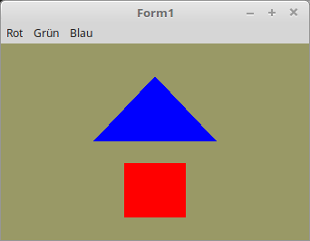

<!DOCTYPE html>
<html>
  <body bgcolor="#DDDDFF">
    <b><h1>02 - Shader</h1></b>
    <b><h2>10 - Uniform Variablen</h2></b>
  
Hier wird die Farbe des Meshes über eine Unifom-Variable an den Shader übergeben, somit kann die Farbe zur Laufzeit geändert werden. 
Unifom-Variablen dienen dazu, um Parameter den Shader-Objecte zu übergeben. Meistens sind dies Matrixen, oder wie hier im Beispiel die Farben. 
Oder auch Beleuchtung-Parameter, zB. die Position des Lichtes. 

 
Deklaration der ID, welche auf die Unifom-Variable im Shader zeigt, und die Variable, welche die Farbe für den Vektor enthält. 
Da man die Farbe als Vektor übergibt, habe ich dafür den Typ <b>TVertex3f</b> gewählt. Seine Komponenten beschreiben den Rot-, Grün- und Blauanteil der Farbe. 
<pre><code>var
  Color_ID: GLint;      // ID
  MyColor: TVertex3f;   // Farbe</pre></code>
Dieser Code wurde um eine Zeile <b>UniformLocation</b> erweitert. 
Diese ermittelt die ID, wo sich <b>Color</b> im Shader befindet. 
 
Vor dem Ermitteln muss mit <b>UseProgram</b> der Shader aktviert werden, von dem man lesen will. 
Im Hintergrund wird dabei <b>glGetUniformLocation(ProgrammID,...</b> aufgerufen. 
Der Vektor von MyColor ist in RGB (Rot, Grün, Blau). 
 
Der String in <b>UniformLocation</b> muss indentisch mit dem Namen der Uniform-Variable im Shader sein. <b>Wichtig:</b> Es muss auf Gross- und Kleinschreibung geachtet werden. 
<pre><code>procedure TForm1.CreateScene;
begin
  Shader := TShader.Create([FileToStr('Vertexshader.glsl'), FileToStr('Fragmentshader.glsl')]);
  Shader.UseProgram;
  Color_ID := Shader.UniformLocation('Color'); // Ermittelt die ID von "Color".
  // MyColor Blau zuweisen.
  MyColor[0] := 0.0;
  MyColor[1] := 0.0;
  MyColor[2] := 1.0;</pre></code>
Hier wird die Uniform-Variable übergeben. Für diese vec3-Variable gibt es zwei Möglichkeiten. 
Mit <b>glUniform3fv...</b> kann man sie als ganzen Vektor übergeben. 
Mit <b>glUniform3f(...</b> kann man die Komponenten der Farben auch einzeln übergeben. 
<pre><code>procedure TForm1.ogcDrawScene(Sender: TObject);
begin
  glClear(GL_COLOR_BUFFER_BIT);
  Shader.UseProgram;

  // Zeichne Dreieck
  glUniform3fv(Color_ID, 1, @MyColor);   // Als Vektor
  glBindVertexArray(VBTriangle.VAO);
  glDrawArrays(GL_TRIANGLES, 0, Length(Triangle) * 3);

  // Zeichne Quadrat
  glUniform3f(Color_ID, 1.0, 0.0, 0.0);  // Einzel
  glBindVertexArray(VBQuad.VAO);
  glDrawArrays(GL_TRIANGLES, 0, Length(Quad) * 3);

  ogc.SwapBuffers;
end;</pre></code>
Folgende Prozedur weist dem Vektor <b<MyColor</b> eine andere Farbe zu. 
Dafür wird ein einfaches Menü verwendet. 
<pre><code>procedure TForm1.MenuItemClick(Sender: TObject);
begin
  case TMainMenu(Sender).Tag of
    0: begin   // Rot
      MyColor[0] := 1.0;
      MyColor[1] := 0.0;
      MyColor[2] := 0.0;
    end;
    1: begin   // Grün
      MyColor[0] := 0.0;
      MyColor[1] := 1.0;
      MyColor[2] := 0.0;
    end;
    2: begin   // Blau
      MyColor[0] := 0.0;
      MyColor[1] := 0.0;
      MyColor[2] := 1.0;
    end;
  end;
  ogc.Invalidate;   // Manuelle Aufruf von DrawScene.
end;</pre></code>

 
<b>Vertex-Shader:</b> 
<pre><code>#version 330

layout (location = 10) in vec3 inPos; // Vertex-Koordinaten
 
void main(void)
{
  gl_Position = vec4(inPos, 1.0);
}
</pre></code>

 
<b>Fragment-Shader:</b> 
 
Hier ist die Uniform-Variable <b>Color</b> hinzugekommen. 
Diese habe ich nur im Fragment-Shader deklariert, da diese nur hier gebraucht wird. 
<pre><code>#version 330

uniform vec3 Color;  // Farbe von Uniform
out vec4 outColor;   // ausgegebene Farbe

void main(void)
{
  outColor = vec4(Color, 1.0); // Das 1.0 ist der Alpha-Kanal, hat hier keine Bedeutung.
}
</pre></code>

       
<h2><a href="../../index.html">zurück</a></h2>
  </body>
</html>
