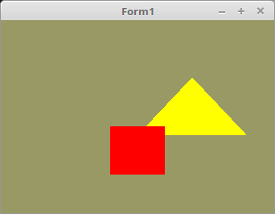

# 02 - Shader
## 15 - Erste Bewegung



Ohne Bewegung ist OpenGL langweilig.
Hier werden dem Shader ein X- und ein Y-Wert übergeben. Diese Werte werden mit einem Timer verändert.
Damit die Änderung auch sichtbar wird, wird <b>DrawScene</b> danach manuell ausgelöst.
---
Hinzugekommen sind die Deklarationen der IDs für die X- und Y-Koordinaten.
<b>TrianglePos</b> bestimmt die Bewegung und Richtung des Dreiecks.

```pascal
var
  X_ID, Y_ID: GLint;      // ID für X und Y.
  Color_ID: GLint;

  TrianglePos: record
    x, y: GLfloat;        // Position
    xr, yr: boolean;      // Richtung
  end;
```

Den Timer immer erst nach dem Initialisieren starten!
Im Objektinspektor <b>muss</b> dessen Eigenschaft <b>Enable=(False)</b> sein!
Ansonsten ist ein SIGSEV vorprogrammiert, da Shader aktviert werden, die es noch gar nicht gibt.

```pascal
procedure TForm1.FormCreate(Sender: TObject);
begin
  ogc := TContext.Create(Self);
  ogc.OnPaint := @ogcDrawScene;

  CreateScene;
  InitScene;
  Timer1.Enabled := True;   // Timer starten
end;
```

Dieser Code wurde um zwei <b>UniformLocation</b>-Zeilen erweitert.
Diese ermitteln die IDs, wo sich <b>x</b> und <b>y</b> im Shader befinden.

```pascal
procedure TForm1.CreateScene;
begin
  Shader := TShader.Create([FileToStr('Vertexshader.glsl'), FileToStr('Fragmentshader.glsl')]);
  Shader.UseProgram;
  Color_ID := Shader.UniformLocation('Color');
  X_ID := Shader.UniformLocation('x'); // Ermittelt die ID von x.
  Y_ID := Shader.UniformLocation('y'); // Ermittelt die ID von y.
```

Hier werden die Uniform-Variablen x und y dem Shader übergeben.
Beim Dreieck sind das die Positions-Koordinaten.
Beim Quad ist es 0, 0 und somit bleibt das Quadrat stehen.
Mit <b>glUniform1f(...</b> kann man einen Float-Wert dem Shader übergeben.

```pascal
procedure TForm1.ogcDrawScene(Sender: TObject);
begin
  glClear(GL_COLOR_BUFFER_BIT);
  Shader.UseProgram;

  // Zeichne Dreieck
  glUniform3f(Color_ID, 1.0, 1.0, 0.0); // Gelb
  with TrianglePos do begin  // Beim Dreieck, die xy-Werte.
    glUniform1f(X_ID, x);
    glUniform1f(Y_ID, y);
  end;
  glBindVertexArray(VBTriangle.VAO);
  glDrawArrays(GL_TRIANGLES, 0, Length(Triangle) * 3);

  // Zeichne Quadrat
  glUniform3f(Color_ID, 1.0, 0.0, 0.0);  // Rot
  glUniform1f(X_ID, 0.0);  // Beim Quadrat keine Verschiebung, daher 0.0, 0.0 .
  glUniform1f(Y_ID, 0.0);
  glBindVertexArray(VBQuad.VAO);
  glDrawArrays(GL_TRIANGLES, 0, Length(Quad) * 3);
```

Den Timer vor dem Freigeben anhalten.

```pascal
procedure TForm1.FormDestroy(Sender: TObject);
begin
  Timer1.Enabled := False;
```

Im Timer wird die Position berechnet, so dass sich das Dreieck bewegt.
Anschliessend wird neu gezeichnet.

```pascal
procedure TForm1.Timer1Timer(Sender: TObject);
const
  stepx: GLfloat = 0.010;
  stepy: GLfloat = 0.0133;
begin
  with TrianglePos do begin
    if xr then begin
      x := x - stepx;
      if x &lt; -0.5 then begin
        xr := False;
      end;
    end else begin
      x := x + stepx;
      if x &gt; 0.5 then begin
        xr := True;
      end;
    end;
    if yr then begin
      y := y - stepy;
      if y &lt; -1.0 then begin
        yr := False;
      end;
    end else begin
      y := y + stepy;
      if y &gt; 0.3 then begin
        yr := True;
      end;
    end;
  end;
  ogcDrawScene(Sender);  // Neu zeichnen
end;
```

---
<b>Vertex-Shader:</b>

Hier sind die Uniform-Variablen <b>x</b> und <b>y</b> hinzugekommen.
Diese werden im Vertex-Shader deklariert. Bewegungen kommen immer in diesen Shader.

```glsl
#version 330

layout (location = 10) in vec3 inPos; // Vertex-Koordinaten
uniform float x;                      // Richtung von Uniform
uniform float y;
 
void main(void)
{
  vec3 pos;
  pos.x = inPos.x + x;
  pos.y = inPos.y + y;
  pos.z = inPos.z;
  gl_Position = vec4(pos, 1.0);
}

```

---
<b>Fragment-Shader:</b>

```glsl
#version 330

uniform vec3 Color;  // Farbe von Uniform
out vec4 outColor;   // ausgegebene Farbe

void main(void)
{
  outColor = vec4(Color, 1.0);
}

```


