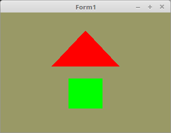

# 02 - Shader
## 20 - Mehrere Shader



Hier wird gezeigt, wie man mit mehreren Shader arbeitet. In diesem Beispiel sind es zwei.
Der Unterschied der beiden Shader ist, dass der eine das Mesh grün färbt, der andere rot.
Normalerweise würde man dies mit nur einem Shader über eine Uniform-Variable realisieren, jedoch geht es hier darum zu zeigen, wie man mehrere Shader verwendet.
---
In diesem Codeausschnitt sind die ersten beiden Zeilen interessant.
Hier werden die zwei Shader in die Grafikkarte geladen.

Der Vertex-Shader ist in beiden Shader-Programs der Gleiche, daher wird zwei mal die gleiche glsl-Datei geladen.

```pascal
procedure TForm1.CreateScene;
begin
  Shader[0] := TShader.Create([FileToStr('Vertexshader.glsl'), FileToStr('Fragmentshader0.glsl')]);
  Shader[1] := TShader.Create([FileToStr('Vertexshader.glsl'), FileToStr('Fragmentshader1.glsl')]);
```

Beim Zeichnen muss man jetzt tatsächlich mit <b>Shader[x].UseProgram(...</b> den Shader wählen, da mehr als ein Shader verwendet wird.
Die Meshes sollten nun zwei verschiedene Farben haben.

```pascal
  // Zeichne Dreieck
  Shader[0].UseProgram;  //  Shader 0 wählen  ( Rot )
  glBindVertexArray(VBTriangle.VAO);
  glDrawArrays(GL_TRIANGLES, 0, Length(Triangle) * 3);

  // Zeichne Quadrat
  Shader[1].UseProgram;  //  Shader 1 wählen  ( Grün )
  glBindVertexArray(VBQuad.VAO);
  glDrawArrays(GL_TRIANGLES, 0, Length(Quad) * 3);

```

Am Ende noch mit <b>Shader[x].Free</b> die Shader in der Grafikkarte wieder freigeben.

```pascal
procedure TForm1.FormDestroy(Sender: TObject);
begin
  Shader[0].Free;
  Shader[1].Free;
```

---
<b>Vertex-Shader:</b>
Der Vertex-Shader ist bei beiden Shader gleich.

```glsl
#version 330
layout (location = 10) in vec3 inPos;

void main(void)
{
  gl_Position = vec4(inPos, 1.0);
}

```

<b>Fragment-Shader 0:</b>

```glsl
#version 330

out vec4 outColor; // ausgegebene Farbe

void main(void)
{
  outColor = vec4(1.0, 0.0, 0.0, 1.0);  // Rot
}

```

<b>Fragment-Shader 1:</b>

```glsl
#version 330

out vec4 outColor; // ausgegebene Farbe

void main(void)
{
  outColor = vec4(0.0, 1.0, 0.0, 1.0);  // Grün
}

```

In der zweit letzten Zeile sieht man, dass man eine andere Farbe an den Ausgang übergibt.

