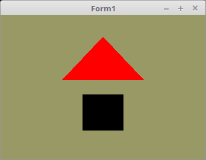

# 02 - Shader
## 25 - Schleifen

<br><br>
In GLSL gibt es auch Schleifen, im Beispiel wird eine <b>if-else</b>-Schleife gezeigt, welche die Mesh Rot oder Schwarz darstellt.
Es gibt auch <b>for</b> und <b>while-do</b>-Schleifen.
<b>case</b>-Verzweigungen gibt es auch, eigentlich alle, welche es in C++ auch gibt.
<hr><br>
Für die <b>if</b>-Abfrage im Beispiel wird ein Boolean verwendet, man kann aber auch Integer, Float, etc. verwenden.
Der ID, ist es egal, um welchen Unifom-Variablentyp es sich handelt, aus diesem Grund ist sie immer ein GLint.

```pascal
var
  rot_ID: GLint;      // ID für uniform "rot"
```

Der Location-Abfrage ist es gleich, was für ein Variablen-Typ die Uniform ist.
Das Ermitteln geht bei allen Typen gleich.

```pascal
procedure TForm1.CreateScene;
begin
  Shader := TShader.Create([FileToStr('Vertexshader.glsl'), FileToStr('Fragmentshader.glsl')]);
  Shader.UseProgram;
  rot_ID := Shader.UniformLocation('rot'); // Ermittelt die ID von "rot".
```

Mit <b>glUniform1i(...</b> wird der Boolean übergeben.
Ein Boolean, muss man als Integer übergeben.

```pascal
procedure TForm1.ogcDrawScene(Sender: TObject);
begin
  glClear(GL_COLOR_BUFFER_BIT);
  Shader.UseProgram;

  // Zeichne Dreieck
  glUniform1i(rot_ID, GLint(True));   // True = rot
  glBindVertexArray(VBTriangle.VAO);
  glDrawArrays(GL_TRIANGLES, 0, Length(Triangle) * 3);

  // Zeichne Quadrat
  glUniform1i(rot_ID, GLint(False));  // False = schwarz
  glBindVertexArray(VBQuad.VAO);
  glDrawArrays(GL_TRIANGLES, 0, Length(Quad) * 3);

  ogc.SwapBuffers;
end;
```

<hr><br>
<b>Vertex-Shader:</b>

```glsl
#version 330

layout (location = 10) in vec3 inPos; // Vertex-Koordinaten
 
void main(void)
{
  gl_Position = vec4(inPos, 1.0);
}

```

<hr><br>
<b>Fragment-Shader:</b>

Mit der Uniform-Variable "rot" wird ermittelt, ob die Mesh Rot oder schwarz ist.
Die Auswertung erfolgt über eine if-else-Schleife.

```glsl
#version 330

uniform bool rot;   // Ist es "rot" ?
out vec4 outColor;  // ausgegebene Farbe

void main(void)
{
  // Die if-Abfrage
  if (rot) {
    outColor = vec4(1.0, 0.0, 0.0, 1.0); // Rot
  } else {
    outColor = vec4(0.0, 0.0, 0.0, 1.0); // Schwarz
  }
}

```


