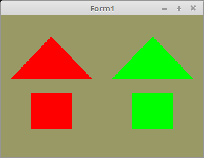

<!DOCTYPE html>
<html>
  <body bgcolor="#DDDDFF">
    <b><h1>02 - Shader</h1></b>
    <b><h2>30 - Geometrie Shader</h2></b>
  
Hier wird ganz kurz der Geometrie-Shader erwähnt. 
In diesem Beispiel wird nicht ins Detail eingegangen, es sollte nur zeigen für was ein Geometrie-Shader gut ist. 
Die Funktion hier im Beispiel ist, die beiden Meshes werden kopiert und anschliessend nach Links und Rechts verschoben. 
Auch bekommt die Linke Version eine andere Farbe als die Rechte. 
 
Man kann einen Geometrie-Shader auch brauchen um automatisch die Normale auszurechnen, welche für Beleuchtungs-Effekte gebraucht wird. 
Was eine Normale ist, wird später im Kapitel Beleuchtung erklärt. 
 
Der Lazarus-Code ist nichts besonderes, er rendert die üblichen zwei Meshes Dreieck und Quadrat. 
Die einzige Besondeheit ist, es wird zu den üblichen zwei Shader noch ein Geometrie-Shader geladen wird. 

 
Hier ist die einzige Besonderheit, dem Constructor von TShader wird ein dritter Shader-Code mitgegeben. 
 
Wen man bei der Shader-Klasse einen dritten Shader mit gibt, wird automatisch erkannt, das noch ein Geometrie-Shader dazu kommt. 
<pre><code>procedure TForm1.CreateScene;
begin
  Shader := TShader.Create([FileToStr('Vertexshader.glsl'), FileToStr('Geometrieshader.glsl'), FileToStr('Fragmentshader.glsl')]);
  Shader.UseProgram;</pre></code>

 
<b>Vertex-Shader:</b> 
<pre><code>#version 330

layout (location = 10) in vec3 inPos; // Vertex-Koordinaten
 
void main(void)
{
  gl_Position = vec4(inPos, 1.0);
}
</pre></code>

 
<b>Geometrie-Shader:</b> 
<pre><code>#version 330

#define distance 0.5

layout(triangles) in;
layout(triangle_strip, max_vertices = 9) out;

out vec3 Color; // Farb-Ausgabe für den Fragment-Shader 

void main(void)
{

// Linke Meshes
   for(int i = 0; i < gl_in.length(); i++)
   {
      gl_Position = gl_in[i].gl_Position + vec4(-distance, 0.0, 0.0, 0.0); // nach Links verschieben
      Color = vec3(1.0, 0.0, 0.0);                                         // Links Rot
      EmitVertex();
   }
   EndPrimitive();

// Rechte Meshes
   for(int i = 0; i < gl_in.length(); i++)
   {
      gl_Position = gl_in[i].gl_Position + vec4(distance, 0.0, 0.0, 0.0);  // nach Rechts verschieben
      Color = vec3(0.0, 1.0, 0.0);                                         // Rechts Grün
      EmitVertex();
   }
   EndPrimitive();
}
</pre></code>

 
<b>Fragment-Shader</b> 
<pre><code>#version 330

in vec3 Color;      // Farbe vom Geometrie-Shader.
out vec4 outColor;  // Ausgegebene Farbe.

void main(void)
{
  outColor = vec4(Color, 0.1);
}
</pre></code>

       
<h2><a href="../../index.html">zurück</a></h2>
  </body>
</html>
