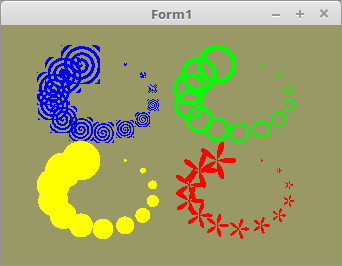

  
Man kann auch Punkte mit dem Shader darstellen, dies kann man auf verschiedene Weise. 
Im Fragment-Shader kann man das Zeichen der Punkte manipulieren. 

 
Die Deklaration der Koordianten und Punktgrösse. 
<pre><code><b>var</b>
  Point: <b>array</b> <b>of</b> TVertex2f;
  PointSize: <b>array</b> <b>of</b> GLfloat;</pre></code>
Daten für die Punkte in die Grafikkarte übertragen 
<pre><code><b>procedure</b> TForm1.InitScene;
<b>begin</b>
  glClearColor(0.6, 0.6, 0.4, 1.0); <i>// Hintergrundfarbe</i>

  <i>// Daten für Punkt Position</i>
  glBindVertexArray(VBPoint.VAO);
  glBindBuffer(GL_ARRAY_BUFFER, VBPoint.VBO);
  glBufferData(GL_ARRAY_BUFFER, sizeof(TVertex2f) * Length(Point), Pointer(Point), GL_STATIC_DRAW);
  glEnableVertexAttribArray(10);
  glVertexAttribPointer(10, 2, GL_FLOAT, <b>False</b>, 0, <b>nil</b>);

  <i>// Daten für Punkt Grösse</i>
  glBindVertexArray(VBPoint.VAO);
  glBindBuffer(GL_ARRAY_BUFFER, VBPoint.VBO_Size);
  glBufferData(GL_ARRAY_BUFFER, sizeof(GLfloat) * Length(PointSize), Pointer(PointSize), GL_STATIC_DRAW);
  glEnableVertexAttribArray(11);
  glVertexAttribPointer(11, 1, GL_FLOAT, <b>False</b>, 0, <b>nil</b>);
<b>end</b>;</pre></code>
Zeichnen der Punkte 
<pre><code><b>procedure</b> TForm1.ogcDrawScene(Sender: TObject);
<b>const</b>
  ofs = 0.4;
<b>begin</b>
  glEnable(GL_PROGRAM_POINT_SIZE);

  glClear(GL_COLOR_BUFFER_BIT);
  Shader.UseProgram;

  glBindVertexArray(VBPoint.VAO);
  <i>// gelb</i>
  glUniform1i(PointTyp_ID, 0);
  glUniform3f(Color_ID, 1.0, 1.0, 0.0);
  glUniform1f(X_ID, -ofs);
  glUniform1f(Y_ID, -ofs);
  glDrawArrays(GL_POINTS, 0, Length(Point));

  <i>// rot</i>
  glUniform1i(PointTyp_ID, 1);
  glUniform3f(Color_ID, 1.0, 0.0, 0.0);
  glUniform1f(X_ID, ofs);
  glUniform1f(Y_ID, -ofs);
  glDrawArrays(GL_POINTS, 0, Length(Point));

  <i>// grün</i>
  glUniform1i(PointTyp_ID, 2);
  glUniform3f(Color_ID, 0.0, 1.0, 0.0);
  glUniform1f(X_ID, ofs);
  glUniform1f(Y_ID, ofs);
  glDrawArrays(GL_POINTS, 0, Length(Point));

  <i>// blau</i>
  glUniform1i(PointTyp_ID, 3);
  glUniform3f(Color_ID, 0.0, 0.0, 1.0);
  glUniform1f(X_ID, -ofs);
  glUniform1f(Y_ID, ofs);
  glDrawArrays(GL_POINTS, 0, Length(Point));

  ogc.SwapBuffers;
<b>end</b>;</pre></code>

 
<b>Vertex-Shader:</b> 
<pre><code><b>#version</b> 330

<b>layout</b> (location = 10) <b>in</b> <b>vec2</b>  inPos;  <i>// Vertex-Koordinaten in 2D</i>
<b>layout</b> (location = 11) <b>in</b> <b>float</b> inSize; <i>// Vertex-Koordinaten in 2D</i>
<b>uniform</b> <b>float</b> x;                        <i>// Richtung von Uniform</i>
<b>uniform</b> <b>float</b> y;
 
<b>void</b> main(<b>void</b>)
{
  <b>vec2</b> pos = inPos;
  pos.x = pos.x + x;
  pos.y = pos.y + y;
  gl_PointSize = inSize;
  gl_Position  = <b>vec4</b>(pos, 0.0, 1.0);   <i>// Der zweiter Parameter (Z) auf 0.0</i>
}
</pre></code>

 
<b>Fragment-Shader:</b> 
<pre><code><b>#version</b> 330

<b>uniform</b> <b>vec3</b> Color  ;  <i>// Farbe von Uniform</i>
<b>out</b>     <b>vec4</b> outColor; <i>// ausgegebene Farbe</i>

<b>uniform</b> <b>int</b> PointTyp;

<b>void</b> main(<b>void</b>)
{
  <b>vec2</b>  p = gl_PointCoord * 2.0 - <b>vec2</b>(1.0);
  <b>float</b> r = sqrt(dot(p, p));

  <b>float</b> theta = atan(p.y, p.x);

  <b>switch</b> (PointTyp){
    <b>case</b> 0: <b>if</b>(dot(gl_PointCoord - 0.5, gl_PointCoord - 0.5) > 0.25)
              <b>discard</b>;
            <b>else</b>
              outColor = <b>vec4</b>(Color, 1.0);
            <b>break</b>;
    <b>case</b> 1: <b>if</b>(dot(p, p) > cos(theta * 5))
              <b>discard</b>;
            <b>else</b>
              outColor = <b>vec4</b>(Color, 1.0);
            <b>break</b>;
    <b>case</b> 2: <b>if</b>(dot(p, p) > r || dot(p, p) < r * 0.75)
              <b>discard</b>;
            <b>else</b>
              outColor = <b>vec4</b>(Color, 1.0);
            <b>break</b>;
    <b>case</b> 3: <b>if</b>(dot(p, p) > 5.0 / cos(theta - 20 * r))
              <b>discard</b>;
            <b>else</b>
              outColor = <b>vec4</b>(Color, 1.0);
            <b>break</b>;
    <b>default</b>: <b>discard</b>;

  }
}
</pre></code>

