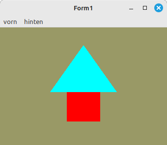

# 02 - Shader
## 37 - Teifenwert korrigieren



Man kann nachträglich den den Tiefenbuffer im Fragment-Shader korrigieren.

---

```pascal
procedure TForm1.CreateScene;
begin
  glEnable(GL_DEPTH_TEST);  // Tiefenprüfung einschalten.

  Shader := TShader.Create([FileToStr('Vertexshader.glsl'), FileToStr('Fragmentshader.glsl')]);
  Shader.UseProgram;
  Color_ID := Shader.UniformLocation('Color');
  ZTest_ID := Shader.UniformLocation('ZTest');
```

Hier sieht man, wie man den Tiefenwert des roten Rechtecks korrigiert.

```pascal
procedure TForm1.ogcDrawScene(Sender: TObject);
begin
  glClear(GL_COLOR_BUFFER_BIT or GL_DEPTH_BUFFER_BIT);  // Frame und Tiefen-Puffer löschen.

  Shader.UseProgram;

  // Zeichne Dreieck
  glUniform1f(ZTest_ID, 0.0);
  glUniform3f(Color_ID, 0.0, 1.0, 1.0);
  glBindVertexArray(VBTriangle.VAO);
  glDrawArrays(GL_TRIANGLES, 0, Length(Triangle) * 3);

  // Zeichne Quadrat
  glUniform1f(ZTest_ID, ZTest); // Tiefenwert korrigieren
  glUniform3f(Color_ID, 1.0, 0.0, 0.0);
  glBindVertexArray(VBQuad.VAO);
  glDrawArrays(GL_TRIANGLES, 0, Length(Quad) * 3);

  ogc.SwapBuffers;
end;

```

Der zu korrigierenden Teifenwert angeben.

```pascal
procedure TForm1.MenuItemClick(Sender: TObject);
begin
  case TMainMenu(Sender).Tag of
    0: begin
      ZTest := 0.1;
    end;
    1: begin
      ZTest := -0.1;
    end;
  end;
  ogc.Invalidate;   // Manuelle Aufruf von DrawScene.
end;

```


---
**Vertex-Shader:**

```glsl
#version 330

layout (location = 10) in vec3 inPos; // Vertex-Koordinaten

void main(void)
{
  gl_Position = vec4(inPos, 1.0);
}

```


---
**Fragment-Shader:**

Hier wird der Tiefenwert korrigiert.

```glsl
#version 330

uniform vec3 Color;  // Farbe von Uniform
uniform float ZTest;

out vec4 outColor;   // ausgegebene Farbe

void main(void)
{
  outColor = vec4(Color, 1.0);
  gl_FragDepth = gl_FragCoord.z + ZTest;  // Tiefenbuffer verändern
}

```


