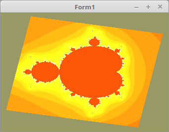

<!DOCTYPE html>
<html>
    <b><h1>02 - Shader</h1></b>
    <b><h2>40 - Shader Mandelbrot</h2></b>
  
Zum Schluss eine kleine Spielerei: Hier wird ein Mandelbrot im Shader (also auf der GPU) berechnet. 
Mit der CPU hatte ich noch keine so schnelle Berechnung hingekriegt, trotz Assembler. 
 
Anmerkung: Bei diesem Beispiel geht es nicht um mathematische Hintegründe, sondern es soll legentlich demonstrieren, das man mit Shader-Programs sehr komplexe Berechnungen machen kann. 
 
Der Lazarus-Code ist nichts besonderes, es wird nur ein Rechteck gerendert und anschliessend mit einer Matrix gedreht. Was eine Matrix ist, wird im Kapitel Matrix beschrieben. 
<b>Achtung:</b> Eine lahme Grafikkarte kann bei Vollbild ins Stockern kommen. 
Zur Beschleunigung kann der Wert <b>#define depth 1000.0</b> im Fragment-Shader verkleinert werden. 

 
<b>Vertex-Shader:</b> 
<pre><code><b>#version</b> 330

<b>layout</b> (location = 10) <b>in</b> <b>vec3</b> inPos;   <i>// Vertex-Koordinaten</i>

<b>uniform</b> <b>mat4</b> mat;

<b>out</b> <b>vec2</b> pos;                           <i>// Koordinaten für den Fragment-Shader</i>

<b>void</b> main(<b>void</b>) {
  gl_Position = mat * <b>vec4</b>(inPos, 1.0);
  pos = gl_Position.xy;                 <i>// XY an Fragment-Shader</i>
}
</pre></code>

 
<b>Fragment-Shader:</b> 
 
Hier steckt die ganze Berechnung für das Mandelbrot. 
<pre><code><b>#version</b> 330
<b>#define</b> depth 1000.0

<b>in</b> <b>vec2</b> pos;       <i>// Interpolierte Koordinaten vom Vertex-Shader</i>

<b>uniform</b> <b>float</b> col; <i>// Start-Wert, für Farben-Spielerei</i>

<b>out</b> <b>vec4</b> outColor;

<b>void</b> main(<b>void</b>) {
  <b>float</b> creal = pos.x * 1.5 - 0.3;
  <b>float</b> cimag = pos.y * 1.5;

  <b>float</b> Color = 0.0;
  <b>float</b> XPos  = 0.0;
  <b>float</b> YPos  = 0.0;

  <b>float</b> SqrX, SqrY;

  <b>do</b> {
    SqrX   = XPos * XPos;
    SqrY   = YPos * YPos;
    YPos   = XPos * YPos * 2 + cimag;
    XPos   = SqrX - SqrY + creal;
    Color += 1;
  } <b>while</b> (!((SqrX + SqrY > 8) || (Color > depth)));

  Color += col;

  <b>if</b> (Color > depth) {
    Color -= depth;
  }

  outColor = <b>vec4</b>(Color / 3, Color / 10 , Color / 100, 1.0);
}
</pre></code>

</html>
