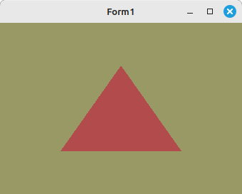

# 02 - Shader
## 42 - Vertex in Shader



Es besteht auch die Möglichkeit, die Vertex-Koordinaten direkt als Konstante im Vertex-Shader zu definieren.
Dies ist ideal für kleine Mesh, zB. für einen GLSL-Demo.

---

```pascal
procedure TForm1.ogcDrawScene(Sender: TObject);
begin
  glClear(GL_COLOR_BUFFER_BIT);
  Shader.UseProgram;

  // Zeichne Dreieck
  glBindVertexArray(VBTriangle.VAO);
  glDrawArrays(GL_TRIANGLES, 0, 3);

  ogc.SwapBuffers;
end;

```


---
**Vertex-Shader:**
Die Koordinaten von der Mesh sind direkt im Vertex-Shader.

```glsl
#version 330

const vec4 vertices[] = vec4[](
  vec4( 0.50, -0.50, 0.75, 1.0),
  vec4(-0.50, -0.50, 0.75, 1.0),
  vec4( 0.00, 0.50, 0.75, 1.0));

void main(void) {

  gl_Position = vertices[gl_VertexID];
}

```


---
**Fragment-Shader:**

```glsl
#version 330

out vec4 outColor;

void main(void)
{
  outColor = vec4(0.7, 0.3, 0.3, 1.0);
}

```


