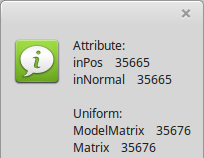

<html>
    <b><h1>02 - Shader</h1></b>
    <b><h2>45 - Variablen Namen auslesen</h2></b>
  
Es ist auch möglich aus dem <b>Shader auszulesen</b>, welche Variablen dort verwendet werden. 
In diesem Beispiel werden <b>Attribut</b>, <b>Uniform</b> und <b>Uniform-Blöcke</b> ausgelesen. 
Für was man <b>Uniform-Blöcke</b> verwendet, wird in einem späteren Kapitel behandelt. 
Auch die Beleuchtung, etc. wird später behandelt. 

 
Mit <b>glGetProgramiv(...</b> wird ermittelt, wie viele Variablen dieses Typen hat. 
Mit <b>glGetActiveAttrib(...</b> wird der Bezeichner der Variable ausgelesen. Typ gibt die Art der Variable an, zB. <b>vec3</b>, <b>mat4</b>, etc. 
Der komplexe Beleuchtungs-Shader wird später beschrieben. 
<pre><code><b>procedure</b> TForm1.MenuItem1Click(Sender: TObject);
<b>var</b>
  s: ansistring;
  i, Count, len, size, Typ: integer;
  sl: TStringList;

<b>begin</b>
  sl := TStringList.Create;

  sl.Add('Attribute:');
  SetLength(s, 255);
  glGetProgramiv(Shader.ID, GL_ACTIVE_ATTRIBUTES, @Count);
  <b>for</b> i := 0 <b>to</b> Count - 1 <b>do</b> <b>begin</b>
    glGetActiveAttrib(Shader.ID, i, 255, len, size, Typ, @s[1]);
    sl.Add(copy(s, 0, len) + '    ' + IntToStr(Typ));
  <b>end</b>;
  sl.Add('');

  sl.Add('Uniform:');
  glGetProgramiv(Shader.ID, GL_ACTIVE_UNIFORMS, @Count);
  <b>for</b> i := 0 <b>to</b> Count - 1 <b>do</b> <b>begin</b>
    glGetActiveUniform(Shader.ID, i, 255, len, size, Typ, @s[1]);
    sl.Add(copy(s, 0, len) + '    ' + IntToStr(Typ));
  <b>end</b>;
  sl.Add('');

  sl.Add('Uniform-Blöcke:');
  glGetProgramiv(Shader.ID, GL_ACTIVE_UNIFORM_BLOCKS, @Count);
  <b>for</b> i := 0 <b>to</b> Count - 1 <b>do</b> <b>begin</b>
    glGetActiveUniformBlockName(Shader.ID, i, 255, @len, @s[1]);
    sl.Add(copy(s, 0, len) + '    ' + IntToStr(Typ));
  <b>end</b>;

  ShowMessage(sl.Text);
  sl.Free;
<b>end</b>;</code></pre>

 
Hier wurde noch eine Variable <b>KeineVerwendung</b> deklariert, da diese von Compiler wegoptimiert wurde, wird so auch nicht aufgelistet. 
 
<b>Vertex-Shader:</b> 
<pre><code><b>#version</b> 330

<i>// Attribute</i>
<b>layout</b> (location = 0) <b>in</b> <b>vec3</b> inPos;    <i>// Vertex-Koordinaten</i>
<b>layout</b> (location = 1) <b>in</b> <b>vec3</b> inNormal; <i>// Normale</i>

<i>// Uniform-Variablen</i>
<b>uniform</b> <b>mat4</b> ModelMatrix;
<b>uniform</b> <b>mat4</b> Matrix;
<b>uniform</b> <b>vec4</b> KeineVerwendung; <i>// Wird nicht angezeigt, da nicht verwendet.</i>

<i>// Daten für Fragment-shader</i>
<b>out</b> Data {
  <b>vec3</b> Pos;
  <b>vec3</b> Normal;
} DataOut;

<b>void</b> main(<b>void</b>)
{
  gl_Position    = Matrix * <b>vec4</b>(inPos, 1.0);

  DataOut.Normal = <b>mat3</b>(ModelMatrix) * inNormal;
  DataOut.Pos    = (ModelMatrix * <b>vec4</b>(inPos, 1.0)).xyz;
}
</code></pre>

 
<b>Fragment-Shader</b> 
<pre><code><b>#version</b> 330

<i>// Licht</i>
<b>#define</b> Lposition  <b>vec3</b>(35.0, 17.5, 35.0)
<b>#define</b> Lambient   <b>vec3</b>(1.8, 1.8, 1.8)
<b>#define</b> Ldiffuse   <b>vec3</b>(1.5, 1.5, 1.5)

<b>in</b> Data {
  <b>vec3</b> Pos;
  <b>vec3</b> Normal;
} DataIn;

<i>// Der Uniform-Block</i>
<b>layout</b>(std140) <b>uniform</b> Material {
  <b>vec3</b>  Mambient;   <i>// Umgebungslicht</i>
  <b>vec3</b>  Mdiffuse;   <i>// Farbe</i>
  <b>vec3</b>  Mspecular;  <i>// Spiegelnd</i>
  <b>float</b> Mshininess; <i>// Glanz</i>
};

<b>out</b> <b>vec4</b> outColor;

<b>vec3</b> Light(<b>in</b> <b>vec3</b> p, <b>in</b> <b>vec3</b> n) {
  <b>vec3</b> nn = normalize(n);
  <b>vec3</b> np = normalize(p);
  <b>vec3</b> diffuse;   <i>// Licht</i>
  <b>vec3</b> specular;  <i>// Reflektion</i>
  <b>float</b> angele = max(dot(nn, np), 0.0);
  <b>if</b> (angele &gt; 0.0) {
    <b>vec3</b> eye = normalize(np + <b>vec3</b>(0.0, 0.0, 1.0));
    specular = pow(max(dot(eye, nn), 0.0), Mshininess) * Mspecular;
    diffuse  = angele * Mdiffuse * Ldiffuse;
  } <b>else</b> {
    specular = <b>vec3</b>(0.0);
    diffuse  = <b>vec3</b>(0.0);
  }
  <b>return</b> (Mambient * Lambient) + diffuse + specular;
}

<b>void</b> main(<b>void</b>)
{
  outColor = <b>vec4</b>(Light(Lposition - DataIn.Pos, DataIn.Normal), 1.0);
}

</code></pre>

</html>
