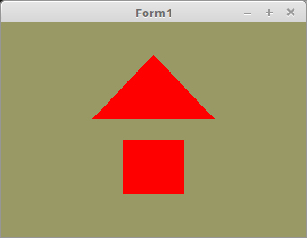

<!DOCTYPE html>
<html>
  <body bgcolor="#DDDDFF">
    <b><h1>03 - Vertex-Puffer</h1></b>
    <b><h2>00 - Einfachster Vertex-Puffer</h2></b>
  

 
Die Deklaration der Vektor-Koordianten Konstanten. 
<pre><code>const
  // Dreieck
  Triangle: array[0..0] of TFace =
    (((-0.4, 0.1, 0.0), (0.4, 0.1, 0.0), (0.0, 0.7, 0.0)));

  // Quadrat
  Quad: array[0..1] of TFace =
    (((-0.2, -0.6, 0.0), (-0.2, -0.1, 0.0), (0.2, -0.1, 0.0)),
    ((-0.2, -0.6, 0.0), (0.2, -0.1, 0.0), (0.2, -0.6, 0.0)));</pre></code>
Hier werden die Daten in die Grafikkarte geschrieben. 
Es hat nichts besonderes. 
<pre><code>procedure TForm1.InitScene;
begin
  glClearColor(0.6, 0.6, 0.4, 1.0); // Hintergrundfarbe

  // Daten für das Dreieck
  glBindVertexArray(VBTriangle.VAO);
  glBindBuffer(GL_ARRAY_BUFFER, VBTriangle.VBO);
  glBufferData(GL_ARRAY_BUFFER, sizeof(Triangle), @Triangle, GL_STATIC_DRAW);
  glEnableVertexAttribArray(10);
  glVertexAttribPointer(10, 3, GL_FLOAT, False, 0, nil);

  // Daten für das Quadrat
  glBindVertexArray(VBQuad.VAO);
  glBindBuffer(GL_ARRAY_BUFFER, VBQuad.VBO);
  glBufferData(GL_ARRAY_BUFFER, sizeof(Quad), @Quad, GL_STATIC_DRAW);
  glEnableVertexAttribArray(10);
  glVertexAttribPointer(10, 3, GL_FLOAT, False, 0, nil);
end;</pre></code>
Bei <b>glDrawArrays(...</b> ist der erste Parameter das wichtigste, hier wird angegeben, wie die Vektor-Koordinaten gezeichnet werden. 
Hier im Beispiel, sind dies einfache Dreiecke. 
<pre><code>procedure TForm1.ogcDrawScene(Sender: TObject);
begin
  glClear(GL_COLOR_BUFFER_BIT);
  Shader.UseProgram;

  // Zeichne Dreieck
  glBindVertexArray(VBTriangle.VAO);
  glDrawArrays(GL_TRIANGLES, 0, Length(Triangle) * 3);

  // Zeichne Quadrat
  glBindVertexArray(VBQuad.VAO);
  glDrawArrays(GL_TRIANGLES, 0, Length(Quad) * 3);</pre></code>

 
<b>Vertex-Shader:</b> 
 
<pre><code>#version 330

layout (location = 10) in vec3 inPos; // Vertex-Koordinaten

void main(void)
{
  gl_Position = vec4(inPos, 1.0);
}
</pre></code>

 
<b>Fragment-Shader:</b> 
<pre><code>#version 330

out vec4 outColor;   // ausgegebene Farbe

void main(void)
{
  vec3 col = vec3(1.0, 0.0, 0.0);
  outColor = vec4(col, 1.0);
}
</pre></code>

       
<h2><a href="../../index.html">zurück</a></h2>
  </body>
</html>
