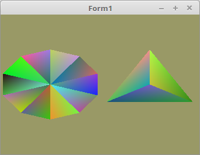

<!DOCTYPE html>
<html>
  <body bgcolor="#DDDDFF">
    <b><h1>03 - Vertex-Puffer</h1></b>
    <b><h2>20 - Vertex-Daten zur Laufzeit modifizieren</h2></b>
  
Bis jetzt waren die Vertexdaten immer statisch. Man kann diese aber auch zur Laufzeit neu in den Vertex-Puffer schreiben. 
 
Da sich nicht nur die Koordinaten ändern, sondern auch die grösse des Mesh, muss die TFaceArray eine <b>dynamische</b> Array sein. 
Zur Demonstration, werden alle 1/2 Sekunden neue Vertex-Daten geladen. 
Dafür habe ich einen Kreis gewählt, der zufällig jedes mal eine andere Anzahl Sektoren bekommt. Die Farben der Vektoren werden auch zufällig erzeugt. 

 
Zusätzlich ist noch eine <b>TFaceArray</b> hinzugekommen. 
Das sieht man, das die <b>TFaceArray</b> für das Mesh dynamisch ist. 
 
Für die einzelnen Meshes gibt es nun einen Record, welcher mit <b>size</b> die Grösse der TFace-Array speichert. 
Auch habe ich die Objekt-Namen von <b>VBO</b> und <b>VAO</b> in den Record genommen. 
<b>size</b> ist erforderlich, weil ich die Arraygrösse im RAM auf Null setzte. Sobald die Vertex-Daten sich im VRAM befinden, werden die Daten im RAM nicht mehr gebraucht. 
Bei einem sehr grossen Mesh kann man damit kostbares RAM sparen. 
<pre><code>type
  TVertex3f = array[0..2] of GLfloat;
  TFace = array[0..2] of TVertex3f;
  TFaceArray = array of TFace;       // neu

  TMesh = record                     // Record für die Mesh-Daten, welcher auch size enthält.
    Vector, Color: TFaceArray;       // Vertex-Daten.
    size: integer;                   // Die Grösse der Vertex-Daten.
    VBuffer: TVB;                    // VBO und VAO der Mesh.
  end;</pre></code>
Deklaration der beiden Meshes. Ich habe bewusst die Meshes in ein Array genommen. 
Somit kann man vieles mit einer For-To-Schleife machen. Was den Vorteil hat, wen man mehrere Meshes hat, man erspart sich viel Tipparbeit. 
<pre><code>var
  CircleMesh: array[0..1] of TMesh;</pre></code>
Mit dieser Funktion werden neue Vertex-Daten berechnet. 
Es wird ein Kreis mit zufälliger Anzahl Sektoren erzeugt, somit hat man unterschiedlich lange Vertex-Daten. 
Mit <b>ofsx</b> wird das Mesh in der X-Achse verschoben. 
<pre><code>procedure TForm1.CreateVertex(var Mesh: TMesh; ofsx: GLfloat);
const
  r = 0.5;  // Radius des Kreises.
var
  i, j: integer;
begin
  with Mesh do begin
    size := Random(maxSektor - 3) + 3;
    SetLength(Vector, size);
    SetLength(Color, size);
    for i := 0 to size - 1 do begin
      for j := 0 to 2 do begin
        Color[i, j, 0] := Random();
        Color[i, j, 1] := Random();
        Color[i, j, 2] := Random();
      end;

      Vector[i, 0, 0] := ofsx;
      Vector[i, 0, 1] := 0;
      Vector[i, 0, 2] := 0;

      Vector[i, 1, 0] := sin(Pi * 2 / size * i) * r + ofsx;
      Vector[i, 1, 1] := cos(Pi * 2 / size * i) * r;
      Vector[i, 1, 2] := 0;

      Vector[i, 2, 0] := sin(Pi * 2 / size * (i + 1)) * r + ofsx;
      Vector[i, 2, 1] := cos(Pi * 2 / size * (i + 1)) * r;
      Vector[i, 2, 2] := 0;
    end;
  end;
end;</pre></code>
Hier werden schon mal die ersten Vertex-Daten erzeugt. 
Später werden neue Daten in einem Timer erzeugt. 
Mit UpdateScene werden sie dann in das VRAM geladen. 
<pre><code>procedure TForm1.FormCreate(Sender: TObject);
begin
  ogc := TContext.Create(Self);
  ogc.OnPaint := @ogcDrawScene;

  Randomize;

  CreateScene;

  CreateVertex(CircleMesh[0], 0.5);   // Vertex-Daten erzeugen.
  CreateVertex(CircleMesh[1], -0.5);

  UpdateScene(0);                     // Vertex-Daten in VRAM schreiben.
  UpdateScene(1);                     // Vertex-Daten in VRAM schreiben.
  Timer1.Enabled := True;
end;</pre></code>
Das Anlegen der Puffer geht mit einer Schleife viel einfacher. 
Bei den zwei Meshes wie bei diesem Beispiel hier, sind die Ersparnisse nicht so gross, aber will man zB. 20 Kreise darstellen, sieht dies schon viel anders aus. 
 
Da die Vertex-Daten erst zur Laufzeit geladen/geändert werden, wird mit <b>glBufferData(...</b> nur der Speicher dafür reserviert. 
 
Auch ist der zweite Parameter (size) etwas anders angegeben, wen man nur SizeOf(Array) macht, würden nur 4Byte zurückgeliefert (Die grösse des Zeigers der Array). 
<pre><code>procedure TForm1.CreateScene;
var
  i: integer;
begin
  Shader := TShader.Create([FileToStr('Vertexshader.glsl'), FileToStr('Fragmentshader.glsl')]);
  Shader.UseProgram;

  for i := 0 to Length(CircleMesh) - 1 do begin
    with CircleMesh[i] do begin
      glGenVertexArrays(1, @VBuffer.VAO);
      glGenBuffers(1, @VBuffer.VBOvert);
      glGenBuffers(1, @VBuffer.VBOcol);

      glBindVertexArray(VBuffer.VAO);

      // Vektor
      glBindBuffer(GL_ARRAY_BUFFER, VBuffer.VBOvert);
      glBufferData(GL_ARRAY_BUFFER, sizeof(TFace) * maxSektor, nil, GL_DYNAMIC_DRAW); // Nur Speicher reservieren.
      glEnableVertexAttribArray(10);
      glVertexAttribPointer(10, 3, GL_FLOAT, False, 0, nil);

      // Farbe
      glBindBuffer(GL_ARRAY_BUFFER, VBuffer.VBOcol);
      glBufferData(GL_ARRAY_BUFFER, sizeof(TFace) * maxSektor, nil, GL_DYNAMIC_DRAW);
      glEnableVertexAttribArray(11);
      glVertexAttribPointer(11, 3, GL_FLOAT, False, 0, nil);
    end;
  end;
end;</pre></code>
Da der Speicher im VRAM schon reserviert ist, kann man mit <b>glBufferSubData(...</b> nur noch die Vertex-Daten in das VRAM schreiben/ersetzen. 
 
Nach dem schreiben ins VRAM , kann mit <b>SetLength(...</b> die Daten im RAM entfernt werden. 
Wen die Daten einmal im VRAM sind, werden sie im RAM nicht mehr gebraucht. 
 
Der Zeiger auf die Vertex-Daten, bei <b>glBufferSubData(...</b> hat sich ein wenig verändert. 
Anstelle von <b>@</b> muss man bei einer dynamischen Array mit <b>Pointer</b> arbeiten. 
Auch wen man mit <b>glBufferData(...</b> schreiben würden muss man es bei der dynamischen Array so machen. 
Ansonsten wird der Zeiger der Array übergeben, anstelle der Daten selbst, da die Array selbst nur ein Zeiger auf die Daten ist. 
 
Mit <b>MeshNr</b> wird die Mesh angegben, welche neu in das VRAM kopiert werden soll. 
<pre><code>procedure TForm1.UpdateScene(MeshNr: integer);
var
  i: integer;
begin
  glClearColor(0.6, 0.6, 0.4, 1.0);

  with CircleMesh[MeshNr] do begin
    glBindVertexArray(VBuffer.VAO);

    // Vektor
    glBindBuffer(GL_ARRAY_BUFFER, VBuffer.VBOvert);
    glBufferSubData(GL_ARRAY_BUFFER, 0, sizeof(TFace) * size, Pointer(Vector)); // Daten ins VRAM schreiben.
    SetLength(Vector, 0);                                                       // Daten im RAM entfernen.

    // Farbe
    glBindBuffer(GL_ARRAY_BUFFER, VBuffer.VBOcol);
    glBufferSubData(GL_ARRAY_BUFFER, 0, sizeof(TFace) * size, Pointer(Color));
    SetLength(Color, 0);
  end;
end;</pre></code>
Das Zeichen ist nichts besonderes, ausser das es jetzt mit einer Schleife läuft. 
<pre><code>// Zeichne Kreise
  for i := 0 to Length(CircleMesh) - 1 do begin
    with CircleMesh[i] do begin
      glBindVertexArray(VBuffer.VAO);
      glDrawArrays(GL_TRIANGLES, 0, size * 3);
    end;
  end;</pre></code>
Mit einem Timer werden alle 1/2 Sekunden neue Vertex-Daten erzeugt und in das VRAM geladen. 
<pre><code>procedure TForm1.Timer1Timer(Sender: TObject);
const
  za: integer = 0;
begin
  Inc(za);
  if za = 5 then begin                    // Mesh 0 neu erzeugen und laden
    CreateVertex(CircleMesh[0], 0.5);
    UpdateScene(0);                       // Daten mit dem VAO 0 binden.
    ogc.Invalidate;                       // Neu zeichnen.
  end else if za = 10 then begin          // Mesh 1 neu erzeugen und laden
    CreateVertex(CircleMesh[1], -0.5);
    UpdateScene(1);                       // Daten mit dem VAO 1 binden
    ogc.Invalidate;                       // Neu zeichnen.
    za := 0;
  end;
end;</pre></code>

 
Bei den Shadern gibt es nichts besonders. 
 
<b>Vertex-Shader:</b> 
<pre><code>#version 330

layout (location = 10) in vec3 inPos; // Vertex-Koordinaten
layout (location = 11) in vec3 inCol; // Farbe

out vec4 Color;                       // Farbe, an Fragment-Shader übergeben

void main(void)
{
  gl_Position = vec4(inPos, 1.0);
  Color = vec4(inCol, 1.0);
}
</pre></code>

 
<b>Fragment-Shader:</b> 
<pre><code>#version 330

in vec4 Color;      // interpolierte Farbe vom Vertexshader
out vec4 outColor;  // ausgegebene Farbe

void main(void)
{
  outColor = Color; // Die Ausgabe der Farbe
}
</pre></code>

       
<h2><a href="../../index.html">zurück</a></h2>
  </body>
</html>
