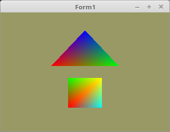

# 03 - Vertex-Puffer
## 22 - 2 Vertex Puffer 1 VBO



Man kann auch mehrer Vector-Daten in einem VBO verwalten.

---
Es wird nur ein VBO benötigt.

```pascal
  glGenVertexArrays(1, @VBTriangle.VAO);
  glGenVertexArrays(1, @VBQuad.VAO);

  glGenBuffers(1, @VBTriangle.VBO);
  glGenBuffers(1, @VBQuad.VBO);
```

Es wird nur ein VBO beladen.
Dafür müssen die Daten nachträglich und gesplitten mit **glBufferSubData** hochgeladen werden.

```pascal
procedure TForm1.InitScene;
begin
  glClearColor(0.6, 0.6, 0.4, 1.0); // Hintergrundfarbe

  // --- Daten für Dreieck
  glBindVertexArray(VBTriangle.VAO);

  glBindBuffer(GL_ARRAY_BUFFER, VBTriangle.VBO);
  glBufferData(GL_ARRAY_BUFFER, Length(TriangleVector) * (sizeof(TFace) + sizeof(TFace)), nil, GL_DYNAMIC_DRAW);

  // Vektor
  glBufferSubData(GL_ARRAY_BUFFER, 0, Length(TriangleVector) * sizeof(TFace), PFace(TriangleVector));
  glEnableVertexAttribArray(10);
  glVertexAttribPointer(10, 3, GL_FLOAT, GL_FALSE, 0, nil);

  // Farbe
  glBufferSubData(GL_ARRAY_BUFFER, Length(TriangleVector) * sizeof(TFace), Length(TriangleColor) * sizeof(TFace), PFace(TriangleColor));
  glEnableVertexAttribArray(11);
  glVertexAttribPointer(11, 3, GL_FLOAT, GL_FALSE, 0, Pointer(Length(TriangleVector) * sizeof(TFace)));

  // --- Daten für Quadrat
  glBindVertexArray(VBQuad.VAO);

  glBindBuffer(GL_ARRAY_BUFFER, VBQuad.VBO);
  glBufferData(GL_ARRAY_BUFFER, Length(QuadVector) * (sizeof(TFace) + sizeof(TFace)), nil, GL_DYNAMIC_DRAW);

  // Vektor
  glBufferSubData(GL_ARRAY_BUFFER, 0, Length(QuadVector) * sizeof(TFace), PFace(QuadVector));
  glEnableVertexAttribArray(10);
  glVertexAttribPointer(10, 3, GL_FLOAT, GL_FALSE, 0, nil);

  // Farbe
  glBufferSubData(GL_ARRAY_BUFFER, Length(QuadVector) * sizeof(TFace), Length(QuadColor) * sizeof(TFace), PFace(QuadColor));
  glEnableVertexAttribArray(11);
  glVertexAttribPointer(11, 3, GL_FLOAT, GL_FALSE, 0, Pointer(Length(QuadVector) * sizeof(TFace)));
end;
```


```pascal
  // Zeichne Dreieck
  glBindVertexArray(VBTriangle.VAO);
  glDrawArrays(GL_TRIANGLES, 0, Length(TriangleVector) * 3);

  // Zeichne Quadrat
  glBindVertexArray(VBQuad.VAO);
  glDrawArrays(GL_TRIANGLES, 0, Length(QuadVector) * 3);
```


```pascal
  glDeleteBuffers(1, @VBTriangle.VBO);
  glDeleteBuffers(1, @VBQuad.VBO);
```


---
**Vertex-Shader:**

```glsl
#version 330

layout (location = 10) in vec3 inPos; // Vertex-Koordinaten
layout (location = 11) in vec3 inCol; // Farbe

out vec4 Color;                       // Farbe, an Fragment-Shader übergeben

void main(void)
{
  gl_Position = vec4(inPos, 1.0);
  Color = vec4(inCol, 1.0);
}

```


---
**Fragment-Shader**

```glsl
#version 330

in vec4 Color;      // interpolierte Farbe vom Vertexshader
out vec4 outColor;  // ausgegebene Farbe

void main(void)
{
  outColor = Color; // Die Ausgabe der Farbe
}

```


