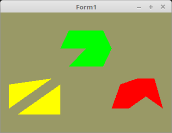

<html>
  
Bis jetzt wurde alles mit kompletten Dreiecken gerendert und gezeichnet. Es gibt aber noch zwei andere Varianten um Dreiecke zu rendern. 
Dies wurde beim Zeichnen mit <b>glDrawArrays(GL_TRIANGLES, ...</b> veranlasst. Diese Version wird in der Paraxis am meisten angewendet. 
Man kann die Dreiecke auch als Streifen hintereinander rendern, dies gerschieht mit <b>glDrawArrays(GL_TRIANGLES_STRIP, ...</b>. 
Oder wie ein Wedel, dabei ist der erste Vektor die Mitte, und der Rest die Eckpunkte. Dies geschieht dann mit <b>glDrawArrays(GL_TRIANGLES_FAN, ...</b>. 
 
Das schreiben in die Grafikkarte, ist bei allen Varianten gleich, der Unterschied ist legendlich beim Zeichenen mit <b>glDrawArrays(...</b>. 
 
Die Darstellung sieht folgendermassen aus: 
 
<b>GL_TRIANGLES</b> 
<pre><code>4 - 3     2
| /     / |
5     0 - 1</code></pre>
<b>GL_TRIANGLES_STRIP</b> 
<pre><code>  5 - 3 - 1
 / \ / \ / \
6 - 4 - 2 - 0</code></pre>
<b>GL_TRIANGLES_FAN</b> 
<pre><code>  5 - 4
 / \ / \
6 - 0 - 3
 \ / \ /
  1 - 2</code></pre>
 

 
Die Deklaration der Vektor-Koordianten Konstanten, zur Vereinfachung habe ich nur 2D-Vektoren genommen. Natürlich können diese auch 3D sein. 
<pre><code><b>const</b>
  <i>// Einfache Dreiecke        ( Gelb )</i>
  Triangles: <b>array</b>[0..5] <b>of</b> TVertex2f =
    ((0.1, 0.0), (0.6, 0.0), (0.6, 0.5), (0.5, 0.6), (0.0, 0.5), (0.0, 0.1));
  <i>// Dreicke als Band, Strip  ( Rot )</i>
  Triangle_Strip: <b>array</b>[0..6] <b>of</b> TVertex2f =
    ((0.6, 0.0), (0.5, 0.5), (0.4, 0.2), (0.3, 0.5), (0.2, 0.0), (0.1, 0.4), (0.0, 0.0));
  <i>// Dreiecke als Wedel, Fan  ( Grün )</i>
  Triangle_Fan: <b>array</b>[0..6] <b>of</b> TVertex2f =
    ((0.0, 0.0), (-0.2, -0.3), (0.2, -0.3), (0.3, 0.0), (0.2, 0.3), (-0.2, 0.3), (-0.3, 0.0));</code></pre>
Hier werden die Daten in die Grafikkarte geschrieben. 
Es hat nichts besonderes. 
<pre><code><b>procedure</b> TForm1.InitScene;
<b>begin</b>
  glClearColor(0.6, 0.6, 0.4, 1.0); <i>// Hintergrundfarbe</i>

  <i>// Daten für GL_TRIANGLE</i>
  glBindVertexArray(VBTriangles.VAO);
  glBindBuffer(GL_ARRAY_BUFFER, VBTriangles.VBO);
  glBufferData(GL_ARRAY_BUFFER, sizeof(Triangles), @Triangles, GL_STATIC_DRAW);
  glEnableVertexAttribArray(10);
  glVertexAttribPointer(10, 2, GL_FLOAT, <b>False</b>, 0, <b>nil</b>);

  <i>// Daten für GL_TRIANGLE_STRIP</i>
  glBindVertexArray(VBTriangle_Strip.VAO);
  glBindBuffer(GL_ARRAY_BUFFER, VBTriangle_Strip.VBO);
  glBufferData(GL_ARRAY_BUFFER, sizeof(Triangle_Strip), @Triangle_Strip, GL_STATIC_DRAW);
  glEnableVertexAttribArray(10);
  glVertexAttribPointer(10, 2, GL_FLOAT, <b>False</b>, 0, <b>nil</b>);

  <i>// Daten für GL_TRIANGLE_FAN</i>
  glBindVertexArray(VBTriangle_Fan.VAO);
  glBindBuffer(GL_ARRAY_BUFFER, VBTriangle_Fan.VBO);
  glBufferData(GL_ARRAY_BUFFER, sizeof(Triangle_Fan), @Triangle_Fan, GL_STATIC_DRAW);
  glEnableVertexAttribArray(10);
  glVertexAttribPointer(10, 2, GL_FLOAT, <b>False</b>, 0, <b>nil</b>);
<b>end</b>;</code></pre>
Bei <b>glDrawArrays(...</b> ist der erste Parameter das wichtigste, hier wird angegeben, wie die Vektor-Koordinaten gezeichnet werden. 
<pre><code><b>procedure</b> TForm1.ogcDrawScene(Sender: TObject);
<b>begin</b>
  glClear(GL_COLOR_BUFFER_BIT);
  Shader.UseProgram;

  <i>// Zeichne GL_TRIANGLE</i>
  glUniform3f(Color_ID, 1.0, 1.0, 0.0); <i>// Gelb</i>
  glUniform1f(X_ID, -0.9);
  glUniform1f(Y_ID, -0.7);
  glBindVertexArray(VBTriangles.VAO);
  glDrawArrays(GL_TRIANGLES, 0, Length(Triangles));

  <i>// Zeichne GL_TRIANGLE_STRIP</i>
  glUniform3f(Color_ID, 1.0, 0.0, 0.0);  <i>// Rot</i>
  glUniform1f(X_ID, 0.3);
  glUniform1f(Y_ID, -0.6);
  glBindVertexArray(VBTriangle_Strip.VAO);
  glDrawArrays(GL_TRIANGLE_STRIP, 0, Length(Triangle_Strip));

  <i>// Zeichne GL_TRIANGLE_FAN</i>
  glUniform3f(Color_ID, 0.0, 1.0, 0.0);  <i>// Grün</i>
  glUniform1f(X_ID, 0.0);
  glUniform1f(Y_ID, 0.4);
  glBindVertexArray(VBTriangle_Fan.VAO);
  glDrawArrays(GL_TRIANGLE_FAN, 0, Length(Triangle_Fan));</code></pre>

 
<b>Vertex-Shader:</b> 
 
Da die Koordinaten nur als 2D gespeichert sind, wird im Vertex-Shader der Z-Wert auf 0.0 gesetzt. 
<pre><code><b>#version</b> 330

<b>layout</b> (location = 10) <b>in</b> <b>vec2</b> inPos; <i>// Vertex-Koordinaten in 2D</i>
<b>uniform</b> <b>float</b> x;                      <i>// Richtung von Uniform</i>
<b>uniform</b> <b>float</b> y;
 
<b>void</b> main(<b>void</b>)
{
  <b>vec2</b> pos = inPos;
  pos.x = pos.x + x;
  pos.y = pos.y + y;
  gl_Position = <b>vec4</b>(pos, 0.0, 1.0);  <i>// Der zweiter Parameter (Z) auf 0.0</i>
}
</code></pre>

 
<b>Fragment-Shader:</b> 
<pre><code><b>#version</b> 330

<b>uniform</b> <b>vec3</b> Color;  <i>// Farbe von Uniform</i>
<b>out</b> <b>vec4</b> outColor;   <i>// ausgegebene Farbe</i>

<b>void</b> main(<b>void</b>)
{
  outColor = <b>vec4</b>(Color, 1.0);
}
</code></pre>

</html>
