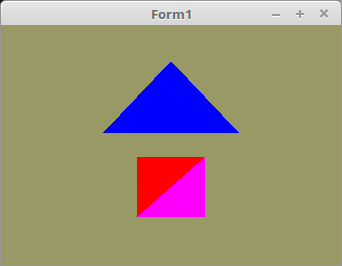

<html>
    <b><h1>03 - Vertex-Puffer</h1></b>
    <b><h2>35 - DrawArrays</h2></b>
  
Mit <b> glDrawArrays(...</b> muss man nicht die ganze Meshes auf einmal zeichnen, man kann auch nur ein Teil davon zeichnen. 
Hier im Beispiel, wir das Quadrat in zwei Teilen gezeichnet, so hat man die Möglichkeit zwischendurch zB. die Farbe zu ändern. 

 
Hier wird das Qudarat in zwei Teilen gezeichnet und zwischendurch die Uniform-Variable Color geändert. 
Dafür gibt es in <b>glDrawArrays(...</b> zwei Parameter. 
Der Zweite gibt das Offset der Vertex-Array an, und der Dritte, wie viele Vertex-Daten. 
Das erste Polygon, fängt bei 0 und ist 3 Vertex lang. 
Das zweite Polygon fängt bei 3 an und ist auch 3 Vertex lang. 
<pre><code><b>procedure</b> TForm1.ogcDrawScene(Sender: TObject);
<b>begin</b>
  glClear(GL_COLOR_BUFFER_BIT);
  Shader.UseProgram;

  <i>// Zeichne Dreieck</i>
  glBindVertexArray(VBTriangle.VAO);
  glUniform3f(Color_ID, 0.0, 0.0, 1.0);
  glDrawArrays(GL_TRIANGLES, 0, 3);

  <i>// Zeichne Quadrat</i>
  glBindVertexArray(VBQuad.VAO);
  glUniform3f(Color_ID, 1.0, 0.0, 0.0);  <i>// Farbe ändern</i>
  glDrawArrays(GL_TRIANGLES, 0, 3);      <i>// zweites Polygon</i>
  glUniform3f(Color_ID, 1.0, 0.0, 1.0);  <i>// Farbe ändern</i>
  glDrawArrays(GL_TRIANGLES, 3, 3);      <i>// zweites Polygon</i>

  ogc.SwapBuffers;
<b>end</b>;</code></pre>

 
<b>Vertex-Shader:</b> 
<pre><code><b>#version</b> 330

<b>layout</b> (location = 10) <b>in</b> <b>vec3</b> inPos; <i>// Vertex-Koordinaten</i>
 
<b>void</b> main(<b>void</b>)
{
  gl_Position = <b>vec4</b>(inPos, 1.0);
}
</code></pre>

 
<b>Fragment-Shader:</b> 
<pre><code><b>#version</b> 330

<b>uniform</b> <b>vec3</b> Color;  <i>// Farbe von Uniform</i>
<b>out</b> <b>vec4</b> outColor;   <i>// ausgegebene Farbe</i>

<b>void</b> main(<b>void</b>)
{
  outColor = <b>vec4</b>(Color, 1.0); <i>// Das 1.0 ist der Alpha-Kanal, hat hier keine Bedeutung.</i>
}
</code></pre>

</html>
