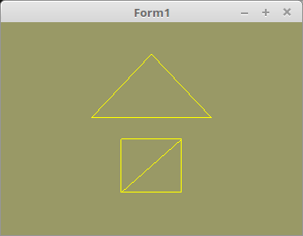

<html>
    <b><h1>03 - Vertex-Puffer</h1></b>
    <b><h2>40 - Indices</h2></b>
  
Normalerweise, werden die Polygone der Reihenfolge der Vertex-Konstanten abgearbeitet. 
Man kann aber auch selbst bestimmen, welche Koordinate abgearbeitet werden. 
Dafür muss man eine Indices-Array kreieren, welche die Reihenfolge der Koordinaten bestimmt. 
 
Der Unterschied zum einfachen Zeichenn ist, das ich noch eine Indicen-Array brauche. 
Und das Zeichnen ist vor allem anders. 
Man verwendet anstelle von <b>glDrawArrays(...</b>, <b>glDrawElements(...</b>, welche als dritten Parameter noch einen Zeiger auf die Indicen-Array bekommt. 

 
Die Deklaration der Vektor-Koordianten und Indicien Konstanten. 
Beim Dreieck sieht man keinen Vorteil bei der Indicien-Version, da das Dreieck sowieso nur aus einem Polygon besteht. 
Beim Quadrat, konnten so schon zwei Koordinaten eingespart werden, da man die Eckpunkte nur einmal angeben muss. 
Bei der einfachen Variante bräuchte es dafür sechs Eckpunte, weil dort zwei Punkte doppelt vorhandnen sein müssen. 
Bei einem Würfel ist der Vorteil noch grösser, da braucht es bei der einfachen Version 36 Punkte, bei der Indicien-Version, nur 8 Stück ! 
 
Mit den Indicen kann ich sagen, zeichen von Punkt 0-1-2 und von Punkt 0-2-3. 
 
<pre><code>3 - 2
| / |
0 - 1</code></pre>
<pre><code><b>const</b>
  <i>// --- Dreieck</i>
  <i>// Vertex-Koordinaten</i>
  Triangle: <b>array</b>[0..2] <b>of</b> TVertex3f =
    ((-0.4, 0.1, 0.0), (0.4, 0.1, 0.0), (0.0, 0.7, 0.0));
  <i>// Indicien ( Reihenfolge )</i>
  Triangle_Indices: <b>array</b>[0..2] <b>of</b> GLint = (0, 1, 2);

  <i>// --- Quadrat</i>
  <i>// Vertex-Koordinaten</i>
  Quad: <b>array</b>[0..3] <b>of</b> TVertex3f =
    ((-0.2, -0.6, 0.0), (0.2, -0.6, 0.0), (0.2, -0.1, 0.0), (-0.2, -0.1, 0.0));
  <i>// Indicien ( Reihenfolge )</i>
  Quad_Indices: <b>array</b>[0..5] <b>of</b> GLint = (0, 1, 2, 0, 2, 3);</code></pre>
Bei <b>glDrawElements(...</b>, muss als dritten Parameter der Zeiger auf die Indicien-Array übergeben werden. 
Ansonsten geht das Zeichen gleich, wie bei der einfachen Methode. 
Der Polygonmodus wurde auf Linien umgestellt, so das man die Polygone besser sieht. 
<pre><code><b>procedure</b> TForm1.ogcDrawScene(Sender: TObject);
<b>begin</b>
  glClear(GL_COLOR_BUFFER_BIT);
  glPolygonMode(GL_FRONT_AND_BACK, GL_LINE);   <i>// Linien</i>
  Shader.UseProgram;

  <i>// Zeichne Dreieck</i>
  glBindVertexArray(VBTriangle.VAO);
  glDrawElements(GL_TRIANGLES, Length(Triangle_Indices), GL_UNSIGNED_INT, @Triangle_Indices);

  <i>// Zeichne Quadrat</i>
  glBindVertexArray(VBQuad.VAO);
  glDrawElements(GL_TRIANGLES, Length(Quad_Indices), GL_UNSIGNED_INT, @Quad_Indices);</code></pre>

 
<b>Vertex-Shader:</b> 
 
<pre><code><b>#version</b> 330

<b>layout</b> (location = 10) <b>in</b> <b>vec3</b> inPos; <i>// Vertex-Koordinaten</i>

<b>void</b> main(<b>void</b>)
{
  gl_Position = <b>vec4</b>(inPos, 1.0);
}
</code></pre>

 
<b>Fragment-Shader:</b> 
<pre><code><b>#version</b> 330

<b>out</b> <b>vec4</b> outColor;   <i>// ausgegebene Farbe</i>

<b>void</b> main(<b>void</b>)
{
  <b>vec3</b> col = <b>vec3</b>(1.0, 1.0, 0.0); <i>// Gelb</i>
  outColor = <b>vec4</b>(col, 1.0);
}
</code></pre>

</html>
