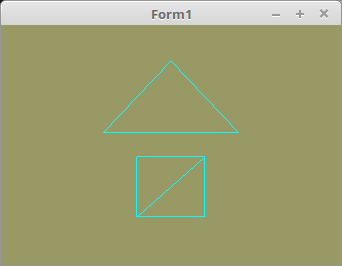

# 03 - Vertex-Puffer
## 45 - Index-Puffer



Die Indicien, kann man auch von Anfang an ins VRAM laden, so müssen die Daten nich jedes mal mit <b>glDrawElements(...</b> neu übegeben werden.
Dafür gibt es den <b> Index Buffer Objects</b> (IBO).
Das Laden geschieht ähnlich wie mit den Vertex-Daten.
---
Die Deklaration der Vektor-Koordianten und Indicien Konstanten, dies ist gleich wie ohne Buffer.

```pascal
const
  // --- Dreieck
  // Vertex-Koordinaten
  Triangle: array[0..2] of TVertex3f =
    ((-0.4, 0.1, 0.0), (0.4, 0.1, 0.0), (0.0, 0.7, 0.0));
  // Indicien ( Reihenfolge )
  Triangle_Indices: array[0..2] of GLint = (0, 1, 2);

  // --- Quadrat
  // Vertex-Koordinaten
  Quad: array[0..3] of TVertex3f =
    ((-0.2, -0.6, 0.0), (0.2, -0.6, 0.0), (0.2, -0.1, 0.0), (-0.2, -0.1, 0.0));
  // Indicien ( Reihenfolge )
  Quad_Indices: array[0..5] of GLint = (0, 1, 2, 0, 2, 3);
```

Der IBO muss noch deklariert werden.
Das Erzeugen des IBI-Puffer geht gleich wie beim VBO-Puffer.
Hier werden die IBO-Daten in den Buffer geladen, dies geschieht ähnlich, wie bei den Vertex-Daten.
Der Unterschied ist der zweite Parameter, dieser muss <b>GL_ELEMENT_ARRAY_BUFFER</b> sein.

```pascal
procedure TForm1.InitScene;
begin
  glClearColor(0.6, 0.6, 0.4, 1.0); // Hintergrundfarbe

  // --- Daten für das Dreieck
  glBindVertexArray(VBTriangle.VAO);

  // VBO der Vertex-Koordinaten
  glBindBuffer(GL_ARRAY_BUFFER, VBTriangle.VBO);
  glBufferData(GL_ARRAY_BUFFER, sizeof(Triangle), @Triangle, GL_STATIC_DRAW);

  // IBO binden und mit den Indices-Daten laden
  glBindBuffer(GL_ELEMENT_ARRAY_BUFFER, VBTriangle.IBO);
  glBufferData(GL_ELEMENT_ARRAY_BUFFER, sizeof(Triangle_Indices), @Triangle_Indices, GL_STATIC_DRAW);

  glEnableVertexAttribArray(10);
  glVertexAttribPointer(10, 3, GL_FLOAT, False, 0, nil);

  // --- Daten für das Quadrat
  glBindVertexArray(VBQuad.VAO);

  // VBO der Vertex-Koordinaten
  glBindBuffer(GL_ARRAY_BUFFER, VBQuad.VBO);
  glBufferData(GL_ARRAY_BUFFER, sizeof(Quad), @Quad, GL_STATIC_DRAW);

  // IBO binden und mit den Indices-Daten laden
  glBindBuffer(GL_ELEMENT_ARRAY_BUFFER, VBQuad.IBO);
  glBufferData(GL_ELEMENT_ARRAY_BUFFER, sizeof(Quad_Indices), @Quad_Indices, GL_STATIC_DRAW);

  glEnableVertexAttribArray(10);
  glVertexAttribPointer(10, 3, GL_FLOAT, False, 0, nil);
end;
```

Da die Indicien im IBO gespeichert sind muss der dritte Paramter bei <b>glDrawElements(...</b>, nil sein.

```pascal
procedure TForm1.ogcDrawScene(Sender: TObject);
begin
  glClear(GL_COLOR_BUFFER_BIT);
  glPolygonMode(GL_FRONT_AND_BACK, GL_LINE);   // Linien
  Shader.UseProgram;

  // Zeichne Dreieck
  glBindVertexArray(VBTriangle.VAO);
  glDrawElements(GL_TRIANGLES, Length(Triangle_Indices), GL_UNSIGNED_INT, Nil);  // Hier Nil

  // Zeichne Quadrat
  glBindVertexArray(VBQuad.VAO);
  glDrawElements(GL_TRIANGLES, Length(Quad_Indices), GL_UNSIGNED_INT, Nil);      // Hier Nil
```

IBO Freigabe ist glech wie bei dem VBO.

```pascal
procedure TForm1.FormDestroy(Sender: TObject);
begin
  Shader.Free;

  glDeleteBuffers(1, @VBTriangle.IBO);  // Indices-Buffer freigeben.
  glDeleteBuffers(1, @VBQuad.IBO);
```

---
<b>Vertex-Shader:</b>


```glsl
#version 330

layout (location = 10) in vec3 inPos; // Vertex-Koordinaten

void main(void)
{
  gl_Position = vec4(inPos, 1.0);
}

```

---
<b>Fragment-Shader:</b>

```glsl
#version 330

out vec4 outColor;   // ausgegebene Farbe

void main(void)
{
  vec3 col = vec3(0.0, 1.0, 1.0); // Mint
  outColor = vec4(col, 1.0);
}

```


