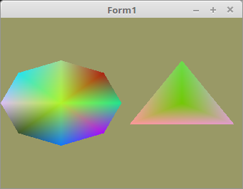

<!DOCTYPE html>
<html>
  <body bgcolor="#DDDDFF">
    <b><h1>03 - Vertex-Puffer</h1></b>
    <b><h2>50 - Index-Puffer dynamisch</h2></b>
  
Indicien kann man auch zur Laufzeit im VRAM verändern, dies geht fast gleich, wie bei den Vertex-Daten. 
Man macht dies auch mit <b>glBufferSubData(...</b>. 

 
Dafür nimmt man für die Indicen auch eine dynamische Array. 
Auch für diese Array wird die Länge gespeichert, da man diese nach dem Laden ins VRAM aus dem RAM entfernen kann. 
<pre><code><b>type</b>
  TVertex3f = <b>array</b>[0..2] <b>of</b> GLfloat;

  TMesh = <b>record</b>                        <i>// Record für die Mesh-Daten, welcher auch size enthält.</i>
    Vector, Color: <b>array</b> <b>of</b> TVertex3f;  <i>// Vertex-Daten.</i>
    Vec_Count: integer;                 <i>// Die Grösse der Vertex-Daten.</i>
    Indicies: <b>array</b> <b>of</b> GLint;           <i>// Indicies-Daten.</i>
    Indicies_Count: integer;            <i>// Die Grösser der Indicies-Array.</i>
    VBuffer: TVB;                       <i>// VBO und VAO der Mesh.</i>
  <b>end</b>;</pre></code>
Mit dieser Funktion werden die Vertex-Daten und die Indicen berechnet. 
Es wird ein Kreis mit zufälliger Anzahl Sektoren erzeugt, somit hat man unterschiedlich lange Vertex-Daten. 
Mit <b>ofsx</b> wird das Mesh in der X-Achse verschoben. 
<pre><code><b>procedure</b> TForm1.CreateVertex_and_Indicien(<b>var</b> Mesh: TMesh; ofsx: GLfloat);
<b>const</b>
  r = 0.5;  <i>// Radius des Kreises.</i>
<b>var</b>
  i: integer;
<b>begin</b>
  <b>with</b> Mesh <b>do</b> <b>begin</b>
    Vec_Count := Random(maxSektor - 3) + 3;
    Indicies_Count := Vec_Count * 3;
    Inc(Vec_Count);

    SetLength(Vector, Vec_Count);
    SetLength(Color, Vec_Count);
    SetLength(Indicies, Indicies_Count);

    <b>for</b> i := 0 <b>to</b> Vec_Count - 1 <b>do</b> <b>begin</b>
      Color[i, 0] := Random();
      Color[i, 1] := Random();
      Color[i, 2] := Random();
    <b>end</b>;

    <b>for</b> i := 0 <b>to</b> Vec_Count - 2 <b>do</b> <b>begin</b>
      Vector[i, 0] := sin(Pi * 2 / (Vec_Count - 1) * i) * r + ofsx;
      Vector[i, 1] := cos(Pi * 2 / (Vec_Count - 1) * i) * r;
      Vector[i, 2] := 0;

      Indicies[i * 3 + 0] := Vec_Count - 1;
      Indicies[i * 3 + 1] := i;
      Indicies[i * 3 + 2] := i + 1;
    <b>end</b>;

    <i>// Das letzte Array-Element ist das Zentrum.</i>
    Vector[Vec_Count - 1, 0] := ofsx;
    Vector[Vec_Count - 1, 1] := 0;
    Vector[Vec_Count - 1, 2] := 0;

    <i>// Der Letzte Index muss auf den ersten Vektor zeigen.</i>
    Indicies[Indicies_Count - 1] := 0;
  <b>end</b>;
<b>end</b>;</pre></code>
Hier werden schon mal die ersten Vertex-Daten und Indicien erzeugt. 
Später werden neue Daten in einem Timer erzeugt. 
Mit UpdateScene werden sie dann in das VRAM geladen. 
<pre><code><b>procedure</b> TForm1.FormCreate(Sender: TObject);
<b>begin</b>
  ogc := TContext.Create(<b>Self</b>);
  ogc.OnPaint := @ogcDrawScene;

  Randomize;

  CreateScene;

  CreateVertex_and_Indicien(CircleMesh[0], 0.5);   <i>// Vertex-Daten erzeugen.</i>
  CreateVertex_and_Indicien(CircleMesh[1], -0.5);

  UpdateScene(0);                                  <i>// Daten in VRAM schreiben.</i>
  UpdateScene(1);                                  <i>// Daten in VRAM schreiben.</i>
  Timer1.Enabled := <b>True</b>;
<b>end</b>;</pre></code>
Da die Vertex-Daten erst zur Laufzeit geladen/geändert werden, wird mit <b>glBufferData(...</b> nur der Speicher dafür reserviert. 
<pre><code><b>procedure</b> TForm1.CreateScene;
<b>var</b>
  i: integer;
<b>begin</b>
  Shader := TShader.Create([FileToStr('Vertexshader.glsl'), FileToStr('Fragmentshader.glsl')]);
  Shader.UseProgram;

  <b>for</b> i := 0 <b>to</b> Length(CircleMesh) - 1 <b>do</b> <b>begin</b>
    <b>with</b> CircleMesh[i] <b>do</b> <b>begin</b>
      glGenVertexArrays(1, @VBuffer.VAO);
      glGenBuffers(1, @VBuffer.VBOvert);
      glGenBuffers(1, @VBuffer.VBOcol);
      glGenBuffers(1, @VBuffer.IBO);

      glBindVertexArray(VBuffer.VAO);

      <i>// Vektor</i>
      glBindBuffer(GL_ARRAY_BUFFER, VBuffer.VBOvert);
      glBufferData(GL_ARRAY_BUFFER, sizeof(TVertex3f) * (maxSektor + 1), <b>nil</b>, GL_DYNAMIC_DRAW); <i>// Nur Speicher reservieren.</i>
      glEnableVertexAttribArray(10);
      glVertexAttribPointer(10, 3, GL_FLOAT, <b>False</b>, 0, <b>nil</b>);

      <i>// Farbe</i>
      glBindBuffer(GL_ARRAY_BUFFER, VBuffer.VBOcol);
      glBufferData(GL_ARRAY_BUFFER, sizeof(TVertex3f) * (maxSektor + 1), <b>nil</b>, GL_DYNAMIC_DRAW);
      glEnableVertexAttribArray(11);
      glVertexAttribPointer(11, 3, GL_FLOAT, <b>False</b>, 0, <b>nil</b>);

      <i>// Indicien</i>
      glBindBuffer(GL_ELEMENT_ARRAY_BUFFER, VBuffer.IBO);
      glBufferData(GL_ELEMENT_ARRAY_BUFFER, sizeof(GLint) * maxSektor * 3, <b>nil</b>, GL_DYNAMIC_DRAW);
    <b>end</b>;
  <b>end</b>;
<b>end</b>;</pre></code>
Da der Speicher im VRAM schon reserviert ist, kann man mit <b>glBufferSubData(...</b> nur noch die Vertex-Daten in das VRAM schreiben/ersetzen. 
 
Nach dem schreiben ins VRAM , kann mit <b>SetLength(...</b> die Daten im RAM entfernt werden. 
Wen die Daten einmal im VRAM sind, werden sie im RAM nicht mehr gebraucht. 
 
Mit <b>MeshNr</b> wird die Mesh angegben, welche neu in das VRAM kopiert werden soll. 
<pre><code><b>procedure</b> TForm1.UpdateScene(MeshNr: integer);
<b>begin</b>
  glClearColor(0.6, 0.6, 0.4, 1.0);

  <b>with</b> CircleMesh[MeshNr] <b>do</b> <b>begin</b>
    glBindVertexArray(VBuffer.VAO);

    <i>// Vektor</i>
    glBindBuffer(GL_ARRAY_BUFFER, VBuffer.VBOvert);
    glBufferSubData(GL_ARRAY_BUFFER, 0, sizeof(TVertex3f) * Vec_Count, Pointer(Vector)); 
    SetLength(Vector, 0);                                                                

    <i>// Farbe</i>
    glBindBuffer(GL_ARRAY_BUFFER, VBuffer.VBOcol);
    glBufferSubData(GL_ARRAY_BUFFER, 0, sizeof(TVertex3f) * Vec_Count, Pointer(Color));
    SetLength(Color, 0);

    <i>// Indicien</i>
    glBindBuffer(GL_ELEMENT_ARRAY_BUFFER, VBuffer.IBO);
    glBufferSubData(GL_ELEMENT_ARRAY_BUFFER, 0, sizeof(GLint) * Indicies_Count, Pointer(Indicies)); <i>// Daten ins VRAM schreiben.</i>
    SetLength(Indicies, 0);                                                                         <i>// Daten im RAM entfernen.</i>
  <b>end</b>;
<b>end</b>;</pre></code>
Gezeichnet wird dann mit <b>glDrawElements(...</b>, wobei der letzte Paramter nur noch <b>Nil</b> ist, da sich die Daten bereits im VRAM befinden. 
<pre><code>  <i>// Zeichne Kreise</i>
  <b>for</b> i := 0 <b>to</b> Length(CircleMesh) - 1 <b>do</b> <b>begin</b>
    <b>with</b> CircleMesh[i] <b>do</b> <b>begin</b>
      glBindVertexArray(VBuffer.VAO);
      glDrawElements(GL_TRIANGLES, Indicies_Count, GL_UNSIGNED_INT, <b>nil</b>);  <i>// Hier Nil</i>
    <b>end</b>;
  <b>end</b>;</pre></code>
Mit einem Timer werden alle 1/2 Sekunden neue Vertex-Daten erzeugt und in das VRAM geladen. 
<pre><code><b>procedure</b> TForm1.Timer1Timer(Sender: TObject);
<b>const</b>
  za: integer = 0;
<b>begin</b>
  Inc(za);
  <b>if</b> za = 5 <b>then</b> <b>begin</b>                             <i>// Mesh 0 neu erzeugen und laden</i>
    CreateVertex_and_Indicien(CircleMesh[0], 0.5);
    UpdateScene(0);                                <i>// Daten mit dem VAO 0 binden.</i>
    ogc.Invalidate;                                <i>// Neu zeichnen.</i>
  <b>end</b> <b>else</b> <b>if</b> za = 10 <b>then</b> <b>begin</b>                   <i>// Mesh 1 neu erzeugen und laden</i>
    CreateVertex_and_Indicien(CircleMesh[1], -0.5);
    UpdateScene(1);                                <i>// Daten mit dem VAO 1 binden</i>
    ogc.Invalidate;                                <i>// Neu zeichnen.</i>
    za := 0;
  <b>end</b>;
<b>end</b>;</pre></code>

 
Bei den Shadern gibt es nichts besonders. 
 
<b>Vertex-Shader:</b> 
<pre><code><b>#version</b> 330

<b>layout</b> (location = 10) <b>in</b> <b>vec3</b> inPos; <i>// Vertex-Koordinaten</i>
<b>layout</b> (location = 11) <b>in</b> <b>vec3</b> inCol; <i>// Farbe</i>

<b>out</b> <b>vec4</b> Color;                       <i>// Farbe, an Fragment-Shader übergeben</i>

<b>void</b> main(<b>void</b>)
{
  gl_Position = <b>vec4</b>(inPos, 1.0);
  Color = <b>vec4</b>(inCol, 1.0);
}
</pre></code>

 
<b>Fragment-Shader:</b> 
<pre><code><b>#version</b> 330

<b>in</b> <b>vec4</b> Color;      <i>// interpolierte Farbe vom Vertexshader</i>
<b>out</b> <b>vec4</b> outColor;  <i>// ausgegebene Farbe</i>

<b>void</b> main(<b>void</b>)
{
  outColor = Color; <i>// Die Ausgabe der Farbe</i>
}
</pre></code>

       
<h2><a href="../../index.html">zurück</a></h2>
  </body>
</html>
