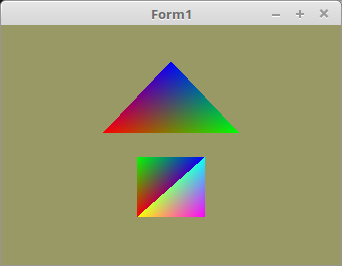

<html>
    <b><h1>03 - Vertex-Puffer</h1></b>
    <b><h2>55 - VertexID</h2></b>
  
Mit <b>gl_VertexID</b> kann man im Vertex-Shader ermitteln, welcher Vertex aus der Vertex-Array gezeichnet wird. 
Das Rendering ist nicht besonderes, es spielt sich alles im Vertex-Shader ab. 

 
Die Koordinaten der Mesh, maximal 6 Stück 
<pre><code=pascal><b>const</b>
  Triangle: <b>array</b>[0..0] <b>of</b> TFace2D =
    (((-0.4, 0.1), (0.4, 0.1), (0.0, 0.7)));
  Quad: <b>array</b>[0..1] <b>of</b> TFace2D =
    (((-0.2, -0.6), (-0.2, -0.1), (0.2, -0.1)),
    (( -0.2, -0.6), (0.2, -0.1), (0.2, -0.6)));</code></pre>

 
Da es in diesem Beispiel nur maximal 6 Vertex-Punkte gibt, habe ich die VertexID mit einer einfachen Case-Schleife ausgewertet. 

 
<b>Vertex-Shader:</b> 
<pre><code><b>#version</b> 330
 
<b>layout</b> (location = 10) <b>in</b> <b>vec2</b> inPos;
 
<b>out</b> <b>vec3</b> col;
 
<b>void</b> main(<b>void</b>)
{
  gl_Position = <b>vec4</b>(inPos, 0.0, 1.0);
  <b>switch</b> (gl_VertexID) <i>// Den aktuellen Vertex abfragen.</i>
  {
    <b>case</b> 0:  col = <b>vec3</b>(1.0, 0.0, 0.0);
             <b>break</b>;
    <b>case</b> 1:  col = <b>vec3</b>(0.0, 1.0, 0.0);
             <b>break</b>;
    <b>case</b> 2:  col = <b>vec3</b>(0.0, 0.0, 1.0);
             <b>break</b>;
    <b>case</b> 3:  col = <b>vec3</b>(1.0, 1.0, 0.0);
             <b>break</b>;
    <b>case</b> 4:  col = <b>vec3</b>(0.0, 1.0, 1.0);
             <b>break</b>;
    <b>default</b>: col = <b>vec3</b>(1.0, 0.0, 1.0);
  }
}
</code></pre>

 
<b>Fragment-Shader</b> 
<pre><code><b>#version</b> 330
 
<b>out</b> <b>vec4</b> outColor;
 
<b>in</b>  <b>vec3</b> col;
 
<b>void</b> main(<b>void</b>) {
  outColor = <b>vec4</b>(col, 1.0);
}
</code></pre>
 
</html>
