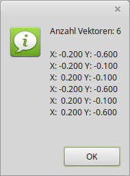

# 03 - Vertex-Puffer
## 60 - Vertex-Puffer auslesen



Man kann nicht nur die Vertex-Daten in das VRAM schreiben, man kann dies auch wieder auslesen.
---
Für diesen Zweck gibt es die Funktion <b>glGetBufferSubData(...</b>.
---
Diese Vertex-Daten sollen auch in der MessageBox erscheinen.

```pascal
const
  TriangleVector: array[0..0] of TFace2D =
    (((-0.4, 0.1), (0.4, 0.1), (0.0, 0.7)));
  TriangleColor: array[0..0] of TVertex3f = ((1.0, 0.5, 0.0));
  QuadVector: array[0..1] of TFace2D =
    (((-0.2, -0.6), (-0.2, -0.1), (0.2, -0.1)),
    ((-0.2, -0.6), (0.2, -0.1), (0.2, -0.6)));
  QuadColor: array[0..1] of TVertex3f =
    ((0.5, 0.0, 1.0), (0.5, 1.0, 0.0));
```

Vertex-Daten auslesen.
Wie üblich müssen die Puffer VAO und VBO gebunden werden.
Mit <b>glGetBufferParameteriv(...</b> wird die Grösse des Puffer ermittelt.
Anschliessend können dann die Daten mit <b>glGetBufferSubData(...</b> ausgelesen werden.

```pascal
procedure TForm1.MenuItem1Click(Sender: TObject);
var
  TempBuffer: array of record   // Zum speichern der Daten
    x, y: glFloat;
  end;
  sx, sy: string;               // Für Formatierung
  i: integer;
  BufSize: GLint;               // Puffergrösse.
  sl: TStringList;              // Für Ausgabe.
begin
  sl := TStringList.Create;

  // Puffer binden.
  if TMenuItem(Sender).Caption = 'Dreieck' then begin
    glBindVertexArray(VBTriangle.VAO);
    glBindBuffer(GL_ARRAY_BUFFER, VBTriangle.VBOvert);
  end else begin
    glBindVertexArray(VBQuad.VAO);
    glBindBuffer(GL_ARRAY_BUFFER, VBQuad.VBOvert);
  end;

  // Die Grösse des Puffers ermitteln.
  glGetBufferParameteriv(GL_ARRAY_BUFFER, GL_BUFFER_SIZE, @BufSize);

  // Ram für den Puffer reservieren.
  SetLength(TempBuffer, BufSize div 8);

  // Puffer in den Ram kopieren.
  glGetBufferSubData(GL_ARRAY_BUFFER, 0, BufSize, Pointer(TempBuffer));

  // Puffer formatieren und ausgeben.
  sl.Add('Anzahl Vektoren: ' + IntToStr(BufSize div 8));
  sl.Add('');

  for i := 0 to BufSize div 8 - 1 do begin
    Str(TempBuffer[i].x: 6: 3, sx);
    Str(TempBuffer[i].y: 6: 3, sy);
    sl.Add('X: ' + sx + ' Y: ' + sy);
  end;

  ShowMessage(sl.Text);
  sl.Free;
end;
```

---
<b>Vertex-Shader:</b>

```glsl
#version 330

layout (location = 10) in vec2 inPos;     // Vertex-Koordinaten, nur XY.
layout (location = 11) in float inCol;    // Farbe, es kommt nur Rot.

out vec4 Color;                           // Farbe, an Fragment-Shader übergeben.

void main(void)
{
  gl_Position = vec4(inPos, 0.0, 1.0);    // Z ist immer 0.0
  Color = vec4(inCol, 0.0, 0.0, 1.0);     // Der Rot- und Grün - Teil, ist 0.0
}

```

---
<b>Fragment-Shader</b>

```glsl
#version 330

in vec4 Color;     // interpolierte Farbe vom Vertexshader
out vec4 outColor; // ausgegebene Farbe

void main(void)
{
  outColor = Color; // Die Ausgabe der Farbe
}

```


