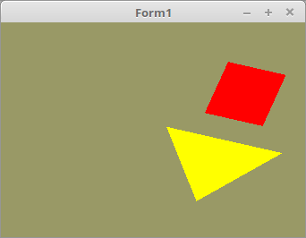

# 04 - Matrix
## 10 - Matrix Verschieben und Multiplizieren

<br><br>
Hier wird die Mesh verschoben, und anschliessend gedreht.

Dazu werden zwei 4x4 Matrixen verwendet, eine für das Verschieben und die andere für die Drehung.
Eine dritte Matrix ist noch für das Produkt von den zweit Matrixen, welche dann am Shader übergeben wird.
Im Timer wird Matrix-Rotation ausgeführt.

Für Matrixen, wird ab jetzt ein Type Helper aus der Unit <b>OpenGLMatrix</b> verwendent, dies macht das Ganze übersichtlicher.
Dafür muss einfach die Unit <b>oglMatrix</b> bei uses eingebunden werden.
In der Regel muss dann die Matrix mit <b>TMatrix.Indenty</b> auf die Einheits-Matrix gesetzt werden.
<hr><br>
Die Deklaration der drei Matrixen.
Und die ID für den Shader. Die ID wird nur eine gebraucht, da nur das Produkt dem Shader übergeben wird.

```pascal
var
  RotMatrix, TransMatrix, prodMatrix: TMatrix;   // Matrizen von der Unit oglMatrix.
  Matrix_ID: GLint;                              // ID für Matrix.
```

Hier werden die drei Matrixen auf die gesetzt.

```pascal
procedure TForm1.CreateScene;
begin
  Shader := TShader.Create([FileToStr('Vertexshader.glsl'), FileToStr('Fragmentshader.glsl')]);
  Shader.UseProgram;
  Color_ID := Shader.UniformLocation('Color');
  Matrix_ID := Shader.UniformLocation('mat');
  RotMatrix.Identity;                   // Zuerst ist eine Einheitsmatrix erwünscht.
  TransMatrix.Identity;
  prodMatrix.Identity;
  TransMatrix.Translate(0.5, 0.0, 0.0); // TransMatrix um 0.5 nach links verschieben.
```

Hier wird das Produkt von TransMatrix und RotMatrix den Shader übergeben.
Mit der Klasse geht dies einfacht mit <b>Matrix.Uniform(ID)</b>

Matrizen multiplizieren geht am einfachsten mit der überladenen Multiplikation-Funktion.

```pascal
Matrix := Matrix * Matrix;
Matrix := Matrix * Matrix * Matrix;
```

Dabei wird die Mesh zuerst gedreht und dann verschoben.
<b>Die Reihenfolge der Multiplikatoren ist sehr wichtig !</b>

Einfach mal TransMatrix und RotMatrix vertauschen, dann sieht man ganz ein anderes Ergebniss.
Dann wird zuerst die Mesh verschoben und dann das Ganze um den Mittelpunkt gedreht.

```pascal
procedure TForm1.ogcDrawScene(Sender: TObject);
begin
  glClear(GL_COLOR_BUFFER_BIT);
  Shader.UseProgram;
  prodMatrix := TransMatrix * RotMatrix;       // Matrix multiplizieren.
  prodMatrix.Uniform(Matrix_ID);               // prodMatrix in den Shader schreiben.
```

Die Drehung der Matrix wird fortlaufend um den Wert <b>step</b> gedreht.

```pascal
procedure TForm1.Timer1Timer(Sender: TObject);
const
  step: GLfloat = 0.01;
begin
  RotMatrix.RotateC(step); // RotMatrix rotieren
  ogcDrawScene(Sender);    // Neu zeichnen
end;
```

<hr><br>
<b>Vertex-Shader:</b>

Hier ist die Uniform-Variable <b>mat</b> hinzugekommen.
Diese wird im Vertex-Shader deklariert, Bewegungen kommen immer in diesen Shader.

```glsl
#version 330

layout (location = 10) in vec3 inPos; // Vertex-Koordinaten
uniform mat4 mat;                     // Matrix von Uniform

void main(void)
{
  gl_Position = mat * vec4(inPos, 1.0);
}

```

<hr><br>
<b>Fragment-Shader:</b>

```glsl
#version 330

uniform vec3 Color;  // Farbe von Uniform
out vec4 outColor;   // ausgegebene Farbe

void main(void)
{
  outColor = vec4(Color, 1.0);
}

```


