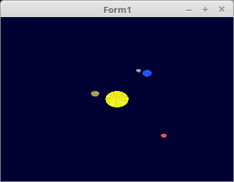

# 04 - Matrix
## 15 - Kleines Planetarium

<br><br>
Kleines Planetarium, welches die Handhabung von Matrizen demonstriert.
Das es übersichtlicher wird, habe ich die Sonne und die Planeten in eine Klasse gepackt.

Da dieses Beispiel auf einer 2D-Ebene läuft, wird nur eine <b>3x3</b>-Matrix verwendet, auch die Vektor-Koordinaten sind 2D.
Einzig der Vertex-Shader wird ein wenig komplizierter, da die Z-Achse nicht verwendet wird.

Am Shader wird nur eine Matrix übergeben, welche von der CPU berechnet wird.
Diese Matrix wird aus verschiedene Transformen berechnet.
<hr><br>
Es gibt nur eine ID, da die ganze Matrizen-Berechnung mit der CPU ausgeführt werden.

```pascal
var
  Matrix_ID: GLint;  // ID für Matrix.
```

Rendern der Sonne und der Paneten.
Dies sind nur farbige Kreise. Der Rest wird später über Matrizen brechnet.

```pascal
constructor TPlanet.Create(col: TVector3f);
const
  maxSektor = 17;  // Anzahl Sektoren der Kreise.
var
  i, j: integer;
begin
  inherited Create;

  with Mesh do begin
    size := maxSektor;
    SetLength(Vector, size);
    SetLength(Color, size);
    for i := 0 to size - 1 do begin
      for j := 0 to 2 do begin
        Color[i, j] := vec3(col[0] + (Random / 4), col[1] + (Random / 4), col[2] + (Random / 4));
      end;

      Vector[i, 0] := vec2(0.0, 0.0);
      Vector[i, 1] := vec2(sin(Pi * 2 / size * i), cos(Pi * 2 / size * i));
      Vector[i, 2] := vec2(sin(Pi * 2 / size * (i + 1)), cos(Pi * 2 / size * (i + 1)));
    end;
  end;
```

Legt die Matrix für die Umlaufbahnen fest.

```pascal
procedure TPlanet.SetMondR(AValue: GLfloat);
begin
  MondTransMatrix.Translate(AValue, 0.0);  // Distanz Erde - Mond. ( Erde Mond ist ein Doppelplanet )
end;

procedure TPlanet.SetUmlaufR(AValue: GLfloat);
begin
  UmlaufTransMatrix.Translate(AValue, 0.0); // Distanz Sonne / Planet.
end;
```

Hier werden die Bahnen der Planeten berechnet und anschliessend gezeichnet.

```pascal
procedure TPlanet.Draw;
begin
  UmlaufRotMatrix.Rotate(FUmlaufSpeed);
  PlanetRotMatrix.Rotate(fPlanetSpeed);
  MondRotMatrix.Rotate(FMondSpeed);

  TempMatrix := PlanetRotMatrix;
  TempMatrix.Scale(fPlanetScale);

  TempMatrix := UmlaufRotMatrix * UmlaufTransMatrix * MondRotMatrix * MondTransMatrix * TempMatrix;

  TempMatrix.Uniform(Matrix_ID);

  glBindVertexArray(VAO);
  glDrawArrays(GL_TRIANGLES, 0, Mesh.size * 3);
end;
```

Die Parameter für die Sonne und Planeten.

```pascal
procedure TForm1.CreateScene;
begin
  Sonne := TPlanet.Create(vec3(0.8, 0.8, 0.0));
  with Sonne do begin
    PlanetSpeed := 0.06;
    PlanetScale := 0.1;
  end;

  Venus := TPlanet.Create(vec3(0.5, 0.5, 0.2));
  with Venus do begin
    PlanetScale := 0.035;
    PlanetSpeed := 0.2;
    UmlaufSpeed := 0.01;
    UmlaufR := 0.2;
  end;

  Erde := TPlanet.Create(vec3(0.0, 0.2, 1.0));
  with Erde do begin
    PlanetScale := 0.04;
    PlanetSpeed := 0.2;
    MondSpeed := 0.04;
    UmlaufSpeed := 0.008;
    MondR := 0.04;
    UmlaufR := 0.4;
  end;

  Mond := TPlanet.Create(vec3(0.5, 0.5, 0.5));
  with Mond do begin
    PlanetScale := 0.02;
    MondSpeed := 0.04;
    UmlaufSpeed := 0.008;
    MondR := -0.04;
    UmlaufR := 0.4;
  end;

  Mars := TPlanet.Create(vec3(0.8, 0.2, 0.2));
  with Mars do begin
    PlanetScale := 0.025;
    PlanetSpeed := 0.3;
    UmlaufSpeed := 0.006;
    UmlaufR := 0.6;
  end;
```

Sonne und Planeten zeichnen

```pascal
procedure TForm1.ogcDrawScene(Sender: TObject);
begin
  glClear(GL_COLOR_BUFFER_BIT);
  Shader.UseProgram;

  // Zeichne Sonne und Planeten
  Sonne.Draw;
  Venus.Draw;
  Erde.Draw;
  Mond.Draw;
  Mars.Draw;

  ogc.SwapBuffers;
end;
```

<hr><br>
<b>Vertex-Shader:</b>

Bei der Multiplikation, wird die Z-Achse ignoriert, aus diesem Grund wird <b>glPosition.xyw</b> verwendet.
Anschliessend wird Z auf <b>0.0</b> gesetzt.

```glsl
#version 330

layout (location = 10) in vec2 inPos; // Vertex-Koordinaten in 2D.
layout (location = 11) in vec3 inCol; // Farbe

out vec4 Color;                       // Farbe, an Fragment-Shader übergeben.

uniform mat3 mat;                     // Matrix von Uniform.


void main(void)
{
  gl_Position.xyw = mat * vec3(inPos, 1.0);
  gl_Position.z   = 0.0;
  Color = vec4(inCol, 1.0);
}

```

<hr><br>
<b>Fragment-Shader:</b>

```glsl
#version 330

in vec4 Color;      // interpolierte Farbe vom Vertexshader
out vec4 outColor;  // ausgegebene Farbe

void main(void)
{
  outColor = Color; // Die Ausgabe der Farbe
}

```


