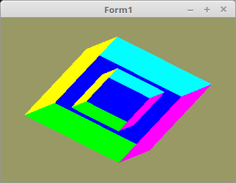

<html>
  
Jetzt wird das erste mal 3D gerendert. 
Dafür wird ein einfacher Würfel genommen, welcher sechs unterschiedlich farbige Flächen hat. 
 
In diesem Beispiel wird bewusst noch auf den Tiefenbuffer verzichtet. 
Somit sieht man gut, was passiert wen man diesen nicht berücksichtigt. 

 
Hier sind die Koordinaten und die Farben des Würfels deklariert. 
<pre><code><b>type</b>
  TCube = <b>array</b>[0..11] <b>of</b> Tmat3x3;

<b>const</b>
  CubeVertex: TCube = (
    ((-0.5, 0.5, 0.5), (-0.5, -0.5, 0.5), (0.5, -0.5, 0.5)), ((-0.5, 0.5, 0.5), (0.5, -0.5, 0.5), (0.5, 0.5, 0.5)),
    ((0.5, 0.5, 0.5), (0.5, -0.5, 0.5), (0.5, -0.5, -0.5)), ((0.5, 0.5, 0.5), (0.5, -0.5, -0.5), (0.5, 0.5, -0.5)),
    ((0.5, 0.5, -0.5), (0.5, -0.5, -0.5), (-0.5, -0.5, -0.5)), ((0.5, 0.5, -0.5), (-0.5, -0.5, -0.5), (-0.5, 0.5, -0.5)),
    ((-0.5, 0.5, -0.5), (-0.5, -0.5, -0.5), (-0.5, -0.5, 0.5)), ((-0.5, 0.5, -0.5), (-0.5, -0.5, 0.5), (-0.5, 0.5, 0.5)),
    <i>// oben</i>
    ((0.5, 0.5, 0.5), (0.5, 0.5, -0.5), (-0.5, 0.5, -0.5)), ((0.5, 0.5, 0.5), (-0.5, 0.5, -0.5), (-0.5, 0.5, 0.5)),
    <i>// unten</i>
    ((-0.5, -0.5, 0.5), (-0.5, -0.5, -0.5), (0.5, -0.5, -0.5)), ((-0.5, -0.5, 0.5), (0.5, -0.5, -0.5), (0.5, -0.5, 0.5)));

  CubeColor: TCube = (
    ((1.0, 0.0, 0.0), (1.0, 0.0, 0.0), (1.0, 0.0, 0.0)), ((1.0, 0.0, 0.0), (1.0, 0.0, 0.0), (1.0, 0.0, 0.0)),
    ((0.0, 1.0, 0.0), (0.0, 1.0, 0.0), (0.0, 1.0, 0.0)), ((0.0, 1.0, 0.0), (0.0, 1.0, 0.0), (0.0, 1.0, 0.0)),
    ((0.0, 0.0, 1.0), (0.0, 0.0, 1.0), (0.0, 0.0, 1.0)), ((0.0, 0.0, 1.0), (0.0, 0.0, 1.0), (0.0, 0.0, 1.0)),
    ((0.0, 1.0, 1.0), (0.0, 1.0, 1.0), (0.0, 1.0, 1.0)), ((0.0, 1.0, 1.0), (0.0, 1.0, 1.0), (0.0, 1.0, 1.0)),
    <i>// oben</i>
    ((1.0, 1.0, 0.0), (1.0, 1.0, 0.0), (1.0, 1.0, 0.0)), ((1.0, 1.0, 0.0), (1.0, 1.0, 0.0), (1.0, 1.0, 0.0)),
    <i>// unten</i>
    ((1.0, 0.0, 1.0), (1.0, 0.0, 1.0), (1.0, 0.0, 1.0)), ((1.0, 0.0, 1.0), (1.0, 0.0, 1.0), (1.0, 0.0, 1.0)));</code></pre>
Ohne Tiefenbuffer wird einfach alles gezeichnet, auch wen es verdeckt hinter einem anderen Object ist. 
Das man dies gut sieht, zeichne ich einen kleinen Würfel in den Grossen. 
Der Kleine übermahlt einfach den grossen. 
<pre><code><b>procedure</b> TForm1.ogcDrawScene(Sender: TObject);
<b>var</b>
  TempMatrix: TMatrix;
<b>begin</b>
  glClear(GL_COLOR_BUFFER_BIT <b>or</b> GL_DEPTH_BUFFER_BIT);

  Shader.UseProgram;

  <i>// --- Zeichne Würfel</i>

  glBindVertexArray(VBCube.VAO);

  WorldMatrix.Uniform(WorldMatrix_ID);                     <i>// Matrix dem Shader übergeben</i>
  glDrawArrays(GL_TRIANGLES, 0, Length(CubeVertex) * 3);   <i>// Zeichne grossen Würfel</i>

  TempMatrix := WorldMatrix;                               <i>// Matrix sichern</i>

  WorldMatrix.Scale(0.5);                                  <i>// Matrix kleiner scalieren</i>
  WorldMatrix.Uniform(WorldMatrix_ID);                     <i>// Matrix dem Shader übergeben</i>
  glDrawArrays(GL_TRIANGLES, 0, Length(CubeVertex) * 3);   <i>// Zeichne kleinen Würfel</i>

  WorldMatrix := TempMatrix;                               <i>// Matrix laden</i>

  ogc.SwapBuffers;
<b>end</b>;</code></pre>
Mit einem Timer wird der Würfel gedreht und neu gezeichnet. 
<pre><code><b>procedure</b> TForm1.Timer1Timer(Sender: TObject);
<b>begin</b>
  WorldMatrix.RotateA(0.0123);  <i>// Drehe um X-Achse</i>
  WorldMatrix.RotateB(0.0234);  <i>// Drehe um Y-Achse</i>

  ogc.Invalidate;
<b>end</b>;</code></pre>

 
<b>Vertex-Shader:</b> 
<pre><code><b>#version</b> 330

<b>layout</b> (location = 10) <b>in</b> <b>vec3</b> inPos; <i>// Vertex-Koordinaten</i>
<b>layout</b> (location = 11) <b>in</b> <b>vec3</b> inCol; <i>// Farbe</i>

<b>out</b> <b>vec4</b> Color;                       <i>// Farbe, an Fragment-Shader übergeben</i>

<b>uniform</b> <b>mat4</b> Matrix;                  <i>// Matrix für die Drehbewegung</i>

<b>void</b> main(<b>void</b>)
{
  gl_Position = Matrix * <b>vec4</b>(inPos, 1.0);
  Color = <b>vec4</b>(inCol, 1.0);
}
</code></pre>

 
<b>Fragment-Shader</b> 
<pre><code><b>#version</b> 330

<b>in</b> <b>vec4</b> Color;      <i>// interpolierte Farbe vom Vertexshader</i>
<b>out</b> <b>vec4</b> outColor;  <i>// ausgegebene Farbe</i>

<b>void</b> main(<b>void</b>)
{
  outColor = Color; <i>// Die Ausgabe der Farbe</i>
}
</code></pre>

</html>
