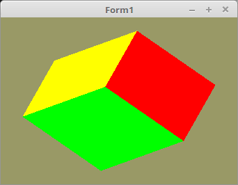

<html>
    <b><h1>05 - 3D</h1></b>
    <b><h2>10 - Tiefenbuffer</h2></b>
  
Einen Tiefenpuffer braucht man, das Polygone nicht einfach willkürlich übereinander gezeichnet werden. 
Mit dem Tiefenpuffer wird berechnet, das ein Polygon das sich hinter einem anderen befindet, nicht gezeichnet wird. 
Diese Berechnung läuft auf Pixelebene. 
 
Bei dem Würfelbeispiel, wird der kleine Würfel nicht mehr gezeichnet, da sich dieser hinter den Flächen des grossen Würfels befindet. 

 
Hier wird den Tiefenpufferprüfung eingeschaltet, dies geschieht mit <b>glEnable(GL_DEPTH_TEST);</b>. 
Die Art der Prüfung kann man mit <b>glDepthFunc(...</b> einstellen, wobei Default auf <b>GL_LESS</b> ist. 
Mit <b>GL_LESS</b> wird geprüft, ob der Z-Wert geringer ist, und wen ja, darf der Pixel gezeichnet werden. 
 
<pre><code><b>procedure</b> TForm1.CreateScene;
<b>begin</b>
  glEnable(GL_DEPTH_TEST);  <i>// Tiefenprüfung einschalten.</i>
  glDepthFunc(GL_LESS);     <i>// Kann man weglassen, da Default.</i></code></pre>
Bei <b>glClear(...</b> ist noch etwas neues dazugekommen, <b>GL_DEPTH_BUFFER_BIT</b>. 
Dies bewirkt, das bei <b>glClear(...</b> nicht nur der Frame-Puffer gelöscht wird, sondern auch der Tiefen-Puffer. 
Jetzt darf der kleine Würfel nicht mehr sichtbar sein, da sich dieser hinter dem grossen versteckt. 
<pre><code><b>procedure</b> TForm1.ogcDrawScene(Sender: TObject);
<b>var</b>
  TempMatrix: TMatrix;
<b>begin</b>
  glClear(GL_COLOR_BUFFER_BIT <b>or</b> GL_DEPTH_BUFFER_BIT);  <i>// Frame und Tiefen-Puffer löschen.</i>
 
  Shader.UseProgram;
 
  <i>// --- Zeichne Würfel</i>
 
  glBindVertexArray(VBCube.VAO);
 
  WorldMatrix.Uniform(WorldMatrix_ID);
  glDrawArrays(GL_TRIANGLES, 0, Length(CubeVertex) * 3);
 
  TempMatrix := WorldMatrix;
 
  WorldMatrix.Scale(0.5);
  WorldMatrix.Uniform(WorldMatrix_ID);
  glDrawArrays(GL_TRIANGLES, 0, Length(CubeVertex) * 3); <i>// wird nicht gezeichnet.</i>
 
  WorldMatrix := TempMatrix;
 
  ogc.SwapBuffers;
<b>end</b>;</code></pre>

 
<b>Vertex-Shader:</b> 
<pre><code><b>#version</b> 330
 
<b>layout</b> (location = 10) <b>in</b> <b>vec3</b> inPos; <i>// Vertex-Koordinaten</i>
<b>layout</b> (location = 11) <b>in</b> <b>vec3</b> inCol; <i>// Farbe</i>
 
<b>out</b> <b>vec4</b> Color;                       <i>// Farbe, an Fragment-Shader übergeben</i>
 
<b>uniform</b> <b>mat4</b> Matrix;                  <i>// Matrix für die Drehbewegung</i>
 
<b>void</b> main(<b>void</b>)
{
  gl_Position = Matrix * <b>vec4</b>(inPos, 1.0);
  Color = <b>vec4</b>(inCol, 1.0);
}
</code></pre>

 
<b>Fragment-Shader</b> 
<pre><code><b>#version</b> 330
 
<b>in</b>  <b>vec4</b> Color;     <i>// interpolierte Farbe vom Vertexshader</i>
<b>out</b> <b>vec4</b> outColor;  <i>// ausgegebene Farbe</i>
 
<b>void</b> main(<b>void</b>)
{
  outColor = Color; <i>// Die Ausgabe der Farbe</i>
}
</code></pre>
 
</html>
