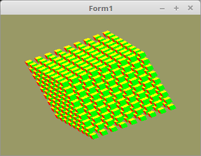

# 05 - 3D
## 15 - Orthogonalprojektion

<br><br>
Eine OpenGL-Scene wird immer in einem Bereich von <b>-1</b> bis <b>+1</b> in allen drei Achsen gezeichnet. Ist etwas ausserhalb dieses Bereiches, wird dies ignoriert.
Um dies zu umgehen multipliziert man die Scene mit einer Ortho-Matrix.
Für diesen Zweck habe ich eine Funtkion <b>TMatrix.Ortho(...</b>. Mit den sechs Parametern in der Funktion, kann man den gewünschten Bereich einstellen.

Zusätzlich ist noch eine Welt-Matrix hinzugekommen. Damit wird die ganze Scene in den sichtbaren Bereich bewegt,
<hr><br>
Deklaration der drei Matrixen.

```pascal
var
  OrthoMatrix,         // Matrix für Ortho.
  WorldMatrix,         // Matrix für Welt.
  Matrix: TMatrix;     // Matrix, welche dem Shader übergeben wird.
  Matrix_ID: GLint;    // ID der Matrix für den Shader.
```

So sieht die Funktion aus: <b>Ortho(left, right, bottom, top, znear, zfar);</b>.
Hier wird die OrthoMatrix erzeugt, und mit neuen Werten eingestellt.
Im Beispiel ist dies eine Seitenlänge in allen Achsen um 24.0 (2 * 12.0).

Die Skalierung der Welt-Matrix hat den Effekt, das die ganze Scene gezoomt wird.

```pascal
procedure TForm1.CreateScene;
const
  w = 12.0;  // Seiten-Länge
begin
  Matrix.Identity;
  WorldMatrix.Identity;
  WorldMatrix.Scale(0.75);                    // Welt-Matrix zoomen
  OrthoMatrix.Ortho(-w, w, -w, +w, -w, +w);   // Den Ortho-Bereich einstellen.
```

Hier werden die einzelnen kleinen Würfel gezeichnet, dabei sieht man gut, wie alle drei Matrizen mutipliziert werden.
Die Matrizen könnte man auch im Shader multiplizieren, dafür müsste man einfach für jede Matrix eine Uniform deklarieren.
Dies hat aber den Nachteil, das die Multiplikation bei jedem Vektor ausgeführt wird, bei Meshes mit hoher Vektor-Zahl merkt man dies bemerklich.

Hier sieht man auch gut, das man eine Mesh nach dem Binden mehrmals gezeichnet werden kann.

```pascal
procedure TForm1.ogcDrawScene(Sender: TObject);
var
  x, y, z: integer;
const
  d = 1.8;  // Abstand der Würfel.
  s = 4;
begin
  glClear(GL_COLOR_BUFFER_BIT or GL_DEPTH_BUFFER_BIT);

  glEnable(GL_CULL_FACE);
  glCullface(GL_BACK);

  Shader.UseProgram;

  glBindVertexArray(VBCube.VAO);

  // --- Zeichne Würfel

  for x := -s to s do begin
    for y := -s to s do begin
      for z := -s to s do begin
        Matrix.Identity;
        Matrix.Translate(x * d, y * d, z * d);                 // Matrix verschieben.

        Matrix := OrthoMatrix * WorldMatrix * Matrix;          // Matrizen multiplizieren.

        Matrix.Uniform(Matrix_ID);                             // Matrix dem Shader übergeben.
        glDrawArrays(GL_TRIANGLES, 0, Length(CubeVertex) * 3); // Zeichnet einen kleinen Würfel.
      end;
    end;
  end;

  ogc.SwapBuffers;
end;
```

Kamera um die Mesh bewegen.

```pascal
procedure TForm1.Timer1Timer(Sender: TObject);
begin
  WorldMatrix.RotateA(0.0123);  // Drehe um X-Achse
  WorldMatrix.RotateB(0.0234);  // Drehe um Y-Achse
```

<hr><br>
<b>Vertex-Shader:</b>

```glsl
#version 330

layout (location = 10) in vec3 inPos; // Vertex-Koordinaten
layout (location = 11) in vec3 inCol; // Farbe

out vec4 Color;                       // Farbe, an Fragment-Shader übergeben

uniform mat4 Matrix;                  // Matrix für die Drehbewegung und Ortho

void main(void)
{
  gl_Position = Matrix * vec4(inPos, 1.0);
  Color = vec4(inCol, 1.0);
}

```

<hr><br>
<b>Fragment-Shader</b>

```glsl
#version 330

in  vec4 Color;     // interpolierte Farbe vom Vertexshader
out vec4 outColor;  // ausgegebene Farbe

void main(void)
{
  outColor = Color; // Die Ausgabe der Farbe
}

```


