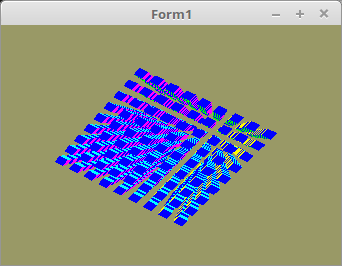

<!DOCTYPE html>
<html>
    <b><h1>05 - 3D</h1></b>
    <b><h2>20 - Fluchtpunktperspektive (Frustum)</h2></b>
  
Will man die Scene realistisch proportional darstellen, nimmt man eine Frustum-Matrix. 
Dies hat den Einfluss, das Objekte kleiner erscheinen, je weiter die Scene von einem weg ist. 
In der Realität ist dies auch so, das Objekte kleiner erscheinen, je weiter sie von einem weg sind. 

 
Der Frustum funktioniert ähnlich wie beim Ortho. 
Nur die Parameter sind ein wenig anders. 
Die Z-Werte müssen immer <b>positiv</b> sein. 
 
Mit den zwei letzten Parametern von Frustum und der World-Matrix muss man ein bisschen probieren, zum Teil wird sonst das Bild verzehrt. 
 
Alternativ kann man den Frustum auch mit <b>Perspective(...</b> einstellen. 
Dabei ist der erste Parameter der Betrachtungs-Winkel. 
Der zweite Parameter ist das Fensterverhältniss, mehr dazu und glViewPort. 
<pre><code><b>procedure</b> TForm1.CreateScene;
<b>const</b>
  w = 1.0;
<b>begin</b>
  Matrix.Identity;
  FrustumMatrix.Frustum(-w, w, -w, w, 2.5, 1000.0);

<i>//   FrustumMatrix.Perspective(45, 1.0, 2.5, 1000.0); // Alternativ</i>

  WorldMatrix.Identity;
  WorldMatrix.Translate(0.0, 0.0, -200.0); <i>// Die Scene in den sichtbaren Bereich verschieben.</i>
  WorldMatrix.Scale(5.0);                  <i>// Und der Grösse anpassen.</i></pre></code>
Das Zeichnen ist das Selbe wie bei Ortho. 
<pre><code>  <i>// --- Zeichne Würfel</i>

  <b>for</b> x := -s <b>to</b> s <b>do</b> <b>begin</b>
    <b>for</b> y := -s <b>to</b> s <b>do</b> <b>begin</b>
      <b>for</b> z := -s <b>to</b> s <b>do</b> <b>begin</b>
        Matrix.Identity;
        Matrix.Translate(x * d, y * d, z * d);                 <i>// Matrix verschieben.</i>

        Matrix := FrustumMatrix * WorldMatrix * Matrix;        <i>// Matrizen multiplizieren.</i>

        Matrix.Uniform(Matrix_ID);                             <i>// Matrix dem Shader übergeben.</i>
        glDrawArrays(GL_TRIANGLES, 0, Length(CubeVertex) * 3); <i>// Zeichnet einen kleinen Würfel.</i>
      <b>end</b>;
    <b>end</b>;
  <b>end</b>;</pre></code>

 
<b>Vertex-Shader:</b> 
<pre><code><b>#version</b> 330

<b>layout</b> (location = 10) <b>in</b> <b>vec3</b> inPos; <i>// Vertex-Koordinaten</i>
<b>layout</b> (location = 11) <b>in</b> <b>vec3</b> inCol; <i>// Farbe</i>

<b>out</b> <b>vec4</b> Color;                       <i>// Farbe, an Fragment-Shader übergeben.</i>

<b>uniform</b> <b>mat4</b> Matrix;                  <i>// Matrix für die Drehbewegung und Frustum.</i>

<b>void</b> main(<b>void</b>)
{
  gl_Position = Matrix * <b>vec4</b>(inPos, 1.0);
  Color = <b>vec4</b>(inCol, 1.0);
}
</pre></code>

 
<b>Fragment-Shader</b> 
<pre><code><b>#version</b> 330

<b>in</b>  <b>vec4</b> Color;     <i>// interpolierte Farbe vom Vertexshader</i>
<b>out</b> <b>vec4</b> outColor;  <i>// ausgegebene Farbe</i>

<b>void</b> main(<b>void</b>)
{
  outColor = Color; <i>// Die Ausgabe der Farbe</i>
}
</pre></code>

</html>
