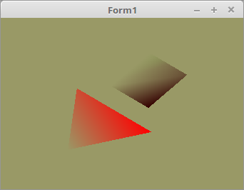

# 06 - Alpha Blending
## 00 - Einfaches Alpha Blending



Mit OpenGL kann man auch (halb)tranparente Elemente zeichen.
Dafür gibt es Alphablending. Der Transparent-Faktor wird mit dem vierten Wert im Vector angegeben. Dies ist auch im Shader der Fall.
Alphablending kann man auch auf Texturen anwenden, zB. um eine Baum zu zeichnen, oder auch nur eine Scheibe. Dazu mehr unter Texturen.
---
Neben einem Face mit 3 Werten, gibt es jetzt noch eines mit einem vierten, welcher dann den Aplhablending angibt.

```pascal
type
  TFace3f = array[0..2] of TVector3f;
  TFace4f = array[0..2] of TVector4f;  // Mit Alpha
```

Beim Color sieht man auch den vierten Parameter. Wobei <b>0.0</b> voll Transparent ist. und <b>1.0</b> undurchsichtig.
Wen man nur den RGB-Wert betrachtet, wäre das Dreieck voll rot und das Rechteck grün.

```pascal
const
  TriangleVector: array[0..0] of TFace3f =
    (((-0.4, 0.1, 0.0), (0.4, 0.1, 0.0), (0.0, 0.7, 0.0)));
  TriangleColor: array[0..0] of TFace4f =
    (((1.0, 0.0, 0.0, 1.0), (1.0, 0.0, 0.0, 0.5), (1.0, 0.0, 0.0, 0.0)));

  QuadVector: array[0..1] of TFace3f =
    (((-0.2, -0.6, 0.0), (-0.2, -0.1, 0.0), (0.2, -0.1, 0.0)),
    ((-0.2, -0.6, 0.0), (0.2, -0.1, 0.0), (0.2, -0.6, 0.0)));
  QuadColor: array[0..1] of TFace4f =
    (((0.0, 1.0, 0.0, 0.5), (0.0, 1.0, 0.0, 1.0), (0.0, 1.0, 0.0, 0.0)),
    ((0.0, 1.0, 0.0, 0.5), (0.0, 1.0, 0.0, 0.0), (0.0, 1.0, 0.0, 0.0)));
```

Hier kommen zwie wichtige Zeilen hinzu, mit der Ersten wird Alphablending aktiviert und mit der zweiten gibt man die Art des Blinding an.
Bei <b>glVertexAttribPointer(...</b> bei der Farbe sieht man, das ein Vector 4 Werte anstelle 3 hat.

```pascal
procedure TForm1.InitScene;
begin
  glClearColor(0.6, 0.6, 0.4, 1.0); // Hintergrundfarbe

  glEnable(GL_BLEND);                                  // Alphablending an
  glBlendFunc(GL_SRC_ALPHA, GL_ONE_MINUS_SRC_ALPHA);   // Sortierung der Primitiven von hinten nach vorne.

  glEnable(GL_DEPTH_TEST);
  glDepthFunc(GL_LESS);

  // --- Daten für Dreieck
  glBindVertexArray(VBTriangle.VAO);

  // Vektor
  glBindBuffer(GL_ARRAY_BUFFER, VBTriangle.VBOvert);
  glBufferData(GL_ARRAY_BUFFER, sizeof(TriangleVector), @TriangleVector, GL_STATIC_DRAW);
  glEnableVertexAttribArray(10);                         // 10 ist die Location in inPos Shader.
  glVertexAttribPointer(10, 3, GL_FLOAT, False, 0, nil);

  // Farbe
  glBindBuffer(GL_ARRAY_BUFFER, VBTriangle.VBOcol);
  glBufferData(GL_ARRAY_BUFFER, sizeof(TriangleColor), @TriangleColor, GL_STATIC_DRAW);
  glEnableVertexAttribArray(11);                         // 11 ist die Location in inCol Shader.
  glVertexAttribPointer(11, 4, GL_FLOAT, False, 0, nil);
```

---
Die Shader sind sehr einfach gehalten. Man könnte mit <b>Color.a</b> direkt einen Alphawert zuordnen.
Da der Alpha-Kanal gebraucht wird, sieht man mehrfach <b>vec4</b> anstelle <b>vec3</b>.

<b>Vertex-Shader:</b>

```glsl
#version 330

layout (location = 10) in vec3 inPos;    // Vertex-Koordinaten
layout (location = 11) in vec4 inCol;    // Farbe inklusive Alpha
uniform mat4 mat;                        // Matrix von Uniform

out vec4 Color;                          // Farbe, an Fragment-Shader übergeben


void main(void)
{
  gl_Position = mat * vec4(inPos, 1.0);  // Vektoren mit der Matrix multiplizieren.
  Color = inCol;
}

```

---
<b>Fragment-Shader:</b>

```glsl
#version 330

in  vec4 Color;      // interpolierte Farbe vom Vertexshader
out vec4 outColor;   // ausgegebene Farbe

void main(void)
{
  outColor = Color;
}

```


