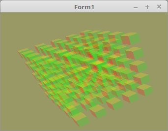

<html>
    <b><h1>06 - Alpha Blending</h1></b>
    <b><h2>10 - Reihenfolge sortiert mit Wuerfeln</h2></b>
  
Wen man mehrere Objekte mit Alpha-Blending hat, ist es wichtig, das man zuerst die Objekte zeichnet, die am weitesten weg sind. 
Aus diesem Grund habe ich jeden Objekt eine eigene Matrix gegeben. Somit kann ich die Object anhand dieser Matrix sortieren, das sie später in richtiger Reihenfolge gezeichnet werden können. 

 
Für CubePos, verwende ich Pointer, somit müssen beim Sortieren nur die Pointer vertauscht werden. 
Ansonsten musste der ganze Record umkopiert werden. Auf einem 32Bit OS müssen so nur 4Byte kopiert werden, ansonsten sind es mehr als 64 Byte. 
<pre><code=pascal><b>type</b>
  TCubePos = <b>record</b>
    pos: TVector3f;
    mat: TMatrix;
  <b>end</b>;
  PCubePos = ^TCubePos; <i>// Pointer für Cube</i>
 
<b>var</b>
  CubePosArray: <b>array</b>[0..CubeTotal - 1] <b>of</b> PCubePos; <i>// Alle Würfel</i></code></pre>
Hier wird der Speicher für die Würfel angefordert. 
<pre><code=pascal><b>procedure</b> TForm1.CreateScene;
<b>const</b>
  w = 1.0;
<b>var</b>
  i: integer;
<b>begin</b>
  <b>for</b> i := 0 <b>to</b> CubeTotal - 1 <b>do</b> <b>begin</b>
    <b>New</b>(CubePosArray[i]);  <i>// Speicher anfordern.</i>
  <b>end</b>;</code></pre>
Startpositionen der einzelnen Würfel definieren. 
<pre><code=pascal><b>procedure</b> TForm1.InitScene;
<b>const</b>
  d = 1.8;
<b>var</b>
  i, s: integer;
<b>begin</b>
  s := CubeSize <b>div</b> 2;
  <b>for</b> i := 0 <b>to</b> CubeTotal - 1 <b>do</b> <b>begin</b>
    CubePosArray[i]^.pos.x := ((i <b>mod</b> CubeSize) - s) * d;
    CubePosArray[i]^.pos.y := ((i <b>div</b> CubeSize) <b>mod</b> CubeSize - s) * d;
    CubePosArray[i]^.pos.z := (i <b>div</b> (CubeSize * CubeSize) - s) * d;
  <b>end</b>;</code></pre>
Hier sieht man, das ich die Matrizen vor dem Zeichnen mit einem Quick-Sort sortiere. 
Die Tiefe ist in der Matrix bei <b>[3, 2]</b> gespeichert, somit nehme ich den Wert als Vergleich für die Sortierung. 
<pre><code=pascal>
<i>// Pointer vertauschen</i>
<b>procedure</b> SwapPointer(<b>var</b> p1, p2: Pointer); <b>inline</b>;
<b>var</b>
  dummy: Pointer;
<b>begin</b>
  dummy := p1;
  p1 := p2;
  p2 := dummy;
<b>end</b>;
 
<i>// Der Quick-Sort</i>
<b>procedure</b> QuickSort(<b>var</b> ia: <b>array</b> <b>of</b> PCubePos; ALo, AHi: integer);
<b>var</b>
  Lo, Hi: integer;
  Pivot: TCubePos;
<b>begin</b>
  Lo := ALo;
  Hi := AHi;
  Pivot := ia[(Lo + Hi) <b>div</b> 2]^;
  <b>repeat</b>
    <b>while</b> ia[Lo]^.mat[3, 2] &lt; Pivot.mat[3, 2] <b>do</b> <b>begin</b>
      Inc(Lo);
    <b>end</b>;
    <b>while</b> ia[Hi]^.mat[3, 2] &gt; Pivot.mat[3, 2] <b>do</b> <b>begin</b>
      Dec(Hi);
    <b>end</b>;
    <b>if</b> Lo <= Hi <b>then</b> <b>begin</b>
      SwapPointer(ia[Lo], ia[Hi]);
      Inc(Lo);
      Dec(Hi);
    <b>end</b>;
  <b>until</b> Lo &gt; Hi;
  <b>if</b> Hi &gt; ALo <b>then</b> <b>begin</b>
    QuickSort(ia, ALo, Hi);
  <b>end</b>;
  <b>if</b> Lo &lt; AHi <b>then</b> <b>begin</b>
    QuickSort(ia, Lo, AHi);
  <b>end</b>;
<b>end</b>;</code></pre>
Hier sieht man, das die Matrix der einzelnen Würfel berechnet werden, um sie anschliessend nach der Z-Tiefe zu sortieren. 
Nach dem Sortieren werden die Würfel in der richtigen Reihenfolge gezeichnet. 
Versuchsweise kann man die Sortierroutine ausklammern, dann sieht man sofort die fehlerhafte Darstellung. 
<pre><code=pascal><b>procedure</b> TForm1.ogcDrawScene(Sender: TObject);
<b>var</b>
  i: integer;
<b>begin</b>
  glClear(GL_COLOR_BUFFER_BIT <b>or</b> GL_DEPTH_BUFFER_BIT);  <i>// Frame und Tiefen-Buffer CubeSizeöschen.</i>
 
  glEnable(GL_CULL_FACE);
  glCullface(GL_BACK);
 
  Shader.UseProgram;
 
  glBindVertexArray(VBCube.VAO);
 

  <i>// --- Zeichne Würfel</i>
 
  <b>for</b> i := 0 <b>to</b> CubeTotal - 1 <b>do</b> <b>begin</b>
    CubePosArray[i]^.mat.Identity;
    CubePosArray[i]^.mat.Translate(CubePosArray[i]^.pos);             <i>// Matrix verschieben.</i>
    CubePosArray[i]^.mat := WorldMatrix * CubePosArray[i]^.mat;       <i>// Matrixen multiplizieren.</i>
  <b>end</b>;
 
  QuickSort(CubePosArray, 0, CubeTotal - 1);                          <i>// Würfel nach der Z-Tiefe sortieren.</i>
 
  <b>for</b> i := 0 <b>to</b> CubeTotal - 1 <b>do</b> <b>begin</b>
    CubePosArray[i]^.mat := FrustumMatrix * CubePosArray[i]^.mat;
    CubePosArray[i]^.mat.Uniform(Matrix_ID);                          <i>// Matrix dem Shader übergeben.</i>
    glDrawArrays(GL_TRIANGLES, 0, Length(CubeVertex) * 3);            <i>// Zeichnet einen kleinen Würfel.</i>
  <b>end</b>;
 
  ogc.SwapBuffers;
<b>end</b>;</code></pre>
Den Speicher von den CubePos wieder frei geben. 
<pre><code=pascal><b>procedure</b> TForm1.FormDestroy(Sender: TObject);
<b>var</b>
  i: integer;
<b>begin</b>
  <b>for</b> i := 0 <b>to</b> CubeTotal - 1 <b>do</b> <b>begin</b>
    <b>New</b>(CubePosArray[i]);
  <b>end</b>;</code></pre>
Gedreht wird nur die WorldMatrix. 
<pre><code=pascal><b>procedure</b> TForm1.Timer1Timer(Sender: TObject);
<b>begin</b>
  WorldMatrix.RotateA(0.0123);  <i>// Drehe um X-Achse</i>
  WorldMatrix.RotateB(0.0234);  <i>// Drehe um Y-Achse</i>
 
  ogc.Invalidate;
<b>end</b>;</code></pre>

 
<b>Vertex-Shader:</b> 
<pre><code><b>#version</b> 330
 
<b>layout</b> (location = 10) <b>in</b> <b>vec3</b> inPos; <i>// Vertex-Koordinaten</i>
<b>layout</b> (location = 11) <b>in</b> <b>vec3</b> inCol; <i>// Farbe</i>
 
<b>out</b> <b>vec4</b> Color;                       <i>// Farbe, an Fragment-Shader übergeben.</i>
 
<b>uniform</b> <b>mat4</b> Matrix;                  <i>// Matrix für die Drehbewegung und Frustum.</i>
 
<b>void</b> main(<b>void</b>)
{
  gl_Position = Matrix * <b>vec4</b>(inPos, 1.0);
  Color = <b>vec4</b>(inCol, 1.0);
}
</code></pre>

 
<b>Fragment-Shader</b> 
<pre><code><b>#version</b> 330
 
<b>in</b>  <b>vec4</b> Color;     <i>// interpolierte Farbe vom Vertexshader</i>
<b>out</b> <b>vec4</b> outColor;  <i>// ausgegebene Farbe</i>
 
<b>void</b> main(<b>void</b>)
{
  outColor   = Color; <i>// Die Ausgabe der Farbe</i>
  outColor.a = 0.2;   <i>// Farbe soll halb transparent sein.</i>
}
</code></pre>
 
</html>
