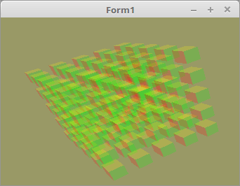

# 06 - Alpha Blending
## 10 - Reihenfolge sortiert mit Wuerfeln



Wen man mehrere Objekte mit Alpha-Blending hat, ist es wichtig, das man zuerst die Objekte zeichnet, die am weitesten weg sind.
Aus diesem Grund habe ich jeden Objekt eine eigene Matrix gegeben. Somit kann ich die Object anhand dieser Matrix sortieren, das sie später in richtiger Reihenfolge gezeichnet werden können.
---
Für CubePos, verwende ich Pointer, somit müssen beim Sortieren nur die Pointer vertauscht werden.
Ansonsten musste der ganze Record umkopiert werden. Auf einem 32Bit OS müssen so nur 4Byte kopiert werden, ansonsten sind es mehr als 64 Byte.

```pascal
type
  TCubePos = record
    pos: TVector3f;
    mat: TMatrix;
  end;
  PCubePos = ^TCubePos; // Pointer für Cube

var
  CubePosArray: array[0..CubeTotal - 1] of PCubePos; // Alle Würfel
```

Hier wird der Speicher für die Würfel angefordert.

```pascal
procedure TForm1.CreateScene;
const
  w = 1.0;
var
  i: integer;
begin
  for i := 0 to CubeTotal - 1 do begin
    New(CubePosArray[i]);  // Speicher anfordern.
  end;
```

Startpositionen der einzelnen Würfel definieren.

```pascal
procedure TForm1.InitScene;
const
  d = 1.8;
var
  i, s: integer;
begin
  s := CubeSize div 2;
  for i := 0 to CubeTotal - 1 do begin
    CubePosArray[i]^.pos.x := ((i mod CubeSize) - s) * d;
    CubePosArray[i]^.pos.y := ((i div CubeSize) mod CubeSize - s) * d;
    CubePosArray[i]^.pos.z := (i div (CubeSize * CubeSize) - s) * d;
  end;
```

Hier sieht man, das ich die Matrizen vor dem Zeichnen mit einem Quick-Sort sortiere.
Die Tiefe ist in der Matrix bei <b>[3, 2]</b> gespeichert, somit nehme ich den Wert als Vergleich für die Sortierung.

```pascal

// Pointer vertauschen
procedure SwapPointer(var p1, p2: Pointer); inline;
var
  dummy: Pointer;
begin
  dummy := p1;
  p1 := p2;
  p2 := dummy;
end;

// Der Quick-Sort
procedure QuickSort(var ia: array of PCubePos; ALo, AHi: integer);
var
  Lo, Hi: integer;
  Pivot: TCubePos;
begin
  Lo := ALo;
  Hi := AHi;
  Pivot := ia[(Lo + Hi) div 2]^;
  repeat
    while ia[Lo]^.mat[3, 2] < Pivot.mat[3, 2] do begin
      Inc(Lo);
    end;
    while ia[Hi]^.mat[3, 2] > Pivot.mat[3, 2] do begin
      Dec(Hi);
    end;
    if Lo <= Hi then begin
      SwapPointer(ia[Lo], ia[Hi]);
      Inc(Lo);
      Dec(Hi);
    end;
  until Lo > Hi;
  if Hi > ALo then begin
    QuickSort(ia, ALo, Hi);
  end;
  if Lo < AHi then begin
    QuickSort(ia, Lo, AHi);
  end;
end;
```

Hier sieht man, das die Matrix der einzelnen Würfel berechnet werden, um sie anschliessend nach der Z-Tiefe zu sortieren.
Nach dem Sortieren werden die Würfel in der richtigen Reihenfolge gezeichnet.
Versuchsweise kann man die Sortierroutine ausklammern, dann sieht man sofort die fehlerhafte Darstellung.

```pascal
procedure TForm1.ogcDrawScene(Sender: TObject);
var
  i: integer;
begin
  glClear(GL_COLOR_BUFFER_BIT or GL_DEPTH_BUFFER_BIT);  // Frame und Tiefen-Buffer CubeSizeöschen.

  glEnable(GL_CULL_FACE);
  glCullface(GL_BACK);

  Shader.UseProgram;

  glBindVertexArray(VBCube.VAO);


  // --- Zeichne Würfel

  for i := 0 to CubeTotal - 1 do begin
    CubePosArray[i]^.mat.Identity;
    CubePosArray[i]^.mat.Translate(CubePosArray[i]^.pos);             // Matrix verschieben.
    CubePosArray[i]^.mat := WorldMatrix * CubePosArray[i]^.mat;       // Matrixen multiplizieren.
  end;

  QuickSort(CubePosArray, 0, CubeTotal - 1);                          // Würfel nach der Z-Tiefe sortieren.

  for i := 0 to CubeTotal - 1 do begin
    CubePosArray[i]^.mat := FrustumMatrix * CubePosArray[i]^.mat;
    CubePosArray[i]^.mat.Uniform(Matrix_ID);                          // Matrix dem Shader übergeben.
    glDrawArrays(GL_TRIANGLES, 0, Length(CubeVertex) * 3);            // Zeichnet einen kleinen Würfel.
  end;

  ogc.SwapBuffers;
end;
```

Den Speicher von den CubePos wieder frei geben.

```pascal
procedure TForm1.FormDestroy(Sender: TObject);
var
  i: integer;
begin
  for i := 0 to CubeTotal - 1 do begin
    New(CubePosArray[i]);
  end;
```

Gedreht wird nur die WorldMatrix.

```pascal
procedure TForm1.Timer1Timer(Sender: TObject);
begin
  WorldMatrix.RotateA(0.0123);  // Drehe um X-Achse
  WorldMatrix.RotateB(0.0234);  // Drehe um Y-Achse

  ogc.Invalidate;
end;
```

---
<b>Vertex-Shader:</b>

```glsl
#version 330

layout (location = 10) in vec3 inPos; // Vertex-Koordinaten
layout (location = 11) in vec3 inCol; // Farbe

out vec4 Color;                       // Farbe, an Fragment-Shader übergeben.

uniform mat4 Matrix;                  // Matrix für die Drehbewegung und Frustum.

void main(void)
{
  gl_Position = Matrix * vec4(inPos, 1.0);
  Color = vec4(inCol, 1.0);
}

```

---
<b>Fragment-Shader</b>

```glsl
#version 330

in  vec4 Color;     // interpolierte Farbe vom Vertexshader
out vec4 outColor;  // ausgegebene Farbe

void main(void)
{
  outColor   = Color; // Die Ausgabe der Farbe
  outColor.a = 0.2;   // Farbe soll halb transparent sein.
}

```


