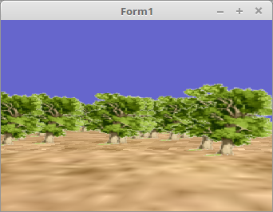

<html>
  
Da mit Texturen welche Alpha-Blending haben das gleiche Problem besteht, wie mit den Würfeln, muss man auch dort sortieren. 
Da die Position der Bäume keine Drehbewegung haben, reicht ein Vector für dessen Position, eine Matrix ist nicht nötig. 
Für den Boden wird eine Matrix gebraucht, da ich diesen drehe. 
 
Zusätzlich habe ich für den Boden noch eine Textur genommen, somit sieht die Scene recht realistisch aus. 
 
Wie Texturen funktionieren, in einem späteren Kapitel. 

 
Den Speicher für die Position der Bäume reservieren. 
<pre><code>
<b>procedure</b> TForm1.FormCreate(Sender: TObject);
<b>var</b>
  i: Integer;
<b>begin</b>
  <b>for</b> i := 0 <b>to</b> TreeCount - 1 <b>do</b> <b>begin</b>
    <b>New</b>(TreePosArray[i]);
  <b>end</b>;</code></pre>
Die Position der Bäume  wird zufällig bestimmt. 
<pre><code><b>procedure</b> TForm1.InitScene;
<b>const</b>
  d = 10;
<b>var</b>
  i: integer;
<b>begin</b>
  <b>for</b> i := 0 <b>to</b> TreeCount - 1 <b>do</b> <b>begin</b>
    TreePosArray[i]^.x := -d / 2 + Random * d;
    TreePosArray[i]^.y := 0.0;
    TreePosArray[i]^.z := -d / 2 + Random * d;
  <b>end</b>;</code></pre>
Der Boden und die Bäume zeichen. 
Dabei ist es wichtig, das man zuerst den Boden zeichnet, weil die Bäume Alpha-Blending haben. 
Objecte mit Alpha-Blending sollte man immer zum Schluss zeichnen. 
<pre><code><b>procedure</b> TForm1.ogcDrawScene(Sender: TObject);

  <b>procedure</b> QuickSort(<b>var</b> ia: <b>array</b> <b>of</b> PTreePos; ALo, AHi: integer);
  <b>var</b>
    Lo, Hi: integer;
    dummy : PTreePos;
    Pivot: TTreePos;
  <b>begin</b>
    Lo := ALo;
    Hi := AHi;
    Pivot := ia[(Lo + Hi) <b>div</b> 2]^;
    <b>repeat</b>
      <b>while</b> ia[Lo]^.z &lt; Pivot.z <b>do</b> <b>begin</b>
        Inc(Lo);
      <b>end</b>;
      <b>while</b> ia[Hi]^.z &gt; Pivot.z <b>do</b> <b>begin</b>
        Dec(Hi);
      <b>end</b>;
      <b>if</b> Lo <= Hi <b>then</b> <b>begin</b>
        dummy := ia[Lo];
        ia[Lo] := ia[Hi];
        ia[Hi] := dummy;
        Inc(Lo);
        Dec(Hi);
      <b>end</b>;
    <b>until</b> Lo &gt; Hi;
    <b>if</b> Hi &gt; ALo <b>then</b> <b>begin</b>
      QuickSort(ia, ALo, Hi);
    <b>end</b>;
    <b>if</b> Lo &lt; AHi <b>then</b> <b>begin</b>
      QuickSort(ia, Lo, AHi);
    <b>end</b>;
  <b>end</b>;

<b>var</b>
  i: integer;
<b>begin</b>
  glClear(GL_COLOR_BUFFER_BIT <b>or</b> GL_DEPTH_BUFFER_BIT);        <i>// Frame und Tiefen-Puffer löschen.</i>

  glEnable(GL_CULL_FACE);
  glCullface(GL_BACK);

  Shader.UseProgram;

  glBindVertexArray(VBQuad.VAO);

  <i>// --- Zeichne Boden</i>
  SandTextur.ActiveAndBind;                                   <i>// Boden-Textur binden</i>
  Matrix.Identity;
  Matrix.Translate(0.0, 1.0, 0.0);
  Matrix.Scale(10.0);
  Matrix.RotateA(Pi / 2);

  Matrix := FrustumMatrix * WorldMatrix * GroundPos * Matrix; <i>// Matrizen multiplizieren.</i>

  Matrix.Uniform(Matrix_ID);                                  <i>// Matrix dem Shader übergeben.</i>
  glDrawArrays(GL_TRIANGLES, 0, Length(QuadVertex));      <i>// Zeichnet einen kleinen Würfel.</i>

  <i>// --- Zeichne Bäume</i>
  QuickSort(TreePosArray, 0, TreeCount - 1);                  <i>// Die Bäume sortieren.</i>

  BaumTextur.ActiveAndBind;                                   <i>// Baum-Textur binden</i>

  <b>for</b> i := 0 <b>to</b> TreeCount - 1 <b>do</b> <b>begin</b>
    Matrix.Identity;
    Matrix.Translate(TreePosArray[i]^);                       <i>// Die Bäume an die richtige Position bringen</i>

    Matrix := FrustumMatrix * WorldMatrix * Matrix;           <i>// Matrizen multiplizieren.</i>

    Matrix.Uniform(Matrix_ID);
    glDrawArrays(GL_TRIANGLES, 0, Length(QuadVertex));
  <b>end</b>;

  ogc.SwapBuffers;
<b>end</b>;</code></pre>
Da sieht man, das es reicht nur den Vector zu drehen. 
<pre><code><b>procedure</b> TForm1.Timer1Timer(Sender: TObject);
<b>const</b>
  rot = 0.0134;
<b>var</b>
  i: integer;
<b>begin</b>
  <b>for</b> i := 0 <b>to</b> TreeCount - 1 <b>do</b> <b>begin</b>
    TreePosArray[i]^.RotateB(rot);
  <b>end</b>;
  GroundPos.RotateB(rot);

  ogc.Invalidate;
<b>end</b>;</code></pre>

 
<b>Vertex-Shader:</b> 
<pre><code><b>#version</b> 330

<b>layout</b> (location =  0) <b>in</b> <b>vec3</b> inPos; <i>// Vertex-Koordinaten</i>
<b>layout</b> (location = 10) <b>in</b> <b>vec2</b> inUV;  <i>// Textur-Koordinaten</i>

<b>out</b> <b>vec2</b> UV0;

<b>uniform</b> <b>mat4</b> Matrix;                  <i>// Matrix für die Drehbewegung und Frustum.</i>

<b>void</b> main(<b>void</b>)
{
  gl_Position = Matrix * <b>vec4</b>(inPos, 1.0);
  UV0         = inUV;                 <i>// Textur-Koordinaten weiterleiten.</i>
}
</code></pre>

 
<b>Fragment-Shader</b> 
<pre><code><b>#version</b> 330

<b>in</b> <b>vec2</b> UV0;

<b>uniform</b> <b>sampler2D</b> Sampler;              <i>// Der Sampler welchem 0 zugeordnet wird.</i>

<b>out</b> <b>vec4</b> FragColor;

<b>void</b> main()
{
  FragColor = texture( Sampler, UV0 );  <i>// Die Farbe aus der Textur anhand der Koordinten auslesen.</i>
}
</code></pre>

</html>
