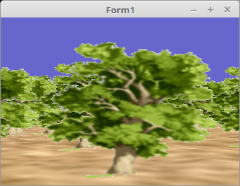

<html>
    <b><h1>06 - Alpha Blending</h1></b>
    <b><h2>20 - Alpha-Kanal abfragen und ingnorieren</h2></b>
  
Bei Texturen mit Alphablending gibt es noch eine einfacher Variante als sortieren. 
Voraus gesetzt der Alphakanal ist voll transparent. 
 
Wen es transparent ist, wird einfach kein Pixel gezeichnet und dadurch wird auch der Z-Buffer nicht aktualisiert. 
Dies spielt sich im FragmentShader ab. 

 
Es empfieht sich trotzdem immer die Objecte mit Alpha-Blending zum Schluss zu zeichnen. 
Aber es muss nicht mehr sortiert werden. 
<pre><code=pascal><b>procedure</b> TForm1.ogcDrawScene(Sender: TObject);
 
<b>var</b>
  i: integer;
<b>begin</b>
  glClear(GL_COLOR_BUFFER_BIT <b>or</b> GL_DEPTH_BUFFER_BIT);        <i>// Frame und Tiefen-Puffer löschen.</i>
 
  glEnable(GL_CULL_FACE);
  glCullface(GL_BACK);
 
  Shader.UseProgram;
 
  glBindVertexArray(VBQuad.VAO);
 
  <i>// --- Zeichne Boden</i>
  SandTextur.ActiveAndBind;                                   <i>// Boden-Textur binden</i>
  Matrix.Identity;
  Matrix.Translate(0.0, 1.0, 0.0);
  Matrix.Scale(10.0);
  Matrix.RotateA(Pi / 2);
 
  Matrix := FrustumMatrix * WorldMatrix * GroundPos * Matrix; <i>// Matrizen multiplizieren.</i>
 
  Matrix.Uniform(Matrix_ID);                                  <i>// Matrix dem Shader übergeben.</i>
  glDrawArrays(GL_TRIANGLES, 0, Length(QuadVertex));          <i>// Zeichnet einen kleinen Würfel.</i>
 
  <i>// --- Zeichne Bäume</i>
  BaumTextur.ActiveAndBind;                                   <i>// Baum-Textur binden</i>
 
  <b>for</b> i := 0 <b>to</b> TreeCount - 1 <b>do</b> <b>begin</b>
    Matrix.Identity;
    Matrix.Translate(TreePosArray[i]);                        <i>// Die Bäume an die richtige Position bringen</i>
 
    Matrix := FrustumMatrix * WorldMatrix * Matrix;           <i>// Matrizen multiplizieren.</i>
 
    Matrix.Uniform(Matrix_ID);
    glDrawArrays(GL_TRIANGLES, 0, Length(QuadVertex));
  <b>end</b>;
 
  ogc.SwapBuffers;
<b>end</b>;</code></pre>

 
<b>Vertex-Shader:</b> 
<pre><code><b>#version</b> 330
 
<b>layout</b> (location =  0) <b>in</b> <b>vec3</b> inPos; <i>// Vertex-Koordinaten</i>
<b>layout</b> (location = 10) <b>in</b> <b>vec2</b> inUV;  <i>// Textur-Koordinaten</i>
 
<b>out</b> <b>vec2</b> UV0;
 
<b>uniform</b> <b>mat4</b> Matrix;                  <i>// Matrix für die Drehbewegung und Frustum.</i>
 
<b>void</b> main(<b>void</b>)
{
  gl_Position = Matrix * <b>vec4</b>(inPos, 1.0);
  UV0         = inUV;                 <i>// Textur-Koordinaten weiterleiten.</i>
}
</code></pre>

 
<b>Fragment-Shader</b> 
Hier wird abgefragt, ob der Pixel transparent ist, wen ja wird er nicht ausgegeben und 
dadurch wird der Z-Buffer nicht aktualisiert. Dadurch werden Objecte hinter der transparent Textur trozdem gezeichnet. 
 
Da die Kanten der Baume nicht voll transparent sind, habe ich einen Mittelwert von 0.5 genommen. 
Da muss man abschätzen, wie streng die Prüfung sein soll. 
<pre><code><b>#version</b> 330
 
<b>in</b> <b>vec2</b> UV0;
 
<b>uniform</b> <b>sampler2D</b> Sampler;
 
<b>out</b> <b>vec4</b> FragColor;
 
<b>void</b> main()
{
  <b>vec4</b> c = texture( Sampler, UV0 );
  <b>if</b> (c.a &gt; 0.5) {
    FragColor =  c;
  } <b>else</b> {
    <b>discard</b>; <i>// Wen transparent, Pixel nicht ausgeben.</i>
  }
}
</code></pre>
 
</html>
