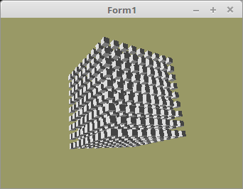

# 07 - Beleuchtung
## 00 - Einfache Beleuchtung



Ohne Beleuchtung sehen die Object statisch aus, wen man noch Beleuchtung ins Spiel bringt, wirkt eine OpenGL-Scene viel realistischer.
Dabei gibt es verschiedene Arten von Beleuchtung. Die meist verwendete ist das <b>Directional Light</b>, dies entspricht dem Sonnenlicht.
Dieses Beispiel zeigt eine ganz einfache Variante von diesem Licht. Je steiler das Licht auf ein Polygon einstrahlt, je heller wird das Polygon.

Das man dies berechnen kann, braucht es für jede Ecke des Polygons einen Normale-Vektor.
Eine Normale zeigt meistens senkrecht auf ein Polygon.
Es gibt Ausnahmen, zB. bei runden Flächen. Dazu in einem späteren Beispiel.

Die <b>Normalen</b> werden mit der <b>ModelMatrix</b> multipliziert, da diese unbeinflusst von Perspektive/Frustum ist.
Die Position der <b>Polygone</b> wird mit <b>Matrix</b> modifiziert, da ist eine perspektifische Darstellung erwünscht.
Wen man dies nicht macht, hat man eine falsche Abdunklung auf den schrägen Dreiecken. Die macht sich besonders start bemerkbar bei <b>Punkt</b> und <b>Spot</b>-Licht.

Hier wird die einfachste Variante einer Beleuchtung gezeigt.
Dazu wird das Skalarprodukt zwischen der Normalen und der Lichtposition berechnet.
Dabei werden die Polygone dunkler, je grösser der Winkel. 0°=weiss; 180°=schwarz.
Diese Beleuchtung ist eigentlich nicht üblich, aber immerhin sieht man die Mehses viel besser.
Aber es zeigt wenigsten, wie das Grundgerüst einer Beleuchtung aussieht.

Die gebräuchlichsten Lichvarianten von OpenGL:
* <b>Ambient-Light</b> - Einfache Raumausleuchtung, alles ist gleich Hell.
* <b>Directional-Light</b> - Das Licht kommt alles aus gleicher Richtung, so wie das Sonnenlicht auf Erde.
* <b>Point-Light</b> - Das Licht wird von einem Punkt ausgestrahlt, so wie bei einer Glühbirne.
* <b>Spot-Light</b> - Das Lich hat einen Kegel, so wie wen es aus einer Taschenlampe kommt.

Was zu beachten das die Beleuchtungs-Effekte <b>keine Schatten</b> berücksichtigen.
Schatten muss man auf eine ganz andere weise berechnen.

Es ist auch möglich mehrere Lichtquellen zu berechnen, dazu werden alle Lichtquellen addiert.
Das sieht man gut bei den mehrfarbigen Beleuchtungbeispielen. Da sieht man auch, das das Licht farbig sein kann.

Dazu später.
---
Die Konstanten der Würfel-Vektoren.

```pascal
const
  CubeVertex: TCube =
    (((-0.5, 0.5, 0.5), (-0.5, -0.5, 0.5), (0.5, -0.5, 0.5)), ((-0.5, 0.5, 0.5), (0.5, -0.5, 0.5), (0.5, 0.5, 0.5)),
    ((0.5, 0.5, 0.5), (0.5, -0.5, 0.5), (0.5, -0.5, -0.5)), ((0.5, 0.5, 0.5), (0.5, -0.5, -0.5), (0.5, 0.5, -0.5)),
    ((0.5, 0.5, -0.5), (0.5, -0.5, -0.5), (-0.5, -0.5, -0.5)), ((0.5, 0.5, -0.5), (-0.5, -0.5, -0.5), (-0.5, 0.5, -0.5)),
    ((-0.5, 0.5, -0.5), (-0.5, -0.5, -0.5), (-0.5, -0.5, 0.5)), ((-0.5, 0.5, -0.5), (-0.5, -0.5, 0.5), (-0.5, 0.5, 0.5)),
    // oben
    ((0.5, 0.5, 0.5), (0.5, 0.5, -0.5), (-0.5, 0.5, -0.5)), ((0.5, 0.5, 0.5), (-0.5, 0.5, -0.5), (-0.5, 0.5, 0.5)),
    // unten
    ((-0.5, -0.5, 0.5), (-0.5, -0.5, -0.5), (0.5, -0.5, -0.5)), ((-0.5, -0.5, 0.5), (0.5, -0.5, -0.5), (0.5, -0.5, 0.5)));
```

Für die Normale wird nur eine Variable für Vektoren deklariert, da diese aus den Vektoren des Würfels berechnet werden.
Diese zeigt dann senkrecht auf das Dreieck.

```pascal
var
  CubeNormal: TCube;
```

Für die Normale braucht es noch eine VBO.

```pascal
type
  TVB = record
    VAO,
    VBOvert,            // VBO für Vektor.
    VBONormal: GLuint;  // VBO für Normale.
  end;
```

In der Unit Matrix hat es eine fertige Funktion, welche die Normale aus den Vertex-Koordinaten berechnet.
Diese Funktion sollte  man <b>nur</b> verwenden, wen die <b>Normale</b> senkrecht auf dem Dreieck steht.
Bei runden Objekten ist dies nicht der Fall.

```pascal
procedure TForm1.CreateScene;
begin
  FaceToNormale(CubeVertex, CubeNormal);
```

Die Normale wird auf gleiche weise in den VRAM geladen, wie die Vertex-Koordinaten.

```pascal
procedure TForm1.InitScene;
begin
  glClearColor(0.6, 0.6, 0.4, 1.0); // Hintergrundfarbe

  // --- Daten für Würfel
  glBindVertexArray(VBCube.VAO);

  // Vektor
  glBindBuffer(GL_ARRAY_BUFFER, VBCube.VBOvert);
  glBufferData(GL_ARRAY_BUFFER, sizeof(CubeVertex), @CubeVertex, GL_STATIC_DRAW);
  glEnableVertexAttribArray(0);
  glVertexAttribPointer(0, 3, GL_FLOAT, False, 0, nil);

  // Normale
  glBindBuffer(GL_ARRAY_BUFFER, VBCube.VBONormal);
  glBufferData(GL_ARRAY_BUFFER, sizeof(CubeNormal), @CubeNormal, GL_STATIC_DRAW);
  glEnableVertexAttribArray(1);
  glVertexAttribPointer(1, 3, GL_FLOAT, False, 0, nil);

end;
```

Hier sieht man gut, das 2 Matrizen dem Shader übergeben werden.
Bevor die Matrix mit Frustum und Worldposition beinflusst wird, wird sie das erste mal dem Shader übergeben.
Diese Matrix beinhaltet nur die lokalen Transformationen der Meshes.
Für die Position der Vektoren, wird eine komplett berechnete Matrix dem Shader übergeben.
Die Multiplikationen hätte man auch im Shader ausführen können, aber dies verbraucht nur unnötige <b>GPU</b>-Leistung.
Wen man es mit der <b>CPU</b> macht, wird die Berechnung nur einmal pro Meshes gemacht und nicht bei jedem Vektor.
Das wird in <b>allen</b> Beleuchtungsbeispielen so gemacht, egal ob Punkt, Directinal, etc. Beleuchtung.
Ausser bei Ambient, da es dort <b>keine</b> Normalen gibt.

In diesem Beispiel wird die pro Würfel gemacht. Da der Würfel mehrmals verwendet wird, gibt es pro Würfel eine Berechnung.

```pascal
  for x := -s to s do begin
    for y := -s to s do begin
      for z := -s to s do begin
        Matrix.Identity;
        Matrix.Translate(x * d, y * d, z * d);                 // Lokale Translationen.
        Matrix := ModelMatrix * Matrix;

        Matrix.Uniform(ModelMatrix_ID);                        // Erste Übergabe an den Shader.

        Matrix := FrustumMatrix * WorldMatrix *  Matrix;       // Matrixen multiplizieren.

        Matrix.Uniform(Matrix_ID);                             // Die komplettt berechnete Matrix übergeben.
        glDrawArrays(GL_TRIANGLES, 0, Length(CubeVertex) * 3); // Zeichnet einen einzelnen Würfel.
      end;
    end;
  end;
```

---
Einfachere Beleuchtungen macht man im Vertex-Shader.
Will man aber komplexer Beleuchtungen, nimmt man dazu den Fragment-Shader, das dieser Pixelgenau ist.
Dafür wird aber mehr Berechnugszeit benötigt.
---
<b>Vertex-Shader:</b>

Die Berechnug für das Licht des einfachen Beispieles ist hier im Vetex-Shader.
Hier sieht man, das verschiedene Matrizen für <b>Normale</b> und <b>Vertex</b> verwendet werden.

```glsl
#version 330

// Die Lichtquelle befindet sich Links.
#define LightPos vec3(1.0, 0.0, 0.0)
#define PI       3.1415

layout (location = 0) in vec3 inPos;    // Vertex-Koordinaten
layout (location = 1) in vec3 inNormal; // Normale

out vec4 Color;                         // Farbe, an Fragment-Shader übergeben.

uniform mat4 ModelMatrix;               // Matrix des Modeles, ohne Einfluss von Frustum.
uniform mat4 Matrix;                    // Matrix für die Drehbewegung und Frustum.

float light(in vec3 p, in vec3 n) {
  vec3  v1 = normalize(p); // Vektoren normalisieren, so das die Länge des Vektors immer 1.0 ist.
  vec3  v2 = normalize(n); // In diesem Beispiel sind diese schon 1.0, aber in der Praxis können auch andere Werte ankommen.
  float d  = dot(v1, v2);  // Skalarprodukt ( Winkel ) aus beiden Vektoren berechnen.
                           // Der Winkel ist bei 180° = Pi.

  d  = acos(d);            // Davon noch den Arkuskosinus berechnen. Somit hat man den Winkel zwischen den beiden Vektoren.
  d /= PI;                 // Anschliessend diesen noch durch Pi teilen, da 0° Weiss und 180° Schwarz sein soll.
  return d;
}

void main(void) {
  gl_Position  = Matrix * vec4(inPos, 1.0);    // Die komplette Berechnete Matrix.

  vec3  Normal = mat3(ModelMatrix) * inNormal; // Matrix mit lokalen Tranformationen.
  float col    = light(LightPos, Normal);      // Licht berechnen.

  Color        = vec4(col, col, col, 1.0);
}

```

---
<b>Fragment-Shader</b>

```glsl
#version 330

in  vec4 Color;     // interpolierte Farbe vom Vertexshader
out vec4 outColor;  // ausgegebene Farbe

void main(void) {
  outColor = Color; // Die Ausgabe der Farbe
}

```


