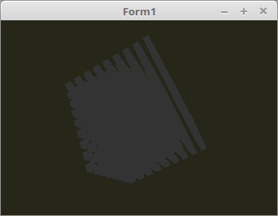

<html>
  
Das Ambient-Light ist nut eine einfache Raumausleuchtung, die ganze Meshes erscheint im gleichen Farbton. 
Bei reiner Ambienten Ausleuchtung wird <b>keine</b> Normale gebraucht. 
 
In der Praxis wir Ambient mit anderen Beleuchtungen kombiniert. 
 
Am Shader an sieht man, wie einfach Ambient ist. 

 
<b>Vertex-Shader:</b> 
<pre><code><b>#version</b> 330

<i>// Eine leichte Ausleuchtung in Grau.</i>
<b>#define</b> ambient <b>vec3</b>(0.2, 0.2, 0.2)

<b>layout</b> (location = 0) <b>in</b> <b>vec3</b> inPos;    <i>// Vertex-Koordinaten</i>

<b>out</b> <b>vec4</b> Color;                         <i>// Farbe, an Fragment-Shader übergeben.</i>

<b>uniform</b> <b>mat4</b> Matrix;                    <i>// Matrix für die Drehbewegung und Frustum.</i>

<b>void</b> main(<b>void</b>) {
  gl_Position = Matrix * <b>vec4</b>(inPos, 1.0);

  Color = <b>vec4</b>(ambient, 1.0);
}
</code></pre>

 
<b>Fragment-Shader</b> 
<pre><code><b>#version</b> 330

<b>in</b>  <b>vec4</b> Color;     <i>// interpolierte Farbe vom Vertexshader</i>
<b>out</b> <b>vec4</b> outColor;  <i>// ausgegebene Farbe</i>

<b>void</b> main(<b>void</b>) {
  outColor = Color; <i>// Die Ausgabe der Farbe</i>
}
</code></pre>

</html>
