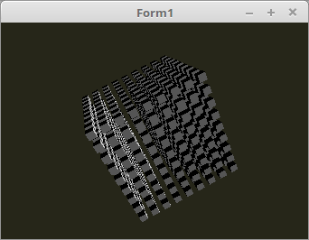

<html>
  
Das Directional-Light entspricht in etwa dem Sonnen-Licht, die Lichtstrahlen kommen alle von der gleichen Richtung. 
Im Grunde ist die Sonne auch ein Punktlicht, aber auf der Erde nimmt man es als Directional-Light war. 
Im Beispiel von Rechts. 
 
Im ersten Beispiel wurde die Beleuchung mit Acos und Pi berechnet. 
Dieser Umweg kann man sich sparen, es gibt zwar so ein kleiner Rechnungsfehler, aber diesen kann man getrost ingnorieren. 
Dies hat sogar den Vorteil, wen der Einstrahlwinkel des Lichtes flacher als 90° ist, ist die Beleuchtungsstärke gleich null. 
Als was flacher als 90° ist, ist negativ. 
Für dies gibt es in GLSL eine fertige Funktion <b>clamp</b>, mit der kann man einen Bereich festlegen. 
So das es in diesem Beispiel keinen Wert < <b>0.0</b> oder > <b>1.0</b> gibt. 
 
Der einzige Unterschied zu vorherigem Beispiel ist im Shader-Code. Auch der Hintergrund wurde etwas dunkler gemacht, das man den Licht-Effekt besser sieht. 
 
Bei dem Lichtpositions-Vector ist es egal, wie weit die Lichtquelle weg ist, da der Vektor nur die Lichtrichtung angeben muss. 
Meistens nimmt man aber einen <b>Einheitsvektor</b>, das ist ein Vektor mit der Länge <b>1.0</b>. 
Die Lichtposition wird im Vertex-Shader als Konstante definiert. 

 

 
Hier sieht man, das anstelle von arcos und Pi, <b>clamp</b> verwendet wurde. 
<b>Vertex-Shader:</b> 
<pre><code><b>#version</b> 330

<i>// Das Licht kommt von Rechts.</i>
<b>#define</b> LightPos <b>vec3</b>(1.0, 0.0, 0.0)

<b>layout</b> (location = 0) <b>in</b> <b>vec3</b> inPos;    <i>// Vertex-Koordinaten</i>
<b>layout</b> (location = 1) <b>in</b> <b>vec3</b> inNormal; <i>// Normale</i>

<b>out</b> <b>vec4</b> Color;                         <i>// Farbe, an Fragment-Shader übergeben.</i>

<b>uniform</b> <b>mat4</b> ModelMatrix;               <i>// Matrix des Modell, ohne Frustumeinfluss.</i>
<b>uniform</b> <b>mat4</b> Matrix;                    <i>// Matrix für die Drehbewegung und Frustum.</i>

<b>float</b> light(<b>vec3</b> p, <b>vec3</b> n) {
  <b>vec3</b>  v1 = normalize(p);       <i>// Vektoren normalisieren,</i>
  <b>vec3</b>  v2 = normalize(n);       <i>// so das die Länge des Vektors immer 1.0 ist.</i>
  <b>float</b> d  = dot(v1, v2);        <i>// Skalarprodukt aus beiden Vektoren berechnen.</i>
  <b>float</b> c  = clamp(d, 0.0, 1.0); <i>// Alles > 1.0 und < 0.0, wird zwischen 0.0 und 1.0 gesetzt.</i>
  <b>return</b> c;                      <i>// Lichtstärke als Rückgabewert.</i>
}

<b>void</b> main(<b>void</b>) {
  gl_Position  = Matrix * <b>vec4</b>(inPos, 1.0);

  <b>vec3</b>  Normal = <b>mat3</b>(ModelMatrix) * inNormal;
  <b>float</b> col    = light(LightPos, Normal);

  Color        = <b>vec4</b>(col, col, col, 1.0);
}
</pre></code>

 
<b>Fragment-Shader</b> 
<pre><code><b>#version</b> 330

<b>in</b>  <b>vec4</b> Color;     <i>// interpolierte Farbe vom Vertexshader</i>
<b>out</b> <b>vec4</b> outColor;  <i>// ausgegebene Farbe</i>

<b>void</b> main(<b>void</b>) {
  outColor = Color; <i>// Die Ausgabe der Farbe</i>
}
</pre></code>

</html>
