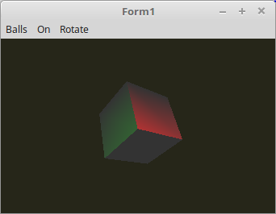

  
In diesem Beispiel werden Würfel anstelle der Kugeln verwendet. 
 
Das Licht wird immer noch im Vertex-Shader berechnet, die hat zwar den Vorteil, das es einges schneller geht als mit dem Fragmsnt-Shader. 
Dafür ist di Darstellung des Point-Lichtes unrealistisch. Das sieht man gut, wen man nur ein Würfel darstellt, da ist die Fläche eines Dreieckes sehr gross. 
Bei den Kugel war dieser Effekt kaum sichtbar, das sehr kleine Dreiecke verwendet werden. 

 
<b>Vertex-Shader:</b> 
<pre><code><b>#version</b> 330

<b>#define</b> ambient <b>vec3</b>(0.2, 0.2, 0.2)
<b>#define</b> red     <b>vec3</b>(1.0, 0.0, 0.0)
<b>#define</b> green   <b>vec3</b>(0.0, 1.0, 0.0)
<b>#define</b> blue    <b>vec3</b>(0.0, 0.0, 1.0)

<b>layout</b> (location = 0) <b>in</b> <b>vec3</b> inPos;    <i>// Vertex-Koordinaten</i>
<b>layout</b> (location = 1) <b>in</b> <b>vec3</b> inNormal; <i>// Normale</i>

<b>out</b> <b>vec4</b> Color;                         <i>// Farbe, an Fragment-Shader übergeben.</i>

<b>uniform</b> <b>mat4</b> ModelMatrix;
<b>uniform</b> <b>mat4</b> Matrix;                    <i>// Matrix für die Drehbewegung und Frustum.</i>

<b>uniform</b> <b>bool</b> RedOn;
<b>uniform</b> <b>bool</b> GreenOn;
<b>uniform</b> <b>bool</b> BlueOn;

<b>uniform</b> <b>vec3</b> RedLightPos;
<b>uniform</b> <b>vec3</b> GreenLightPos;
<b>uniform</b> <b>vec3</b> BlueLightPos;

<b>float</b> light(<b>vec3</b> p, <b>vec3</b> n) {
  <b>vec3</b> v1 = normalize(p);     <i>// Vektoren normalisieren, so das die Länge des Vektors immer 1.0 ist.</i>
  <b>vec3</b> v2 = normalize(n);
  <b>float</b> d = dot(v1, v2);      <i>// Skalarprodukt aus beiden Vektoren berechnen.</i>
  <b>return</b> clamp(d, 0.0, 1.0);
}

<b>void</b> main(<b>void</b>) {
  gl_Position = Matrix * <b>vec4</b>(inPos, 1.0);

  <b>vec3</b> Normal = <b>mat3</b>(ModelMatrix) * inNormal;
  <b>vec3</b> pos    = (ModelMatrix * <b>vec4</b>(inPos, 1.0)).xyz;

  Color = <b>vec4</b>(ambient, 1.0);
  <b>if</b> (RedOn) {
    <b>vec3</b> colRed = light(RedLightPos - pos, Normal) * red;
    Color.rgb += colRed;
  }
  <b>if</b> (GreenOn) {
    <b>vec3</b> colGreen = light(GreenLightPos - pos, Normal) * green;
    Color.rgb += colGreen;
  }
  <b>if</b> (BlueOn) {
    <b>vec3</b> colBlue = light(BlueLightPos - pos, Normal) * blue;
    Color.rgb += colBlue;
  }
}
</pre></code>

 
<b>Fragment-Shader</b> 
<pre><code><b>#version</b> 330

<b>in</b>  <b>vec4</b> Color;      <i>// interpolierte Farbe vom Vertexshader</i>
<b>out</b> <b>vec4</b> outColor;  <i>// ausgegebene Farbe</i>

<b>void</b> main(<b>void</b>) {
  outColor = Color; <i>// Die Ausgabe der Farbe</i>
}
</pre></code>

