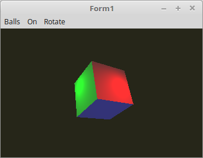

<!DOCTYPE html>
<html>
  <head>
    <meta charset="utf-8">
    <title>30 - Point Light Fragment-Shader</title>
    
  </head>
  <body bgcolor="#DDDDFF">
    <b><h1>07 - Beleuchtung</h1></b>
    <b><h2>30 - Point Light Fragment-Shader</h2></b>
  
Die Berechnung des Lichtes wurde in den Fertex-Shader ausgelagert, somit sieht das Punkt-Licht viel realistischer aus. 
Am besten sieht man dies, wen man nur ein Würfel darstellt. 
 
Der Nachteil dabei, es wird mehr <b>GPU</b>-Leistung verlangt, als wen man es im Vertex-Shader berechnet. 

 
Hier sieht man, das die Berechnung des Lichtes im Fragment-Shader ist. 
 
<b>Vertex-Shader:</b> 
<pre><code><b>#version</b> 330

<b>layout</b> (location = 0) <b>in</b> <b>vec3</b> inPos;    <i>// Vertex-Koordinaten</i>
<b>layout</b> (location = 1) <b>in</b> <b>vec3</b> inNormal; <i>// Normale</i>

<i>// Daten für Fragment-shader</i>
<b>out</b> Data {
  <b>vec3</b> pos;
  <b>vec3</b> Normal;
} DataOut;

<b>uniform</b> <b>mat4</b> ModelMatrix;
<b>uniform</b> <b>mat4</b> Matrix;                    <i>// Matrix für die Drehbewegung und Frustum.</i>

<b>void</b> main(<b>void</b>) {
  gl_Position    = Matrix * <b>vec4</b>(inPos, 1.0);

  DataOut.Normal = <b>mat3</b>(ModelMatrix) * inNormal;
  DataOut.pos    = (ModelMatrix * <b>vec4</b>(inPos, 1.0)).xyz;
}
</pre></code>

 
<b>Fragment-Shader</b> 
<pre><code><b>#version</b> 330

<b>#define</b> ambient <b>vec3</b>(0.2, 0.2, 0.2)
<b>#define</b> red     <b>vec3</b>(1.0, 0.0, 0.0)
<b>#define</b> green   <b>vec3</b>(0.0, 1.0, 0.0)
<b>#define</b> blue    <b>vec3</b>(0.0, 0.0, 1.0)

<i>// Daten vom Vertex-Shader</i>
<b>in</b> Data {
  <b>vec3</b> pos;
  <b>vec3</b> Normal;
} DataIn;

<b>uniform</b> <b>bool</b> RedOn;
<b>uniform</b> <b>bool</b> GreenOn;
<b>uniform</b> <b>bool</b> BlueOn;

<b>uniform</b> <b>vec3</b> RedLightPos;
<b>uniform</b> <b>vec3</b> GreenLightPos;
<b>uniform</b> <b>vec3</b> BlueLightPos;

<b>out</b> <b>vec4</b> outColor;  <i>// ausgegebene Farbe</i>

<b>float</b> light(<b>vec3</b> p, <b>vec3</b> n) {
  <b>vec3</b> v1 = normalize(p);     <i>// Vektoren normalisieren, so das die Länge des Vektors immer 1.0 ist.</i>
  <b>vec3</b> v2 = normalize(n);
  <b>float</b> d = dot(v1, v2);      <i>// Skalarprodukt aus beiden Vektoren berechnen.</i>
  <b>return</b> clamp(d, 0.0, 1.0);
}

<b>void</b> main(<b>void</b>) {
  outColor = <b>vec4</b>(ambient, 1.0);
  <b>if</b> (RedOn) {
    <b>vec3</b> colRed   = light(RedLightPos   - DataIn.pos, DataIn.Normal) * red;
    outColor.rgb += colRed;
  }
  <b>if</b> (GreenOn) {
    <b>vec3</b> colGreen = light(GreenLightPos - DataIn.pos, DataIn.Normal) * green;
    outColor.rgb += colGreen;
  }
  <b>if</b> (BlueOn) {
    <b>vec3</b> colBlue  = light(BlueLightPos  - DataIn.pos, DataIn.Normal) * blue;
    outColor.rgb += colBlue;
  }
}
</pre></code>

       
<h2><a href="../../index.html">zurück</a></h2>
  </body>
</html>
