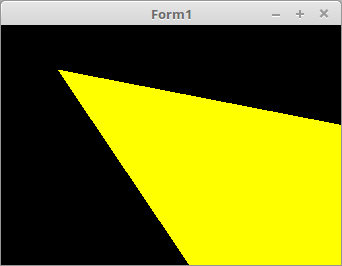

# 07 - Beleuchtung
## 35 - Grundlage Spot Licht



Dieses Beispiel zeigt, wie ein Spotlicht berechnet wird.
Zum besseren Verständnis, wird das ganze ohne OpenGL als 2D auf einem Canvas gezeigt.
---
Deklarationen der benütigenten Variablen.

```pascal
type
  TVec2 = array[0..1] of single;

var
  LichtOefffnung: single;
  LichtPos, LichtRichtung: TVec2;
```

Entspricht dem <b>vec2</b> von <b>GLSL</b>.

```pascal
function vec2(x, y: single): TVec2; inline;
begin
  Result[0] := x;
  Result[1] := y;
end;
```

Entspricht dem <b>normalize(vec2)</b> von <b>GLSL</b>.
Dies normalisiert den 2D-Vektor.

```pascal
function normalize(v: TVec2): TVec2;
var
  i: integer;
  l: single;
begin
  l := Sqrt(Sqr(v[0]) + Sqr(v[1]));
  if l = 0 then begin
    l := 1.0;
  end;
  for i := 0 to 1 do begin
    Result[i] := v[i] / l;
  end;
end;
```

Entspricht dem <b>dot(vec2)</b> von <b>GLSL</b>.
Hier wird das Skalarprodukt aus 2 Vektoren berechnent.
<b>arccos(Result)</b>, gibt den Winkel der beiden Vektoren im Bogenmass aus.

```pascal
function dot(v1, v2: TVec2): single;
begin
  Result := ((v1[0] * v2[0] + v1[1] * v2[1]) / (sqrt(v1[0] * v1[0] + v1[1] * v1[1]) * sqrt(v2[0] * v2[0] + v2[1] * v2[1])));
end;
```

Startwerte für die Lichtparameter.

```pascal
procedure TForm1.FormCreate(Sender: TObject);
begin
  LichtOefffnung := 8; // Ausstrahl-Winkel 45°  ( PI / 8 )
  LichtPos := vec2(200, 100);
  LichtRichtung := vec2(2, 2);
end;
```

Die Maustasten ändern die Licht und Austrahl-Position.

```pascal
procedure TForm1.FormMouseDown(Sender: TObject; Button: TMouseButton;
  Shift: TShiftState; X, Y: integer);
begin
  case Button of
    mbLeft: begin
      LichtRichtung[0] := x - LichtPos[0];
      LichtRichtung[1] := y - LichtPos[1];
    end;
    mbRight: begin
      LichtPos[0] := x;
      LichtPos[1] := y;
    end;
  end;
  Invalidate;
end;
```

Das Mausrad ändert den Austrahlwinkel.

```pascal
function isCone(x, y: integer): boolean;
var
  winkel: single;
  lr, lp: TVec2;
begin
  // Lichtrichtung Normalisieren.
  lr := normalize(LichtRichtung);

  // Lichtposition inkremental berechnen.
  lp :=vec2(x - LichtPos[0], y - LichtPos[1]);

  // Lichtposition Normlisieren.
  lp := normalize(lp);

  // Skalarprodukt berechen.
  winkel := dot(lr, lp);

  // Prüfen, ob sicher der Pixel im Lichtstrahl befindet.
  Result := (winkel > cos(pi / LichtOefffnung));
end;
```

Zeichen der ganzen Scene.

```pascal
procedure TForm1.FormPaint(Sender: TObject);
var
  x, y: integer;
begin
  for x := 0 to ClientWidth - 1 do begin
    for y := 0 to ClientHeight - 1 do begin
      if isCone(x, y) then begin
        Canvas.Pixels[x, y] := clYellow;
      end else begin
        Canvas.Pixels[x, y] := clBlack;
      end;
    end;
  end;
end;
```


