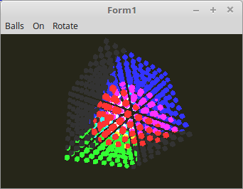

<html>
    <b><h1>07 - Beleuchtung</h1></b>
    <b><h2>40 - Spot Light, einfacher Kegel</h2></b>
  
Da es für ein Spotlicht mehrere Schritte braucht, wird dies in mehreren Beispielen gezeigt. 
 
In diesem Beispiel wird zuerst mal gezeigt, wie der Lichtkegen berechnet wird. 
Die Beleuchtung berechnung mit den Normalen wird zuerst mal ingnoriert. 
So sieht man gut, wie der Lichtkegel entsteht. 

 
Bei einem Spotlicht, ist die Lichtposition kein Einheitsvektor mehr. 
Die Licht-Position ist ist die effektive Position der Lichtquelle, so wie es bei einer Taschenlampe auch der Fall ist. 
 
Da die <b>halbe</b> Seitenlänge der kompletten Meshes etwa 30.0 lang ist, wird das Licht in einem Radius von 25.0 positioniert. 
Die Lichtquelle befindet sich somit in dem kompletten Würfel-Körper. 
 
Als Versuch kann man den Radius mal auf 50.0 setzen, dann wird man sehen, das die Lichtquelle ausserhalb der Meshes ist. 
 
Es werden Einheitsvektoren um den Faktor <b>LichtPositionRadius</b> skaliert. 
<pre><code=scal><b>procedure</b> TForm1.CreateScene;
<b>const</b>
  LichtPositionRadius = 25.0;
<b>begin</b>
  <b>with</b> LightPos <b>do</b> <b>begin</b>
    Red := vec3(-1.0, 0.0, 0.0);
    Red.Scale(LichtPositionRadius);
 
    Green := vec3(0.0, 1.0, 0.0);
    Green.Scale(LichtPositionRadius);
 
    Blue := vec3(1.0, 1.0, -1.0);
    Blue.Scale(LichtPositionRadius);
  <b>end</b>;</code></pre>

 
Hier wird die Kegelberechnung ausgeführt. 
 
<b>Vertex-Shader:</b> 
<pre><code><b>#version</b> 330
 
<b>layout</b> (location = 0) <b>in</b> <b>vec3</b> inPos;    <i>// Vertex-Koordinaten</i>
 
<b>out</b> Data {
  <b>vec3</b> pos;
} DataOut;
 
<b>uniform</b> <b>mat4</b> ModelMatrix;
<b>uniform</b> <b>mat4</b> Matrix;                    <i>// Matrix für die Drehbewegung und Frustum.</i>
 
<b>void</b> main(<b>void</b>) {
  gl_Position = Matrix * <b>vec4</b>(inPos, 1.0);
  DataOut.pos = (ModelMatrix * <b>vec4</b>(inPos, 1.0)).xyz;
}
</code></pre>

 
<b>Fragment-Shader</b> 
 
Der wichtigste Parameter ist der Ausstrahlwinkel der Lichtes. 
 
Man muss beachten, das der Winkel doppelt so gross wird. Somit hat Pi/2 einen Austrahlwinkel von 180°. 
1*Pi entpräche einem Ausstrahlwinkel von 380°, somit bekommt man ein Punkt-Licht. 
 
Für die Berechnung des Kegels wird ein Skalarprodukt verwendet. 
<pre><code><b>#version</b> 330
 
<b>#define</b> ambient <b>vec3</b>(0.2, 0.2, 0.2)
<b>#define</b> red     <b>vec3</b>(1.0, 0.0, 0.0)
<b>#define</b> green   <b>vec3</b>(0.0, 1.0, 0.0)
<b>#define</b> blue    <b>vec3</b>(0.0, 0.0, 1.0)
 
<b>#define</b> PI      3.1415
<b>#define</b> Cutoff  cos(PI / 2 / 4)
 
<b>in</b> Data {
  <b>vec3</b> pos;
} DataIn;
 
<b>uniform</b> <b>bool</b> RedOn;
<b>uniform</b> <b>bool</b> GreenOn;
<b>uniform</b> <b>bool</b> BlueOn;
 
<b>uniform</b> <b>vec3</b> RedLightPos;
<b>uniform</b> <b>vec3</b> GreenLightPos;
<b>uniform</b> <b>vec3</b> BlueLightPos;
 
<b>out</b> <b>vec4</b> outColor;  <i>// ausgegebene Farbe</i>
 
<i>// Prüfen ob Fragment in Lichtkegel</i>
<b>vec3</b> isCone(<b>vec3</b> LightPos) {
 
  <b>vec3</b> lp = LightPos;
 
  <b>vec3</b> lightDirection = normalize(DataIn.pos - lp);
  <b>vec3</b> spotDirection  = normalize(-LightPos);
 
  <b>float</b> angle = dot(spotDirection, lightDirection);
  angle = max(angle, 0.0);
 
  <b>if</b>(angle &gt; Cutoff) {
    <b>return</b> <b>vec3</b>(1.0);
  } <b>else</b> {
    <b>return</b> <b>vec3</b>(0.0);
  }
}
 
<b>void</b> main(<b>void</b>) {
  outColor = <b>vec4</b>(ambient, 1.0);
  <b>if</b> (RedOn) {
    outColor.rgb += isCone(RedLightPos) * red;
  }
  <b>if</b> (GreenOn) {
    outColor.rgb += isCone(GreenLightPos) * green;
  }
  <b>if</b> (BlueOn) {
    outColor.rgb += isCone(BlueLightPos) * blue;
  }
}
 
</code></pre>
 
</html>
