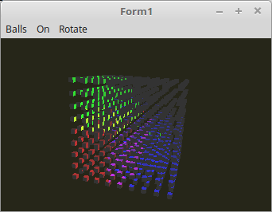

    <b><h1>07 - Beleuchtung</h1></b>
    <b><h2>45 - Spot Light, mit Normale</h2></b>
  
Jetzt wird auch die normale berücksicht. Somit wird nur die Vorderseite der Dreiecke beleuchtet, so wie es beim Punktlicht auch der Fall ist. 
Diese Berechnung funktioniert genau gleich, wie beim Punktlicht. Somit wird auch wieder eine <b>Normale</b> gebraucht. 

 
Hier wird die Kegelberechnung ausgeführt. 
 
<b>Vertex-Shader:</b> 
<pre><code><b>#version</b> 330

<b>layout</b> (location = 0) <b>in</b> <b>vec3</b> inPos;    <i>// Vertex-Koordinaten</i>
<b>layout</b> (location = 1) <b>in</b> <b>vec3</b> inNormal; <i>// Normale</i>

<b>out</b> Data {
  <b>vec3</b> pos;
  <b>vec3</b> Normal;
} DataOut;

<b>uniform</b> <b>mat4</b> ModelMatrix;
<b>uniform</b> <b>mat4</b> Matrix;                    <i>// Matrix für die Drehbewegung und Frustum.</i>

<b>void</b> main(<b>void</b>) {
  gl_Position    = Matrix * <b>vec4</b>(inPos, 1.0);

  DataOut.Normal = <b>mat3</b>(ModelMatrix) * inNormal;
  DataOut.pos    = (ModelMatrix * <b>vec4</b>(inPos, 1.0)).xyz;
}
</pre></code>

 
<b>Fragment-Shader</b> 
 
Zuerst wird geprüft, ob das Fragment sich im Lichtkegel befindet. 
Anschliessend wird die Flächenanleuchtung gleich berechnet, wie beim Punktlicht. 
<pre><code><b>#version</b> 330

<b>#define</b> ambient <b>vec3</b>(0.2, 0.2, 0.2)
<b>#define</b> red     <b>vec3</b>(1.0, 0.0, 0.0)
<b>#define</b> green   <b>vec3</b>(0.0, 1.0, 0.0)
<b>#define</b> blue    <b>vec3</b>(0.0, 0.0, 1.0)

<b>#define</b> PI      3.1415
<b>#define</b> Cutoff  cos(PI / 2 / 4)

<b>in</b> Data {
  <b>vec3</b> pos;
  <b>vec3</b> Normal;
} DataIn;

<b>uniform</b> <b>bool</b> RedOn;
<b>uniform</b> <b>bool</b> GreenOn;
<b>uniform</b> <b>bool</b> BlueOn;

<b>uniform</b> <b>vec3</b> RedLightPos;
<b>uniform</b> <b>vec3</b> GreenLightPos;
<b>uniform</b> <b>vec3</b> BlueLightPos;

<b>out</b> <b>vec4</b> outColor;  <i>// ausgegebene Farbe</i>

<i>// Prüfen ob Fragment in Lichtkegel.</i>
<b>bool</b> isCone(<b>vec3</b> LightPos) {

  <b>vec3</b> lp = LightPos;

  <b>vec3</b> lightDirection = normalize(DataIn.pos - lp);
  <b>vec3</b> spotDirection  = normalize(-LightPos);

  <b>float</b> angle = dot(spotDirection, lightDirection);
  angle = max(angle, 0.0);

  <b>if</b>(angle > Cutoff) {
    <b>return</b> <b>true</b>;
  } <b>else</b> {
    <b>return</b> <b>false</b>;
  }
}

<i>// Lichtstärke anhand der Normale.</i>
<b>float</b> light(<b>vec3</b> p, <b>vec3</b> n) {
  <b>vec3</b> v1 = normalize(p);     <i>// Vektoren normalisieren, so das die Länge des Vektors immer 1.0 ist.</i>
  <b>vec3</b> v2 = normalize(n);
  <b>float</b> d = dot(v1, v2);      <i>// Skalarprodukt aus beiden Vektoren berechnen.</i>
  <b>return</b> clamp(d, 0.0, 1.0);
}

<b>void</b> main(<b>void</b>) {
  outColor = <b>vec4</b>(ambient, 1.0);
  <b>if</b> (RedOn) {
    <b>if</b> (isCone(RedLightPos)) {
      outColor.rgb += light(RedLightPos - DataIn.pos, DataIn.Normal) * red;
    }
  }
  <b>if</b> (GreenOn) {
    <b>if</b> (isCone(GreenLightPos)) {
      outColor.rgb += light(GreenLightPos - DataIn.pos, DataIn.Normal) * green;
    }
  }
  <b>if</b> (BlueOn) {
    <b>if</b> (isCone(BlueLightPos)) {
      outColor.rgb += light(BlueLightPos - DataIn.pos, DataIn.Normal) * blue;
    }
  }
}

</pre></code>

