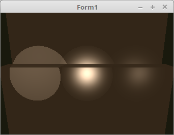

<!DOCTYPE html>
<html>
    <b><h1>07 - Beleuchtung</h1></b>
    <b><h2>50 - Spot Light, Abschwaechen</h2></b>
  
Wen das Licht schwächer wird, je weiter es von der Mesh entfernt wird, sieht es viel realistischer aus. 
Auch wird ein Lichtstrahl schwächer je weit er vom Zentrum weg ist. 
 
Die beiden linken Lichter wird nur eine Abschwächung angewendet. Das rechte Licht ist eine Kombination aus beiden Abschwächungen und somit die realistischte. 
 
Dies Distanzabhängige Abschwächung, kann man auch bei einer Punkt-Beleuchtung anwenden. 

 
Hier werden die Lichtpositionen der drei Lampen festgelegt. 
<pre><code><b>procedure</b> TForm1.CreateScene;
<b>const</b>
  LichtPositionRadius = 25.0;
<b>begin</b>
  <b>with</b> LightPos <b>do</b> <b>begin</b>
    Red := vec3(-1.2, 0.0, 4.0);
    Red.Scale(LichtPositionRadius);

    Green := vec3(0.0, 0.0, 4.0);
    Green.Scale(LichtPositionRadius);

    Blue := vec3(1.2, 0.0, 4.0);
    Blue.Scale(LichtPositionRadius);
  <b>end</b>;</pre></code>
Hier werden die 3 Lichter in der Z-Achse bewegt. 
<pre><code><b>procedure</b> TForm1.Timer1Timer(Sender: TObject);
<b>const</b>
  Step: single = 0.5;
  min = 40.0;
  max = 80.0;

  ZPos: single = (max + min) / 2;
<b>begin</b>
  ModelMatrix.Identity;
  ModelMatrix.Translate(0.0, 0.0, 30);
  ModelMatrix.RotateA(0.25);

  ZPos += Step;
  <b>if</b> (ZPos > max) <b>or</b> (ZPos < min) <b>then</b> <b>begin</b>
    Step *= -1;
  <b>end</b>;
  LightPos.Red.z := ZPos;

  ZPos += Step;
  <b>if</b> (ZPos > max) <b>or</b> (ZPos < min) <b>then</b> <b>begin</b>
    Step *= -1;
  <b>end</b>;
  LightPos.Green.z := ZPos;

  ZPos += Step;
  <b>if</b> (ZPos > max) <b>or</b> (ZPos < min) <b>then</b> <b>begin</b>
    Step *= -1;
  <b>end</b>;
  LightPos.Blue.z := ZPos;

  ogc.Invalidate;
<b>end</b>;</pre></code>
Berechnen der 3 Lichtkegel. 
 
<b>Vertex-Shader:</b> 
<pre><code><b>#version</b> 330

<b>layout</b> (location = 0) <b>in</b> <b>vec3</b> inPos;    <i>// Vertex-Koordinaten</i>
<b>layout</b> (location = 1) <b>in</b> <b>vec3</b> inNormal; <i>// Normale</i>

<b>out</b> Data {
  <b>vec3</b> pos;
  <b>vec3</b> Normal;
} DataOut;

<b>uniform</b> <b>mat4</b> ModelMatrix;
<b>uniform</b> <b>mat4</b> Matrix;                    <i>// Matrix für die Drehbewegung und Frustum.</i>

<b>void</b> main(<b>void</b>) {
  gl_Position    = Matrix * <b>vec4</b>(inPos, 1.0);

  DataOut.Normal = <b>mat3</b>(ModelMatrix) * inNormal;
  DataOut.pos    = (ModelMatrix * <b>vec4</b>(inPos, 1.0)).xyz;
}
</pre></code>

 
<b>Fragment-Shader</b> 
<pre><code><b>#version</b> 330

<b>#define</b> PI            3.1415

<i>// Eine leichte Hintergrundbeleuchtung.</i>
<b>#define</b> ambient       <b>vec3</b>(0.2, 0.15, 0.095)

<i>// Farbe des Lichtstrahles.</i>
<b>#define</b> yellow        <b>vec3</b>(1.0, 0.9, 0.8)

<i>// Öffnungswinkel der Lampe</i>
<i>// 22.5°</i>
<b>#define</b> Cutoff        cos(PI / 2 / 4)

<i>// Lichtrichtung, brennt senkrecht in der Z-Achse.</i>
<b>#define</b> spotDirection <b>vec3</b>(0.0, 0.0, -1.0)

<i>// Für Abschwächung</i>
<i>// default 0.0</i>
<b>#define</b> spotExponent  50.0

<i>// Diese Werte entsprechen Attenuation Parametern vom alten OpenGL.</i>
<i>// default 1.0</i>
<b>#define</b> spotAttConst  1.0
<i>// default 0.0</i>
<b>#define</b> spotAttLinear 0.1
<i>// default 0.0</i>
<b>#define</b> spotAttQuad   0.0

<b>in</b> Data {
  <b>vec3</b> pos;
  <b>vec3</b> Normal;
} DataIn;

<b>uniform</b> <b>vec3</b> LeftLightPos;
<b>uniform</b> <b>vec3</b> CenterLightPos;
<b>uniform</b> <b>vec3</b> RightLightPos;

<b>out</b> <b>vec4</b> outColor;  <i>// ausgegebene Farbe</i>

<i>// Abschwächung, abhängig vom Radius des Lichtes.</i>
<b>float</b> ConeAtt(<b>vec3</b> LightPos) {
  <b>vec3</b>  lightDirection = normalize(DataIn.pos - LightPos);

  <b>float</b> D              = length(LightPos - DataIn.pos);
  <b>float</b> attenuation    = 1.0 / (spotAttConst + spotAttLinear * D + spotAttQuad * D * D);

  <b>float</b> angle          = dot(spotDirection, lightDirection);
  angle                = clamp(angle, 0.0, 1.0);

  <b>if</b>(angle > Cutoff) {
    <b>return</b> attenuation;
  } <b>else</b> {
    <b>return</b> 0.0;
  }
}

<i>// Abschwächung anhängig der Lichtentfernung zum Mesh.</i>
<b>float</b> ConeExp(<b>vec3</b> LightPos) {
  <b>vec3</b>  lightDirection = normalize(DataIn.pos - LightPos);

  <b>float</b> angle          = dot(spotDirection, lightDirection);
  angle                = clamp(angle, 0.0, 1.0);

  <b>if</b>(angle > Cutoff) {
    <b>return</b> pow(angle, spotExponent);
  } <b>else</b> {
    <b>return</b> 0.0;
  }
}

<i>// Lichtstärke anhand der Normale.</i>
<b>float</b> light(<b>vec3</b> p, <b>vec3</b> n) {
  <b>vec3</b> v1 = normalize(p);
  <b>vec3</b> v2 = normalize(n);
  <b>float</b> d = dot(v1, v2);
  <b>return</b> clamp(d, 0.0, 1.0);
}

<b>void</b> main(<b>void</b>) {
  <i>// Grundbeleuchtung</i>
  outColor = <b>vec4</b>(ambient, 1.0);
  <b>float</b> c;

  <i>// Nur Attenuation ( Links )</i>
  c = ConeAtt(LeftLightPos);
  outColor.rgb += <b>vec3</b>(c) * light(LeftLightPos - DataIn.pos, DataIn.Normal) * yellow;

  <i>// Nur Exponent ( Mitte )</i>
  c = ConeExp(CenterLightPos);
  outColor.rgb += <b>vec3</b>(c)  * light(CenterLightPos - DataIn.pos, DataIn.Normal) * yellow;

  <i>// Kombiniert ( Rechte )</i>
  <b>float</b> c1 = ConeAtt(RightLightPos);
  <b>float</b> c2 = ConeExp(RightLightPos);
  c        = c1 * c2; <i>// Beide Abschwächungen multipizieren.</i>
  outColor.rgb += <b>vec3</b>(c)  * light(RightLightPos - DataIn.pos, DataIn.Normal) * yellow;
}

</pre></code>

</html>
