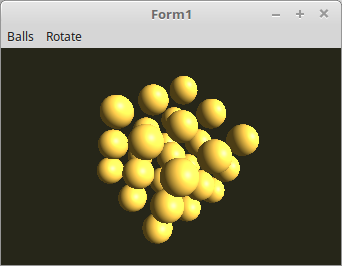

<!DOCTYPE html>
<html>
  <body bgcolor="#DDDDFF">
    <b><h1>15 - Material Eigenschaften</h1></b>
    <b><h2>00 - Material Directional Light</h2></b>
  
Nur eine Beleuchtung reicht nicht, das eine Mesh realistisch aussieht. 
Aus diesem Grund, kann man der Mesh Materialeigenschaften mitgeben, dies sind Reflektionen des Lichtes. 
Wen man zB. eine Gummi-Fläche anleuchtet, sieht dies anders aus, als bei einer Stahlfläche. 
Stahl reflektiert das Licht viel besser. 
Dieses Beispiel zeigt wie dies bei Gold aussieht. Wen man im INet nach <b>"OpenGL Material"</b> sucht, 
findet man viele Daten, welche man bei <b>Ambient</b>, <b>Diffuse</b>, <b>Specular</b> und <b>Shininess</b> eintragen muss. 
 
Bei diesem Beispiel sind die Kugeln aus Gold. 

 

 
Die Berechnung, ist ähnlich wie beim einfachen Licht. Zusätlich wird <b>Specular</b> zum normalen Licht addiert. 
<b>Specular</b> ist die Reflektion de Materiales. 
<b>Diffuse</b> ist die Farbe des Lichtes/Material. 
 
Im Shader sind alle Material-Eigenschaft als <b>#define</b> deklariert. Dies könnte man auch als <b>Uniform</b> übergeben. 
 
<b>Vertex-Shader:</b> 
<pre><code>#version 330

layout (location = 0) in vec3 inPos;    // Vertex-Koordinaten
layout (location = 1) in vec3 inNormal; // Normale

// Daten für Fragment-shader
out Data {
  vec3 Normal;
} DataOut;

// Matrix des Modeles, ohne Frustum-Beeinflussung.
uniform mat4 ModelMatrix;

// Matrix für die Drehbewegung und Frustum.
uniform mat4 Matrix;

void main(void) {
  gl_Position    = Matrix * vec4(inPos, 1.0);
  DataOut.Normal = mat3(ModelMatrix) * inNormal;
}

</pre></code>

 
<b>Fragment-Shader</b> 
<pre><code>#version 330

// Licht
#define Lposition  vec3(1.0, 0.5, 1.0)
#define Lambient   vec3(1.2, 1.2, 1.2)
#define Ldiffuse   vec3(1.5, 1.5, 1.5)

// Material ( Gold )
#define Mambient   vec3(0.25, 0.20, 0.07)
#define Mdiffuse   vec3(0.75, 0.60, 0.23)
#define Mspecular  vec3(0.63, 0.56, 0.37)
#define Mshininess 51.2

// Daten vom Vertex-Shader
in Data {
  vec3 Normal;
} DataIn;

out vec4 outColor;

vec3 Light(in vec3 p, in vec3 n) {
  vec3 nn = normalize(n);
  vec3 np = normalize(p);
  vec3 diffuse;   // Licht
  vec3 specular;  // Reflektion
  float angele = max(dot(nn, np), 0.0);
  if (angele > 0.0) {
    vec3 eye = normalize(np + vec3(0.0, 0.0, 1.0));
    specular = pow(max(dot(eye, nn), 0.0), Mshininess) * Mspecular;
    diffuse  = angele * Mdiffuse * Ldiffuse;
  } else {
    specular = vec3(0.0);
    diffuse  = vec3(0.0);
  }
  return (Mambient * Lambient) + diffuse + specular;
}

void main(void) {
  outColor = vec4(Light(Lposition, DataIn.Normal), 1.0);
}
</pre></code>

       
<h2><a href="../../index.html">zurück</a></h2>
  </body>
</html>
