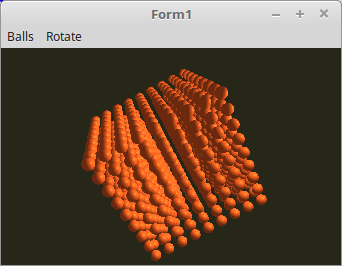

  
Material-Eigenschaften sind auch mit <b>Point-Light</b> möglich. 
Dies funktioniert etwa gleich, wie das Point-Light ohne Material-Eigenschaften. 
 
In diesem Beispiel sind die Kugeln aus Kupfer. 

 

 
Der einzige Unterschied gegenüber des Directional-Light befindet sich im Shader. 
 
<b>Vertex-Shader:</b> 
<pre><code><b>#version</b> 330

<b>layout</b> (location = 0) <b>in</b> <b>vec3</b> inPos;    <i>// Vertex-Koordinaten</i>
<b>layout</b> (location = 1) <b>in</b> <b>vec3</b> inNormal; <i>// Normale</i>

<i>// Daten für Fragment-shader</i>
<b>out</b> Data {
  <b>vec3</b> Pos;
  <b>vec3</b> Normal;
} DataOut;

<i>// Matrix des Modeles, ohne Frustum-Beeinflussung.</i>
<b>uniform</b> <b>mat4</b> ModelMatrix;

<i>// Matrix für die Drehbewegung und Frustum.</i>
<b>uniform</b> <b>mat4</b> Matrix;

<b>void</b> main(<b>void</b>) {
  gl_Position    = Matrix * <b>vec4</b>(inPos, 1.0);

  DataOut.Normal = <b>mat3</b>(ModelMatrix) * inNormal;
  DataOut.Pos    = (ModelMatrix * <b>vec4</b>(inPos, 1.0)).xyz;
}
</pre></code>

 
<b>Fragment-Shader</b> 
<pre><code><b>#version</b> 330

<i>// Licht</i>
<b>#define</b> Lposition  <b>vec3</b>(35.0, 17.5, 35.0)
<b>#define</b> Lambient   <b>vec3</b>(1.8, 1.8, 1.8)
<b>#define</b> Ldiffuse   <b>vec3</b>(1.5, 1.5, 1.5)

<i>// Material ( Poliertes Kupfer  )</i>
<b>#define</b> Mambient   <b>vec3</b>(0.23, 0.09, 0.03)
<b>#define</b> Mdiffuse   <b>vec3</b>(0.55, 0.21, 0.07)
<b>#define</b> Mspecular  <b>vec3</b>(0.58, 0.22, 0.07)
<b>#define</b> Mshininess 51.2

<i>// Daten vom Vertex-Shader</i>
<b>in</b> Data {
  <b>vec3</b> Pos;
  <b>vec3</b> Normal;
} DataIn;

<b>out</b> <b>vec4</b> outColor;

<b>vec3</b> Light(<b>in</b> <b>vec3</b> p, <b>in</b> <b>vec3</b> n) {
  <b>vec3</b> nn = normalize(n);
  <b>vec3</b> np = normalize(p);
  <b>vec3</b> diffuse;   <i>// Licht</i>
  <b>vec3</b> specular;  <i>// Reflektion</i>
  <b>float</b> angele = max(dot(nn, np), 0.0);
  <b>if</b> (angele > 0.0) {
    <b>vec3</b> eye = normalize(np + <b>vec3</b>(0.0, 0.0, 1.0));
    specular = pow(max(dot(eye, nn), 0.0), Mshininess) * Mspecular;
    diffuse  = angele * Mdiffuse * Ldiffuse;
  } <b>else</b> {
    specular = <b>vec3</b>(0.0);
    diffuse  = <b>vec3</b>(0.0);
  }
  <b>return</b> (Mambient * Lambient) + diffuse + specular;
}

<b>void</b> main(<b>void</b>) {
  outColor = <b>vec4</b>(Light(Lposition - DataIn.Pos, DataIn.Normal), 1.0);
}

</pre></code>

