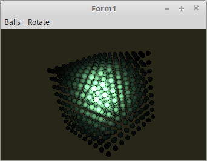

# 15 - Material Eigenschaften
## 10 - Material Spot Light



Material-Eigenschaften sind auch mit Spot-Light möglich.
Dies funktioniert etwa gleich, wie das Point-Light ohne Material-Eigenschaften.

Bei diesem Beispiel, wird mit einer Taschenlampe in einen Jade-Würfel gezündet.
---
---
Dieser Shader ist schon sehr komplex.
Neben der Spotlichtberechnung, wird noch die Abschwächung des Lichtes berücksichtigt.

<b>Vertex-Shader:</b>

```glsl
#version 330

layout (location = 0) in vec3 inPos;    // Vertex-Koordinaten
layout (location = 1) in vec3 inNormal; // Normale

// Daten für Fragment-shader
out Data {
  vec3 Pos;
  vec3 Normal;
} DataOut;

// Matrix des Modeles, ohne Frustum-Beeinflussung.
uniform mat4 ModelMatrix;

// Matrix für die Drehbewegung und Frustum.
uniform mat4 Matrix;

void main(void) {
  gl_Position    = Matrix * vec4(inPos, 1.0);

  DataOut.Normal = mat3(ModelMatrix) * inNormal;
  DataOut.Pos    = (ModelMatrix * vec4(inPos, 1.0)).xyz;
}

```

---
<b>Fragment-Shader</b>

```glsl
#version 330

#define PI         3.1415

// === Licht
#define Lposition  vec3(0.0, 0.0, 100.0)
#define Lambient   vec3(1.8, 1.8, 1.8)
#define Ldiffuse   vec3(1000.0, 1000.0, 1000.0)

// === Material ( Jade )
#define Mambient   vec3(0.14, 0.22, 0.16)
#define Mdiffuse   vec3(0.54, 0.89, 0.63)
#define Mspecular  vec3(0.32, 0.32, 0.32)
#define Mshininess 12.8

// === Spotlicht Parameter
// Öffnungswinkel der Lampe
// 22.5°
#define Cutoff        cos(PI / 2 / 4)

// Lichtrichtung, brennt senkrecht in der Z-Achse.
#define spotDirection vec3(0.0, 0.0, -1.0)

// === Für Abschwächung
// default 0.0
#define spotExponent  50.0

// Diese Werte entsprechen Attenuation Parametern vom alten OpenGL.
// default 1.0
#define spotAttConst  1.0
// default 0.0
#define spotAttLinear 0.0
// default 0.0
#define spotAttQuad   0.1


// Daten vom Vertex-Shader
in Data {
  vec3 Pos;
  vec3 Normal;
} DataIn;

out vec4 outColor;

// Abschwächung, abhängig vom Radius des Lichtes.
float ConeAtt(vec3 LightPos) {
  vec3  lightDirection = normalize(DataIn.Pos - LightPos);

  float D              = length(LightPos - DataIn.Pos);
  float attenuation    = 1.0 / (spotAttConst + spotAttLinear * D + spotAttQuad * D * D);

  float angle          = dot(spotDirection, lightDirection);
  angle                = clamp(angle, 0.0, 1.0);

  if(angle > Cutoff) {
    return attenuation;
  } else {
    return 0.0;
  }
}

// Abschwächung anhängig der Lichtentfernung zum Mesh.
float ConeExp(vec3 LightPos) {
  vec3  lightDirection = normalize(DataIn.Pos - LightPos);

  float angle          = dot(spotDirection, lightDirection);
  angle                = clamp(angle, 0.0, 1.0);

  if(angle > Cutoff) {
    return pow(angle, spotExponent);
  } else {
    return 0.0;
  }
}

// Lichtstärke und Material anhand der Normale.
vec3 Light(in vec3 p, in vec3 n) {
  vec3 nn = normalize(n);
  vec3 np = normalize(p);
  vec3 diffuse;   // Licht
  vec3 specular;  // Reflektion
  float angele = max(dot(nn, np), 0.0);
  if (angele > 0.0) {
    vec3 eye = normalize(np + vec3(0.0, 0.0, 1.0));
    specular = pow(max(dot(eye, nn), 0.0), Mshininess) * Mspecular;
    diffuse  = angele * Mdiffuse * Ldiffuse;
  } else {
    specular = vec3(0.0);
    diffuse  = vec3(0.0);
  }
  return (Mambient * Lambient) + diffuse + specular;
}

void main(void) {
  float c  = ConeAtt(Lposition) * ConeExp(Lposition); // Beide Abschwächungen multipizieren.
  outColor = vec4(vec3(c)  * Light(Lposition - DataIn.Pos, DataIn.Normal), 1.0);
}


```


