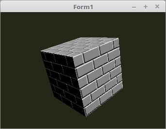

<html>
  
Mit Bump-Maping kann man eine Oberfläche noch realistischer gestalten. 
Da viele Oberflächen nicht absolut flach sind, so wie die Fugen im Beispiel, drift das Licht nicht immer gleichen Winkel auf die gesamte Oberfläche. 
Um dies zu simulieren, nimmt man eine Textur, welche Winkelkorreturen enthält, dies ist eine <b>Normal-Map</b> 
 
Lazarus-Seitig läuft die genau gleich ab, wie wen man eine enfache Textur lädt. 
Die ganze Berechnung läuft im Fragment-Shader ab. 
 
Der Rest der Beleuchtung läuft gleich ab, so wie bei den anderen Beleuchtungen auch. 

 

 
<b>Vertex-Shader:</b> 
<pre><code><b>#version</b> 330

<b>layout</b> (location =  0) <b>in</b> <b>vec3</b> inPos;    <i>// Vertex-Koordinaten</i>
<b>layout</b> (location =  1) <b>in</b> <b>vec3</b> inNormal; <i>// Normale</i>
<b>layout</b> (location = 10) <b>in</b> <b>vec2</b> inUV;     <i>// Textur-Koordinaten</i>

<i>// Daten für Fragment-Shader</i>
<b>out</b> Data {
  <b>vec3</b> pos;
  <b>vec3</b> Normal;
  <b>vec2</b> UV;
} DataOut;

<b>uniform</b> <b>mat4</b> ModelMatrix;
<b>uniform</b> <b>mat4</b> Matrix;

<b>void</b> main(<b>void</b>)
{
  gl_Position    = Matrix * <b>vec4</b>(inPos, 1.0);

  DataOut.Normal = <b>mat3</b>(ModelMatrix) * inNormal;
  DataOut.pos    = (ModelMatrix * <b>vec4</b>(inPos, 1.0)).xyz;
  DataOut.UV     = inUV;
}
</pre></code>

 
<b>Fragment-Shader</b> 
 
Hier sieht man, das die <b>Normal-Map</b> zur Normalen addiert wird. 
<pre><code><b>#version</b> 330

<i>// Beleuchtungs-Parameter</i>
<b>#define</b> LightPos <b>vec3</b>(100.0, 100.0, 50.0)
<b>#define</b> ambient  <b>vec3</b>(0.1, 0.1, 0.1)

<i>// Textur-Sampler für Normal-Map</i>
<b>uniform</b> <b>sampler2D</b> Sampler;

<i>// Daten vom Vertex-Shader</i>
<b>in</b> Data {
  <b>vec3</b> pos;
  <b>vec3</b> Normal;
  <b>vec2</b> UV;
} DataIn;

<i>// Farb-Ausgabe.</i>
<b>out</b> <b>vec4</b> outColor;

<i>// Ein einfaches Directional-Light.</i>
<b>vec4</b> light(<b>vec3</b> p, <b>vec3</b> n) {
  <b>vec3</b> v1 = normalize(p);
  <b>vec3</b> v2 = normalize(n);
  <b>float</b> d = dot(v1, v2);
  <b>vec3</b> c  = <b>vec3</b>(clamp(d, 0.0, 1.0));
  <b>return</b> <b>vec4</b>(c, 1.0);
}

<b>void</b> main(<b>void</b>)
{
  <i>// Ein Ambient-Light festlegen.</i>
  outColor = <b>vec4</b>(ambient, 1.0);

  <i>// Normal-Map zu Normalen addieren.</i>
  <b>vec3</b> n   = DataIn.Normal + normalize(texture2D(Sampler, DataIn.UV).rgb * 2.0 - 1.0);

  <i>// Einfache Lichtberechnung.</i>
  outColor = light(LightPos - DataIn.pos, n);
}
</pre></code>

</html>
