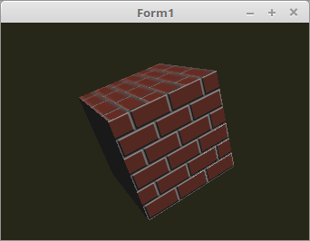

# 16 - Bump Mapping
## 05 - Bump Mapping

<br><br>
Bump-Mapping verwendet man meisten in Kombination mit einer Textur.

So sieht man, das die Fugen grau und die Ziegel braun sind.
<hr><br>
<hr><br>
<b>Vertex-Shader:</b>

```glsl
#version 330

layout (location =  0) in vec3 inPos;    // Vertex-Koordinaten
layout (location =  1) in vec3 inNormal; // Normale
layout (location = 10) in vec2 inUV;     // Textur-Koordinaten

// Daten für Fragment-shader
out Data {
  vec3 pos;
  vec3 Normal;
  vec2 UV;
} DataOut;

uniform mat4 ModelMatrix;
uniform mat4 Matrix;

void main(void)
{
  gl_Position    = Matrix * vec4(inPos, 1.0);

  DataOut.Normal = mat3(ModelMatrix) * inNormal;
  DataOut.pos    = (ModelMatrix * vec4(inPos, 1.0)).xyz;
  DataOut.UV     = inUV;
}

```

<hr><br>
<b>Fragment-Shader</b>

Zum einfachen Bump-Mapping wir noch mit einer Textur multipliziert, welche die Farben der Mauer enthält.

```glsl
#version 330

// Beleuchtungs-Parameter
#define LightPos vec3(100.0, 100.0, 50.0)
#define ambient  vec3(0.1, 0.1, 0.1)

// Textur-Sampler für Normal-Map
uniform sampler2D NormalMapSampler;

// Textur-Sampler für Textur
uniform sampler2D TexturSampler;

// Daten vom Vertex-Shader
in Data {
  vec3 pos;
  vec3 Normal;
  vec2 UV;
} DataIn;

// Farb-Ausgabe.
out vec4 outColor;

// Ein einfaches Directional-Light.
vec4 light(vec3 p, vec3 n) {
  vec3 v1 = normalize(p);
  vec3 v2 = normalize(n);
  float d = dot(v1, v2);
  vec3 c  = vec3(clamp(d, 0.0, 1.0));
  return vec4(c, 1.0);
}

void main(void)
{
  // Ein Ambient-Light festlegen.
  outColor = vec4(ambient, 1.0);

  // Normal-Map zu Normalen addieren.
  vec3 n = DataIn.Normal + normalize(texture2D(NormalMapSampler, DataIn.UV).rgb * 2.0 - 1.0);

  // Einfache Lichtberechnung.
  outColor += light(LightPos - DataIn.pos, n) ;

  // Mit der Textur multiplizieren.
  outColor *= texture( TexturSampler, DataIn.UV );
}

```


