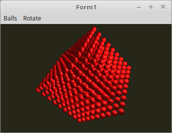

# 17 - Uniform Buffer Object (UBO)
## 00 - Einfacher UBO

<br><br>
Bis jetzt wurden alle Uniforms einzeln dem Shader übegeben.
Wen man aber mehrer Werte übeergeben will, kann man die <b>Uniforms</b> zu einem <b>Block</b> zusammenfassen.
Aus diesem Grund heisst dieser Puffer <b>Uniform</b> Buffer Object ( UBO ).

Dies macht man mit einem Record. Dabei muss man auf eine <b>16Byte</b>-Ausrichtung achten.

Die Material-Eigenschaften sind ein ideales Beispiel dafür.

In diesem Beispiel sind die Kugeln aus Rubin.
<hr><br>
Hier wird der Record für die Material-Eigenschaften deklariert.

Da ein <b>TVector3f</b> nur <b>12Byte</b> hat, muss man zum Aufrunden auf <b>16Byte</b> noch ein Padding von 4Byte einfügen.
Ein Float mit <b>4Byte</b> ist gut dafür gut geeignet.
Im Shader-Code, muss dies bei den Uniform-Blöcken nicht beachtet werden.

Bei Verwendung von einem <b>TVector4f</b>, braucht es kein Padding, da dieser 16Byte gross ist.

```pascal
type
  TMaterial = record
    ambient: TVector3f;      // Umgebungslicht
    pad0: GLfloat;           // padding 4Byte
    diffuse: TVector3f;      // Farbe
    pad1: GLfloat;           // padding 4Byte
    specular: TVector3f;     // Spiegelnd
    shininess: GLfloat;      // Glanz
  end;
```

So was geht leider <b>nicht</b>.
Diffuse muss in den nächsten 16Byte-Block !

```pascal
type    // Unbrauchbare Deklaration !
  TMaterial = record
    ambient: TVector3f;      // 3Byte
    diffuse: TVector3f;      // 3Byte
    specular: TVector3f;     // 3Byte
    shininess: GLfloat;      // 3Byte
  end;
```


Generell wird für ein UBO ein Record empfohlen, mann könnte einen UBO-Buffer auch anders anlegen, zB. in eine Float-Array, dies macht aber wenig Sinn.
Für einen <b>UBO</b> wird auch ein <b>Zeiger</b> auf den <b>Puffer</b> gebraucht, ähnlich eines Vertex-Puffers.
Auch wird eine <b>ID</b> gebraucht, so wie es bei einfachen Uniforms der Fall ist.

```pascal
var
  UBO: GLuint;        // Puffer-Zeiger
  Material_ID: GLint; // ID im Shader
```

ID und Puffer generieren.
Anstelle von <b>glUniformLocation(...</b>, muss man die ID mit <b>glUniformBlockIndex(...</b> auslesen.

```pascal
procedure TForm1.CreateScene;
begin
  with Shader do begin
    UseProgram;
    Matrix_ID := UniformLocation('Matrix');
    ModelMatrix_ID := UniformLocation('ModelMatrix');

    Material_ID := UniformBlockIndex('Material'); // UBO-Block ID aus dem Shader holen.
  end;

  glGenVertexArrays(1, @VBCube.VAO);

  glGenBuffers(1, @VBCube.VBOvert);
  glGenBuffers(1, @VBCube.VBONormal);

  glGenBuffers(1, @UBO);                          // UB0-Puffer generieren.
```

Material-Daten in den UBO-Puffer laden und binden.
Pro UBO-Block, wird ein BindingPoint gebraucht.
Wobei, wen man in mehreren Shader die gleichen Daten laden will, kann man den gleichen BindingPoint verwenden, dazu später.

```pascal
procedure TForm1.InitScene;
var
  bindingPoint: gluint = 0; // Pro Verbindung wird ein BindingPoint gebraucht.
begin
  // Material-Werte inizialisieren
  with mRubin do begin
    ambient := vec3(0.17, 0.01, 0.01);
    diffuse := vec3(0.61, 0.04, 0.04);
    specular := vec3(0.73, 0.63, 0.63);
    shininess := 76.8;
  end;


  // UBO mit Daten laden
  glBindBuffer(GL_UNIFORM_BUFFER, UBO);
  glBufferData(GL_UNIFORM_BUFFER, SizeOf(TMaterial), @mRubin, GL_DYNAMIC_DRAW);

  // UBO mit dem Shader verbinden
  glUniformBlockBinding(Shader.ID, Material_ID, bindingPoint);
  glBindBufferBase(GL_UNIFORM_BUFFER, bindingPoint, UBO);
```

Ein UBO muss am Ende wie andere Puffer auch frei gegeben werden.

```pascal
procedure TForm1.FormDestroy(Sender: TObject);
begin
  Shader.Free;

  glDeleteVertexArrays(1, @VBCube.VAO);
  glDeleteBuffers(1, @VBCube.VBOvert);
  glDeleteBuffers(1, @VBCube.VBONormal);
  glDeleteBuffers(1, @UBO);  // UBO löschen.
```

<hr><br>
Im Shader sind die Material-Daten zu einem Block zusammengefasst, ähnlich einem <b>struct</b> un <b>C++</b>.
Im Shader wird kein Padding gebraucht.

<b>Vertex-Shader:</b>

```glsl
#version 330

layout (location = 0) in vec3 inPos;    // Vertex-Koordinaten
layout (location = 1) in vec3 inNormal; // Normale

// Daten für Fragment-shader
out Data {
  vec3 Pos;
  vec3 Normal;
} DataOut;

// Matrix des Modeles, ohne Frustum-Beeinflussung.
uniform mat4 ModelMatrix;

// Matrix für die Drehbewegung und Frustum.
uniform mat4 Matrix;

void main(void)
{
  gl_Position    = Matrix * vec4(inPos, 1.0);

  DataOut.Normal = mat3(ModelMatrix) * inNormal;
  DataOut.Pos    = (ModelMatrix * vec4(inPos, 1.0)).xyz;
}

```

<hr><br>
<b>Fragment-Shader</b>

```glsl
#version 330

// Licht
#define Lposition  vec3(35.0, 17.5, 35.0)
#define Lambient   vec3(1.8, 1.8, 1.8)
#define Ldiffuse   vec3(1.5, 1.5, 1.5)

// Daten vom Vertex-Shader
in Data {
  vec3 Pos;
  vec3 Normal;
} DataIn;

layout (std140) uniform Material {
  vec3  Mambient;   // Umgebungslicht
  vec3  Mdiffuse;   // Farbe
  vec3  Mspecular;  // Spiegelnd
  float Mshininess; // Glanz
};

out vec4 outColor;

vec3 Light(in vec3 p, in vec3 n) {
  vec3 nn = normalize(n);
  vec3 np = normalize(p);
  vec3 diffuse;   // Licht
  vec3 specular;  // Reflektion
  float angele = max(dot(nn, np), 0.0);
  if (angele &gt; 0.0) {
    vec3 eye = normalize(np + vec3(0.0, 0.0, 1.0));
    specular = pow(max(dot(eye, nn), 0.0), Mshininess) * Mspecular;
    diffuse  = angele * Mdiffuse * Ldiffuse;
  } else {
    specular = vec3(0.0);
    diffuse  = vec3(0.0);
  }
  return (Mambient * Lambient) + diffuse + specular;
}

void main(void)
{
  outColor = vec4(Light(Lposition - DataIn.Pos, DataIn.Normal), 1.0);
}


```


