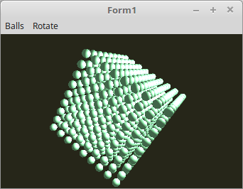

<html>
    <b><h1>17 - Uniform Buffer Object (UBO)</h1></b>
    <b><h2>05 - UBO Zur Laufzeit aktualisieren</h2></b>
  
UBO-Daten können auch zur Laufzeit geändert/neu geladen werden, so wie es beim Vertex-Puffer auch geht. 
Auf diese Art, werden die Uniform-Daten aktualisiert. Dies ersetzt die Aktualisierung mit <b>glUniformxxx</b>. 
 
In diesem Beispiel wird das Material der Kugeln gewechselt, abwechslungsweise Rubin oder Jade. 
Dazu wird alle 1s die UBO-Daten aktualisiert. 

 
Es werden zwei Materialien gebraucht, welche abwechslungsweise neu geladen werden. 
<pre><code=pascal><b>type</b>
  TMaterial = <b>record</b>
    ambient: TVector3f;      <i>// Umgebungslicht</i>
    pad0: GLfloat;           <i>// padding 4Byte</i>
    diffuse: TVector3f;      <i>// Farbe</i>
    pad1: GLfloat;           <i>// padding 4Byte</i>
    specular: TVector3f;     <i>// Spiegelnd</i>
    shininess: GLfloat;      <i>// Glanz</i>
  <b>end</b>;
 
<b>var</b>
  mRubin, mJade: TMaterial;</code></pre>
Material-Daten in den UBO-Puffer laden und binden 
<pre><code=pascal><b>procedure</b> TForm1.InitScene;
<b>var</b>
  bindingPoint: gluint = 0;
<b>begin</b>
  <i>// Material-Werte inizialisieren</i>
  <b>with</b> mRubin <b>do</b> <b>begin</b>
    ambient := vec3(0.17, 0.01, 0.01);
    diffuse := vec3(0.61, 0.04, 0.04);
    specular := vec3(0.73, 0.63, 0.63);
    shininess := 76.8;
  <b>end</b>;
 
  <b>with</b> mJade <b>do</b> <b>begin</b>
    ambient := vec3(0.14, 0.22, 0.16);
    diffuse := vec3(0.54, 0.89, 0.63);
    specular := vec3(0.32, 0.32, 0.32);
    shininess := 12.8;
  <b>end</b>;
 
  <i>// Speicher für UBO reservieren</i>
  glBindBuffer(GL_UNIFORM_BUFFER, UBO);
  glBufferData(GL_UNIFORM_BUFFER, sizeof(TMaterial), <b>nil</b>, GL_DYNAMIC_DRAW);
 
  <i>// UBO mit dem Shader verbinden</i>
  glUniformBlockBinding(Shader.ID, Material_ID, bindingPoint);
  glBindBufferBase(GL_UNIFORM_BUFFER, bindingPoint, UBO);
 
  <i>// Timer manuell aufrufen, so das die ersten Daten in den UBO-kopiert werden.</i>
  Timer2Timer(<b>nil</b>);</code></pre>
Hier sieht man gut, wie die UBO-Daten aktualisiert werden. 
Der Timer wird alle 1s aufgerufen. 
<pre><code=pascal><b>procedure</b> TForm1.Timer2Timer(Sender: TObject);
<b>const</b>
  m: integer = 0;
<b>begin</b>
  <b>case</b> m <b>of</b>
    0: <b>begin</b>
      glBindBuffer(GL_UNIFORM_BUFFER, UBO);
      glBufferSubData(GL_UNIFORM_BUFFER, 0, sizeof(TMaterial), @mRubin);
    <b>end</b>;
    1: <b>begin</b>
      glBindBuffer(GL_UNIFORM_BUFFER, UBO);
      glBufferSubData(GL_UNIFORM_BUFFER, 0, sizeof(TMaterial), @mJade);
    <b>end</b>;
  <b>end</b>;
 
  Inc(m);
  <b>if</b> m &gt; 1 <b>then</b> <b>begin</b>
    m := 0;
  <b>end</b>;
<b>end</b>;</code></pre>

 
Der Shader ist der selbe wie im ersten Beispiel. 
 
<b>Vertex-Shader:</b> 
<pre><code><b>#version</b> 330
 
<b>layout</b> (location = 0) <b>in</b> <b>vec3</b> inPos;    <i>// Vertex-Koordinaten</i>
<b>layout</b> (location = 1) <b>in</b> <b>vec3</b> inNormal; <i>// Normale</i>
 
<i>// Daten für Fragment-shader</i>
<b>out</b> Data {
  <b>vec3</b> Pos;
  <b>vec3</b> Normal;
} DataOut;
 
<i>// Matrix des Modeles, ohne Frustum-Beeinflussung.</i>
<b>uniform</b> <b>mat4</b> ModelMatrix;
 
<i>// Matrix für die Drehbewegung und Frustum.</i>
<b>uniform</b> <b>mat4</b> Matrix;
 
<b>void</b> main(<b>void</b>)
{
  gl_Position    = Matrix * <b>vec4</b>(inPos, 1.0);
 
  DataOut.Normal = <b>mat3</b>(ModelMatrix) * inNormal;
  DataOut.Pos    = (ModelMatrix * <b>vec4</b>(inPos, 1.0)).xyz;
}
</code></pre>

 
<b>Fragment-Shader</b> 
<pre><code><b>#version</b> 330
 
<i>// Licht</i>
<b>#define</b> Lposition  <b>vec3</b>(35.0, 17.5, 35.0)
<b>#define</b> Lambient   <b>vec3</b>(1.8, 1.8, 1.8)
<b>#define</b> Ldiffuse   <b>vec3</b>(1.5, 1.5, 1.5)
 
<i>// Daten vom Vertex-Shader</i>
<b>in</b> Data {
  <b>vec3</b> Pos;
  <b>vec3</b> Normal;
} DataIn;
 
<b>layout</b> (std140) <b>uniform</b> Material {
  <b>vec3</b>  Mambient;   <i>// Umgebungslicht</i>
  <b>vec3</b>  Mdiffuse;   <i>// Farbe</i>
  <b>vec3</b>  Mspecular;  <i>// Spiegelnd</i>
  <b>float</b> Mshininess; <i>// Glanz</i>
};
 
<b>out</b> <b>vec4</b> outColor;
 
<b>vec3</b> Light(<b>in</b> <b>vec3</b> p, <b>in</b> <b>vec3</b> n) {
  <b>vec3</b> nn = normalize(n);
  <b>vec3</b> np = normalize(p);
  <b>vec3</b> diffuse;   <i>// Licht</i>
  <b>vec3</b> specular;  <i>// Reflektion</i>
  <b>float</b> angele = max(dot(nn, np), 0.0);
  <b>if</b> (angele &gt; 0.0) {
    <b>vec3</b> eye = normalize(np + <b>vec3</b>(0.0, 0.0, 1.0));
    specular = pow(max(dot(eye, nn), 0.0), Mshininess) * Mspecular;
    diffuse  = angele * Mdiffuse * Ldiffuse;
  } <b>else</b> {
    specular = <b>vec3</b>(0.0);
    diffuse  = <b>vec3</b>(0.0);
  }
  <b>return</b> (Mambient * Lambient) + diffuse + specular;
}
 
<b>void</b> main(<b>void</b>)
{
  outColor = <b>vec4</b>(Light(Lposition - DataIn.Pos, DataIn.Normal), 1.0);
}
 
</code></pre>
 
</html>
